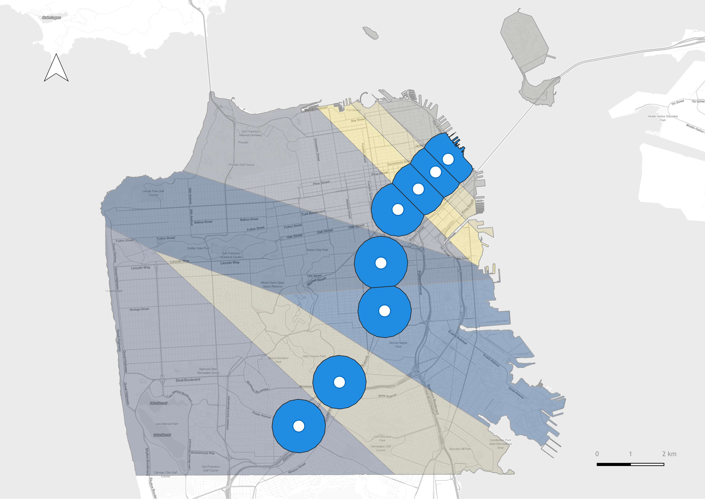
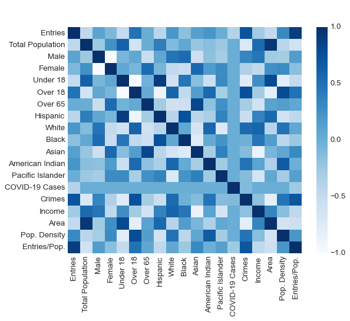
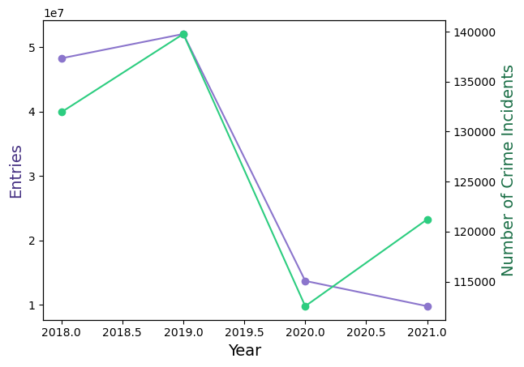
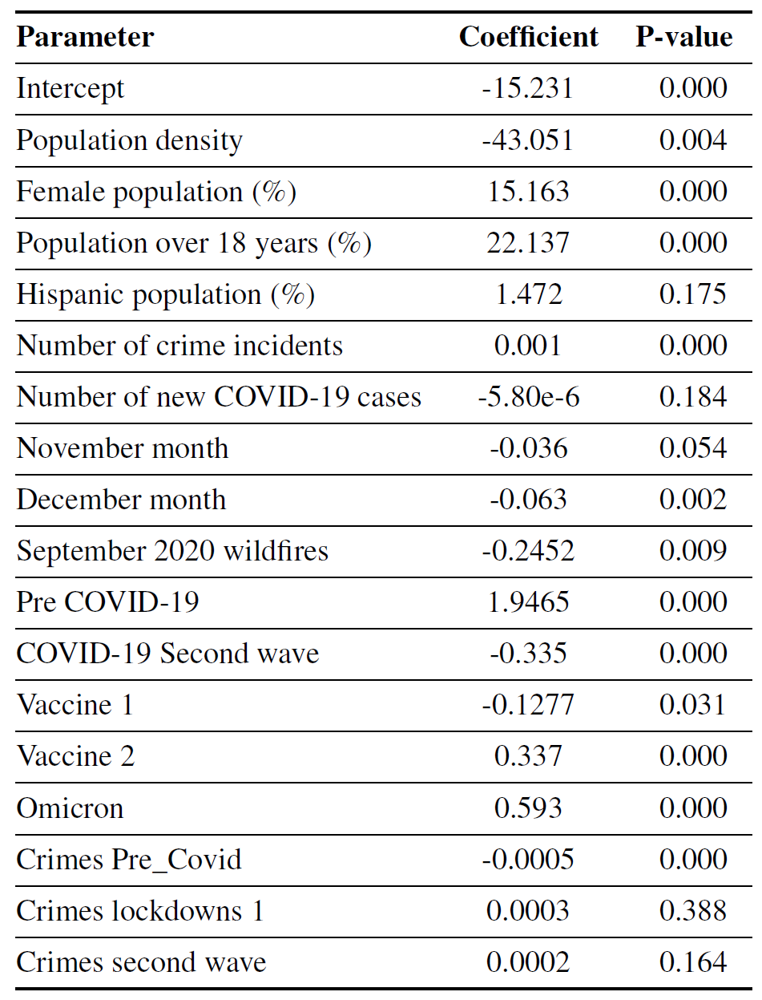

Using ridership data collected from BART stations (2018-2021) we used a negative binomial regression model to understand the influence of crime on transit ridership at the stop level. We used the number of entries from 8 stations as a dependent variable for the regression analysis. Independent variables included: number of crime incidents around stations, rate of new COVID-19 cases and socio-demographics (race, gender, income). 

### Data Collection
* Police Department Incident reports were gathered from San Francisco Open Data portal, from 2018 to 2021, the dataset included incident reports filed to the San Francisco Police Department online report system. 
* Monthly ridership reports were collected from the BART official portal. Only entries from 2018 to 2021 to each station were taken into account for the modeling
*  Datasets for income, gender, race and ethnicity were taken from the US Census Bureau official site at census tract neighborhood level
* Impacts of the COVID-19 pandemic were included through number of new cases reported on San Francisco’s Open Data portal

### Spatial Resolution
An area division of San Francisco using Voronoi diagrams (Thiessen polygons) was used to determine the area of influence of BART stations. An additional buffer area of 800m around stations was created as direct catchment area. Crime, income and demographic data were attachet to a station if they fell within it's buffer. For overlapping buffers, the Voronoi polygons were used as delimitants. (_Thiessen polygons were made with QGIS but the buffers and the data join in Python_)

<!--  -->
<!--  -->

### Exploratory Data Analysis
A correlation matrix between all available variables collected allows shows there is a strong positive correlation between number of crimes and entries to BART stations. 

Another finding of the exploration relates to the trend of number of entries and number of crime incidents over the years 2018 to 2021. Crimes around stations from 2020 to 2021 showed a significant increase opposed to the number of entries for that same period. Although there is a positive correlation between entry and crime around BART stations, further exploration of the possible causes for this increase in crime is necessary.

### Model Results
Time associated dummy variables were created for important events that could impact the number of passengers riding BART (holiday months, the 2020 California wildfires, pre-COVID months, peak waves of the COVID pandemic, etc.) 

The final model results indicate that the number of crime incidents around stations have a significant effect on transit ridership. Our results also showed that there is a stark difference in assessing crime and ridership in pre vs post pandemic scenarios.  Study findings suggest crime-related safety measures are crucial to addressing ridership declines.
