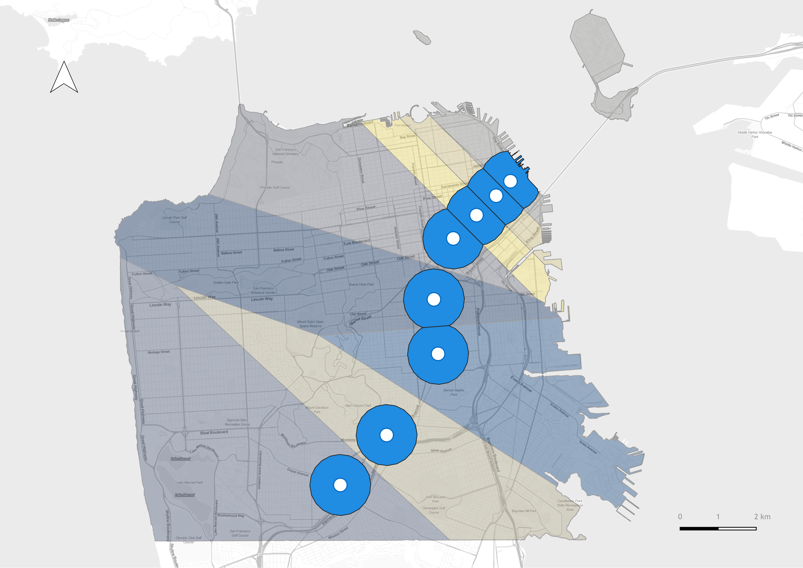

Here we explore the spatial and time dimensions of crime reports to undestand how crimes has changed over time outside BART stations.

### Crime in Space
First we start by looking at the spatial distribution of crime across the entire city. The map below shows the number of crime reports by census tract as well as an 800 meter buffer representing the catchment area of each station. An 800 m buffer was chosen since BART it is a regional transit system, people are more likely to walk a longer distance

  <iframe src="../assets/img/folium_map.html" height="500" width="700"></iframe>

  

### Crime in Time
Next we look at how crime reports change over time at each station.

                        
                        

            <script type="text/javascript">                                    window.PLOTLYENV=window.PLOTLYENV || {};                                    if (document.getElementById("af6f3191-c550-47dd-8e1c-2f97592f171e")) {                    Plotly.newPlot(                        "af6f3191-c550-47dd-8e1c-2f97592f171e",                        [{"hovertemplate":"<b>%{hovertext}</b>  station=16TH STREET & MISSION Date=2018-1 Crime Count=%{marker.size} lat=%{lat} lon=%{lon}<extra></extra>","hovertext":[440.0],"lat":[37.764687209999984],"legendgroup":"16TH STREET & MISSION","lon":[-122.41945664000002],"marker":{"color":"#636efa","size":[440],"sizemode":"area","sizeref":2.67},"mode":"markers","name":"16TH STREET & MISSION","showlegend":true,"subplot":"mapbox","type":"scattermapbox"},{"hovertemplate":"<b>%{hovertext}</b>  station=24TH STREET & MISSION Date=2018-1 Crime Count=%{marker.size} lat=%{lat} lon=%{lon}<extra></extra>","hovertext":[217.0],"lat":[37.75278417],"legendgroup":"24TH STREET & MISSION","lon":[-122.41830452],"marker":{"color":"#EF553B","size":[217],"sizemode":"area","sizeref":2.67},"mode":"markers","name":"24TH STREET & MISSION","showlegend":true,"subplot":"mapbox","type":"scattermapbox"},{"hovertemplate":"<b>%{hovertext}</b>  station=BALBOA PARK Date=2018-1 Crime Count=%{marker.size} lat=%{lat} lon=%{lon}<extra></extra>","hovertext":[70.0],"lat":[37.72160654999999],"legendgroup":"BALBOA PARK","lon":[-122.44712859],"marker":{"color":"#00cc96","size":[70],"sizemode":"area","sizeref":2.67},"mode":"markers","name":"BALBOA PARK","showlegend":true,"subplot":"mapbox","type":"scattermapbox"},{"hovertemplate":"<b>%{hovertext}</b>  station=CIVIC CENTER/ UN PLAZA Date=2018-1 Crime Count=%{marker.size} lat=%{lat} lon=%{lon}<extra></extra>","hovertext":[802.0],"lat":[37.778964959999975],"legendgroup":"CIVIC CENTER/ UN PLAZA","lon":[-122.41418453],"marker":{"color":"#ab63fa","size":[802],"sizemode":"area","sizeref":2.67},"mode":"markers","name":"CIVIC CENTER/ UN PLAZA","showlegend":true,"subplot":"mapbox","type":"scattermapbox"},{"hovertemplate":"<b>%{hovertext}</b>  station=DALY CITY Date=2018-1 Crime Count=%{marker.size} lat=%{lat} lon=%{lon}<extra></extra>","hovertext":[9.0],"lat":[37.70673684999997],"legendgroup":"DALY CITY","lon":[-122.46866639000001],"marker":{"color":"#FFA15A","size":[9],"sizemode":"area","sizeref":2.67},"mode":"markers","name":"DALY CITY","showlegend":true,"subplot":"mapbox","type":"scattermapbox"},{"hovertemplate":"<b>%{hovertext}</b>  station=EMBARCADERO Date=2018-1 Crime Count=%{marker.size} lat=%{lat} lon=%{lon}<extra></extra>","hovertext":[182.0],"lat":[37.79322219999998],"legendgroup":"EMBARCADERO","lon":[-122.39603322000002],"marker":{"color":"#19d3f3","size":[182],"sizemode":"area","sizeref":2.67},"mode":"markers","name":"EMBARCADERO","showlegend":true,"subplot":"mapbox","type":"scattermapbox"},{"hovertemplate":"<b>%{hovertext}</b>  station=GLEN PARK Date=2018-1 Crime Count=%{marker.size} lat=%{lat} lon=%{lon}<extra></extra>","hovertext":[51.0],"lat":[37.73313053999999],"legendgroup":"GLEN PARK","lon":[-122.43395995],"marker":{"color":"#FF6692","size":[51],"sizemode":"area","sizeref":2.67},"mode":"markers","name":"GLEN PARK","showlegend":true,"subplot":"mapbox","type":"scattermapbox"},{"hovertemplate":"<b>%{hovertext}</b>  station=MONTGOMERY STREET Date=2018-1 Crime Count=%{marker.size} lat=%{lat} lon=%{lon}<extra></extra>","hovertext":[428.0],"lat":[37.78888641999997],"legendgroup":"MONTGOMERY STREET","lon":[-122.40153984000001],"marker":{"color":"#B6E880","size":[428],"sizemode":"area","sizeref":2.67},"mode":"markers","name":"MONTGOMERY STREET","showlegend":true,"subplot":"mapbox","type":"scattermapbox"},{"hovertemplate":"<b>%{hovertext}</b>  station=POWELL STREET Date=2018-1 Crime Count=%{marker.size} lat=%{lat} lon=%{lon}<extra></extra>","hovertext":[896.0],"lat":[37.784769659999995],"legendgroup":"POWELL STREET","lon":[-122.40682358999999],"marker":{"color":"#FF97FF","size":[896],"sizemode":"area","sizeref":2.67},"mode":"markers","name":"POWELL STREET","showlegend":true,"subplot":"mapbox","type":"scattermapbox"}],                        {"legend":{"itemsizing":"constant","title":{"text":"station"},"tracegroupgap":0},"mapbox":{"accesstoken":"pk.eyJ1IjoibHVnYW1lOTciLCJhIjoiY2wwanZha3AzMGdoMTNwdW9kcG43Y2Z0ciJ9.e7gaVhqsyTGySVUVEPd-6g","center":{"lat":37.75830983999986,"lon":-122.42289969666669},"domain":{"x":[0.0,1.0],"y":[0.0,1.0]},"zoom":11},"margin":{"t":60},"sliders":[{"active":0,"currentvalue":{"prefix":"Date="},"len":0.9,"pad":{"b":10,"t":60},"steps":[{"args":[["2018-1"],{"frame":{"duration":0,"redraw":true},"mode":"immediate","fromcurrent":true,"transition":{"duration":0,"easing":"linear"}}],"label":"2018-1","method":"animate"},{"args":[["2018-2"],{"frame":{"duration":0,"redraw":true},"mode":"immediate","fromcurrent":true,"transition":{"duration":0,"easing":"linear"}}],"label":"2018-2","method":"animate"},{"args":[["2018-3"],{"frame":{"duration":0,"redraw":true},"mode":"immediate","fromcurrent":true,"transition":{"duration":0,"easing":"linear"}}],"label":"2018-3","method":"animate"},{"args":[["2018-4"],{"frame":{"duration":0,"redraw":true},"mode":"immediate","fromcurrent":true,"transition":{"duration":0,"easing":"linear"}}],"label":"2018-4","method":"animate"},{"args":[["2018-5"],{"frame":{"duration":0,"redraw":true},"mode":"immediate","fromcurrent":true,"transition":{"duration":0,"easing":"linear"}}],"label":"2018-5","method":"animate"},{"args":[["2018-6"],{"frame":{"duration":0,"redraw":true},"mode":"immediate","fromcurrent":true,"transition":{"duration":0,"easing":"linear"}}],"label":"2018-6","method":"animate"},{"args":[["2018-7"],{"frame":{"duration":0,"redraw":true},"mode":"immediate","fromcurrent":true,"transition":{"duration":0,"easing":"linear"}}],"label":"2018-7","method":"animate"},{"args":[["2018-8"],{"frame":{"duration":0,"redraw":true},"mode":"immediate","fromcurrent":true,"transition":{"duration":0,"easing":"linear"}}],"label":"2018-8","method":"animate"},{"args":[["2018-9"],{"frame":{"duration":0,"redraw":true},"mode":"immediate","fromcurrent":true,"transition":{"duration":0,"easing":"linear"}}],"label":"2018-9","method":"animate"},{"args":[["2018-10"],{"frame":{"duration":0,"redraw":true},"mode":"immediate","fromcurrent":true,"transition":{"duration":0,"easing":"linear"}}],"label":"2018-10","method":"animate"},{"args":[["2018-11"],{"frame":{"duration":0,"redraw":true},"mode":"immediate","fromcurrent":true,"transition":{"duration":0,"easing":"linear"}}],"label":"2018-11","method":"animate"},{"args":[["2018-12"],{"frame":{"duration":0,"redraw":true},"mode":"immediate","fromcurrent":true,"transition":{"duration":0,"easing":"linear"}}],"label":"2018-12","method":"animate"},{"args":[["2019-1"],{"frame":{"duration":0,"redraw":true},"mode":"immediate","fromcurrent":true,"transition":{"duration":0,"easing":"linear"}}],"label":"2019-1","method":"animate"},{"args":[["2019-2"],{"frame":{"duration":0,"redraw":true},"mode":"immediate","fromcurrent":true,"transition":{"duration":0,"easing":"linear"}}],"label":"2019-2","method":"animate"},{"args":[["2019-3"],{"frame":{"duration":0,"redraw":true},"mode":"immediate","fromcurrent":true,"transition":{"duration":0,"easing":"linear"}}],"label":"2019-3","method":"animate"},{"args":[["2019-4"],{"frame":{"duration":0,"redraw":true},"mode":"immediate","fromcurrent":true,"transition":{"duration":0,"easing":"linear"}}],"label":"2019-4","method":"animate"},{"args":[["2019-5"],{"frame":{"duration":0,"redraw":true},"mode":"immediate","fromcurrent":true,"transition":{"duration":0,"easing":"linear"}}],"label":"2019-5","method":"animate"},{"args":[["2019-6"],{"frame":{"duration":0,"redraw":true},"mode":"immediate","fromcurrent":true,"transition":{"duration":0,"easing":"linear"}}],"label":"2019-6","method":"animate"},{"args":[["2019-7"],{"frame":{"duration":0,"redraw":true},"mode":"immediate","fromcurrent":true,"transition":{"duration":0,"easing":"linear"}}],"label":"2019-7","method":"animate"},{"args":[["2019-8"],{"frame":{"duration":0,"redraw":true},"mode":"immediate","fromcurrent":true,"transition":{"duration":0,"easing":"linear"}}],"label":"2019-8","method":"animate"},{"args":[["2019-9"],{"frame":{"duration":0,"redraw":true},"mode":"immediate","fromcurrent":true,"transition":{"duration":0,"easing":"linear"}}],"label":"2019-9","method":"animate"},{"args":[["2019-10"],{"frame":{"duration":0,"redraw":true},"mode":"immediate","fromcurrent":true,"transition":{"duration":0,"easing":"linear"}}],"label":"2019-10","method":"animate"},{"args":[["2019-11"],{"frame":{"duration":0,"redraw":true},"mode":"immediate","fromcurrent":true,"transition":{"duration":0,"easing":"linear"}}],"label":"2019-11","method":"animate"},{"args":[["2019-12"],{"frame":{"duration":0,"redraw":true},"mode":"immediate","fromcurrent":true,"transition":{"duration":0,"easing":"linear"}}],"label":"2019-12","method":"animate"},{"args":[["2020-1"],{"frame":{"duration":0,"redraw":true},"mode":"immediate","fromcurrent":true,"transition":{"duration":0,"easing":"linear"}}],"label":"2020-1","method":"animate"},{"args":[["2020-2"],{"frame":{"duration":0,"redraw":true},"mode":"immediate","fromcurrent":true,"transition":{"duration":0,"easing":"linear"}}],"label":"2020-2","method":"animate"},{"args":[["2020-3"],{"frame":{"duration":0,"redraw":true},"mode":"immediate","fromcurrent":true,"transition":{"duration":0,"easing":"linear"}}],"label":"2020-3","method":"animate"},{"args":[["2020-4"],{"frame":{"duration":0,"redraw":true},"mode":"immediate","fromcurrent":true,"transition":{"duration":0,"easing":"linear"}}],"label":"2020-4","method":"animate"},{"args":[["2020-5"],{"frame":{"duration":0,"redraw":true},"mode":"immediate","fromcurrent":true,"transition":{"duration":0,"easing":"linear"}}],"label":"2020-5","method":"animate"},{"args":[["2020-6"],{"frame":{"duration":0,"redraw":true},"mode":"immediate","fromcurrent":true,"transition":{"duration":0,"easing":"linear"}}],"label":"2020-6","method":"animate"},{"args":[["2020-7"],{"frame":{"duration":0,"redraw":true},"mode":"immediate","fromcurrent":true,"transition":{"duration":0,"easing":"linear"}}],"label":"2020-7","method":"animate"},{"args":[["2020-8"],{"frame":{"duration":0,"redraw":true},"mode":"immediate","fromcurrent":true,"transition":{"duration":0,"easing":"linear"}}],"label":"2020-8","method":"animate"},{"args":[["2020-9"],{"frame":{"duration":0,"redraw":true},"mode":"immediate","fromcurrent":true,"transition":{"duration":0,"easing":"linear"}}],"label":"2020-9","method":"animate"},{"args":[["2020-10"],{"frame":{"duration":0,"redraw":true},"mode":"immediate","fromcurrent":true,"transition":{"duration":0,"easing":"linear"}}],"label":"2020-10","method":"animate"},{"args":[["2020-11"],{"frame":{"duration":0,"redraw":true},"mode":"immediate","fromcurrent":true,"transition":{"duration":0,"easing":"linear"}}],"label":"2020-11","method":"animate"},{"args":[["2020-12"],{"frame":{"duration":0,"redraw":true},"mode":"immediate","fromcurrent":true,"transition":{"duration":0,"easing":"linear"}}],"label":"2020-12","method":"animate"},{"args":[["2021-1"],{"frame":{"duration":0,"redraw":true},"mode":"immediate","fromcurrent":true,"transition":{"duration":0,"easing":"linear"}}],"label":"2021-1","method":"animate"},{"args":[["2021-2"],{"frame":{"duration":0,"redraw":true},"mode":"immediate","fromcurrent":true,"transition":{"duration":0,"easing":"linear"}}],"label":"2021-2","method":"animate"},{"args":[["2021-3"],{"frame":{"duration":0,"redraw":true},"mode":"immediate","fromcurrent":true,"transition":{"duration":0,"easing":"linear"}}],"label":"2021-3","method":"animate"},{"args":[["2021-4"],{"frame":{"duration":0,"redraw":true},"mode":"immediate","fromcurrent":true,"transition":{"duration":0,"easing":"linear"}}],"label":"2021-4","method":"animate"},{"args":[["2021-5"],{"frame":{"duration":0,"redraw":true},"mode":"immediate","fromcurrent":true,"transition":{"duration":0,"easing":"linear"}}],"label":"2021-5","method":"animate"},{"args":[["2021-6"],{"frame":{"duration":0,"redraw":true},"mode":"immediate","fromcurrent":true,"transition":{"duration":0,"easing":"linear"}}],"label":"2021-6","method":"animate"},{"args":[["2021-7"],{"frame":{"duration":0,"redraw":true},"mode":"immediate","fromcurrent":true,"transition":{"duration":0,"easing":"linear"}}],"label":"2021-7","method":"animate"},{"args":[["2021-8"],{"frame":{"duration":0,"redraw":true},"mode":"immediate","fromcurrent":true,"transition":{"duration":0,"easing":"linear"}}],"label":"2021-8","method":"animate"},{"args":[["2021-9"],{"frame":{"duration":0,"redraw":true},"mode":"immediate","fromcurrent":true,"transition":{"duration":0,"easing":"linear"}}],"label":"2021-9","method":"animate"},{"args":[["2021-10"],{"frame":{"duration":0,"redraw":true},"mode":"immediate","fromcurrent":true,"transition":{"duration":0,"easing":"linear"}}],"label":"2021-10","method":"animate"},{"args":[["2021-11"],{"frame":{"duration":0,"redraw":true},"mode":"immediate","fromcurrent":true,"transition":{"duration":0,"easing":"linear"}}],"label":"2021-11","method":"animate"},{"args":[["2021-12"],{"frame":{"duration":0,"redraw":true},"mode":"immediate","fromcurrent":true,"transition":{"duration":0,"easing":"linear"}}],"label":"2021-12","method":"animate"},{"args":[["2022-1"],{"frame":{"duration":0,"redraw":true},"mode":"immediate","fromcurrent":true,"transition":{"duration":0,"easing":"linear"}}],"label":"2022-1","method":"animate"},{"args":[["2022-2"],{"frame":{"duration":0,"redraw":true},"mode":"immediate","fromcurrent":true,"transition":{"duration":0,"easing":"linear"}}],"label":"2022-2","method":"animate"},{"args":[["2022-3"],{"frame":{"duration":0,"redraw":true},"mode":"immediate","fromcurrent":true,"transition":{"duration":0,"easing":"linear"}}],"label":"2022-3","method":"animate"},{"args":[["2022-4"],{"frame":{"duration":0,"redraw":true},"mode":"immediate","fromcurrent":true,"transition":{"duration":0,"easing":"linear"}}],"label":"2022-4","method":"animate"}],"x":0.1,"xanchor":"left","y":0,"yanchor":"top"}],"template":{"data":{"barpolar":[{"marker":{"line":{"color":"#E5ECF6","width":0.5},"pattern":{"fillmode":"overlay","size":10,"solidity":0.2}},"type":"barpolar"}],"bar":[{"error_x":{"color":"#2a3f5f"},"error_y":{"color":"#2a3f5f"},"marker":{"line":{"color":"#E5ECF6","width":0.5},"pattern":{"fillmode":"overlay","size":10,"solidity":0.2}},"type":"bar"}],"carpet":[{"aaxis":{"endlinecolor":"#2a3f5f","gridcolor":"white","linecolor":"white","minorgridcolor":"white","startlinecolor":"#2a3f5f"},"baxis":{"endlinecolor":"#2a3f5f","gridcolor":"white","linecolor":"white","minorgridcolor":"white","startlinecolor":"#2a3f5f"},"type":"carpet"}],"choropleth":[{"colorbar":{"outlinewidth":0,"ticks":""},"type":"choropleth"}],"contourcarpet":[{"colorbar":{"outlinewidth":0,"ticks":""},"type":"contourcarpet"}],"contour":[{"colorbar":{"outlinewidth":0,"ticks":""},"colorscale":[[0.0,"#0d0887"],[0.1111111111111111,"#46039f"],[0.2222222222222222,"#7201a8"],[0.3333333333333333,"#9c179e"],[0.4444444444444444,"#bd3786"],[0.5555555555555556,"#d8576b"],[0.6666666666666666,"#ed7953"],[0.7777777777777778,"#fb9f3a"],[0.8888888888888888,"#fdca26"],[1.0,"#f0f921"]],"type":"contour"}],"heatmapgl":[{"colorbar":{"outlinewidth":0,"ticks":""},"colorscale":[[0.0,"#0d0887"],[0.1111111111111111,"#46039f"],[0.2222222222222222,"#7201a8"],[0.3333333333333333,"#9c179e"],[0.4444444444444444,"#bd3786"],[0.5555555555555556,"#d8576b"],[0.6666666666666666,"#ed7953"],[0.7777777777777778,"#fb9f3a"],[0.8888888888888888,"#fdca26"],[1.0,"#f0f921"]],"type":"heatmapgl"}],"heatmap":[{"colorbar":{"outlinewidth":0,"ticks":""},"colorscale":[[0.0,"#0d0887"],[0.1111111111111111,"#46039f"],[0.2222222222222222,"#7201a8"],[0.3333333333333333,"#9c179e"],[0.4444444444444444,"#bd3786"],[0.5555555555555556,"#d8576b"],[0.6666666666666666,"#ed7953"],[0.7777777777777778,"#fb9f3a"],[0.8888888888888888,"#fdca26"],[1.0,"#f0f921"]],"type":"heatmap"}],"histogram2dcontour":[{"colorbar":{"outlinewidth":0,"ticks":""},"colorscale":[[0.0,"#0d0887"],[0.1111111111111111,"#46039f"],[0.2222222222222222,"#7201a8"],[0.3333333333333333,"#9c179e"],[0.4444444444444444,"#bd3786"],[0.5555555555555556,"#d8576b"],[0.6666666666666666,"#ed7953"],[0.7777777777777778,"#fb9f3a"],[0.8888888888888888,"#fdca26"],[1.0,"#f0f921"]],"type":"histogram2dcontour"}],"histogram2d":[{"colorbar":{"outlinewidth":0,"ticks":""},"colorscale":[[0.0,"#0d0887"],[0.1111111111111111,"#46039f"],[0.2222222222222222,"#7201a8"],[0.3333333333333333,"#9c179e"],[0.4444444444444444,"#bd3786"],[0.5555555555555556,"#d8576b"],[0.6666666666666666,"#ed7953"],[0.7777777777777778,"#fb9f3a"],[0.8888888888888888,"#fdca26"],[1.0,"#f0f921"]],"type":"histogram2d"}],"histogram":[{"marker":{"pattern":{"fillmode":"overlay","size":10,"solidity":0.2}},"type":"histogram"}],"mesh3d":[{"colorbar":{"outlinewidth":0,"ticks":""},"type":"mesh3d"}],"parcoords":[{"line":{"colorbar":{"outlinewidth":0,"ticks":""}},"type":"parcoords"}],"pie":[{"automargin":true,"type":"pie"}],"scatter3d":[{"line":{"colorbar":{"outlinewidth":0,"ticks":""}},"marker":{"colorbar":{"outlinewidth":0,"ticks":""}},"type":"scatter3d"}],"scattercarpet":[{"marker":{"colorbar":{"outlinewidth":0,"ticks":""}},"type":"scattercarpet"}],"scattergeo":[{"marker":{"colorbar":{"outlinewidth":0,"ticks":""}},"type":"scattergeo"}],"scattergl":[{"marker":{"colorbar":{"outlinewidth":0,"ticks":""}},"type":"scattergl"}],"scattermapbox":[{"marker":{"colorbar":{"outlinewidth":0,"ticks":""}},"type":"scattermapbox"}],"scatterpolargl":[{"marker":{"colorbar":{"outlinewidth":0,"ticks":""}},"type":"scatterpolargl"}],"scatterpolar":[{"marker":{"colorbar":{"outlinewidth":0,"ticks":""}},"type":"scatterpolar"}],"scatter":[{"marker":{"colorbar":{"outlinewidth":0,"ticks":""}},"type":"scatter"}],"scatterternary":[{"marker":{"colorbar":{"outlinewidth":0,"ticks":""}},"type":"scatterternary"}],"surface":[{"colorbar":{"outlinewidth":0,"ticks":""},"colorscale":[[0.0,"#0d0887"],[0.1111111111111111,"#46039f"],[0.2222222222222222,"#7201a8"],[0.3333333333333333,"#9c179e"],[0.4444444444444444,"#bd3786"],[0.5555555555555556,"#d8576b"],[0.6666666666666666,"#ed7953"],[0.7777777777777778,"#fb9f3a"],[0.8888888888888888,"#fdca26"],[1.0,"#f0f921"]],"type":"surface"}],"table":[{"cells":{"fill":{"color":"#EBF0F8"},"line":{"color":"white"}},"header":{"fill":{"color":"#C8D4E3"},"line":{"color":"white"}},"type":"table"}]},"layout":{"annotationdefaults":{"arrowcolor":"#2a3f5f","arrowhead":0,"arrowwidth":1},"autotypenumbers":"strict","coloraxis":{"colorbar":{"outlinewidth":0,"ticks":""}},"colorscale":{"diverging":[[0,"#8e0152"],[0.1,"#c51b7d"],[0.2,"#de77ae"],[0.3,"#f1b6da"],[0.4,"#fde0ef"],[0.5,"#f7f7f7"],[0.6,"#e6f5d0"],[0.7,"#b8e186"],[0.8,"#7fbc41"],[0.9,"#4d9221"],[1,"#276419"]],"sequential":[[0.0,"#0d0887"],[0.1111111111111111,"#46039f"],[0.2222222222222222,"#7201a8"],[0.3333333333333333,"#9c179e"],[0.4444444444444444,"#bd3786"],[0.5555555555555556,"#d8576b"],[0.6666666666666666,"#ed7953"],[0.7777777777777778,"#fb9f3a"],[0.8888888888888888,"#fdca26"],[1.0,"#f0f921"]],"sequentialminus":[[0.0,"#0d0887"],[0.1111111111111111,"#46039f"],[0.2222222222222222,"#7201a8"],[0.3333333333333333,"#9c179e"],[0.4444444444444444,"#bd3786"],[0.5555555555555556,"#d8576b"],[0.6666666666666666,"#ed7953"],[0.7777777777777778,"#fb9f3a"],[0.8888888888888888,"#fdca26"],[1.0,"#f0f921"]]},"colorway":["#636efa","#EF553B","#00cc96","#ab63fa","#FFA15A","#19d3f3","#FF6692","#B6E880","#FF97FF","#FECB52"],"font":{"color":"#2a3f5f"},"geo":{"bgcolor":"white","lakecolor":"white","landcolor":"#E5ECF6","showlakes":true,"showland":true,"subunitcolor":"white"},"hoverlabel":{"align":"left"},"hovermode":"closest","mapbox":{"style":"light"},"paper_bgcolor":"white","plot_bgcolor":"#E5ECF6","polar":{"angularaxis":{"gridcolor":"white","linecolor":"white","ticks":""},"bgcolor":"#E5ECF6","radialaxis":{"gridcolor":"white","linecolor":"white","ticks":""}},"scene":{"xaxis":{"backgroundcolor":"#E5ECF6","gridcolor":"white","gridwidth":2,"linecolor":"white","showbackground":true,"ticks":"","zerolinecolor":"white"},"yaxis":{"backgroundcolor":"#E5ECF6","gridcolor":"white","gridwidth":2,"linecolor":"white","showbackground":true,"ticks":"","zerolinecolor":"white"},"zaxis":{"backgroundcolor":"#E5ECF6","gridcolor":"white","gridwidth":2,"linecolor":"white","showbackground":true,"ticks":"","zerolinecolor":"white"}},"shapedefaults":{"line":{"color":"#2a3f5f"}},"ternary":{"aaxis":{"gridcolor":"white","linecolor":"white","ticks":""},"baxis":{"gridcolor":"white","linecolor":"white","ticks":""},"bgcolor":"#E5ECF6","caxis":{"gridcolor":"white","linecolor":"white","ticks":""}},"title":{"x":0.05},"xaxis":{"automargin":true,"gridcolor":"white","linecolor":"white","ticks":"","title":{"standoff":15},"zerolinecolor":"white","zerolinewidth":2},"yaxis":{"automargin":true,"gridcolor":"white","linecolor":"white","ticks":"","title":{"standoff":15},"zerolinecolor":"white","zerolinewidth":2}}},"updatemenus":[{"buttons":[{"args":[null,{"frame":{"duration":500,"redraw":true},"mode":"immediate","fromcurrent":true,"transition":{"duration":500,"easing":"linear"}}],"label":"&#9654;","method":"animate"},{"args":[[null],{"frame":{"duration":0,"redraw":true},"mode":"immediate","fromcurrent":true,"transition":{"duration":0,"easing":"linear"}}],"label":"&#9724;","method":"animate"}],"direction":"left","pad":{"r":10,"t":70},"showactive":false,"type":"buttons","x":0.1,"xanchor":"right","y":0,"yanchor":"top"}]},                        {"responsive": true}                    ).then(function(){
                            Plotly.addFrames('af6f3191-c550-47dd-8e1c-2f97592f171e', [{"data":[{"hovertemplate":"<b>%{hovertext}</b>  station=16TH STREET & MISSION Date=2018-1 Crime Count=%{marker.size} lat=%{lat} lon=%{lon}<extra></extra>","hovertext":[440.0],"lat":[37.764687209999984],"legendgroup":"16TH STREET & MISSION","lon":[-122.41945664000002],"marker":{"color":"#636efa","size":[440],"sizemode":"area","sizeref":2.67},"mode":"markers","name":"16TH STREET & MISSION","showlegend":true,"subplot":"mapbox","type":"scattermapbox"},{"hovertemplate":"<b>%{hovertext}</b>  station=24TH STREET & MISSION Date=2018-1 Crime Count=%{marker.size} lat=%{lat} lon=%{lon}<extra></extra>","hovertext":[217.0],"lat":[37.75278417],"legendgroup":"24TH STREET & MISSION","lon":[-122.41830452],"marker":{"color":"#EF553B","size":[217],"sizemode":"area","sizeref":2.67},"mode":"markers","name":"24TH STREET & MISSION","showlegend":true,"subplot":"mapbox","type":"scattermapbox"},{"hovertemplate":"<b>%{hovertext}</b>  station=BALBOA PARK Date=2018-1 Crime Count=%{marker.size} lat=%{lat} lon=%{lon}<extra></extra>","hovertext":[70.0],"lat":[37.72160654999999],"legendgroup":"BALBOA PARK","lon":[-122.44712859],"marker":{"color":"#00cc96","size":[70],"sizemode":"area","sizeref":2.67},"mode":"markers","name":"BALBOA PARK","showlegend":true,"subplot":"mapbox","type":"scattermapbox"},{"hovertemplate":"<b>%{hovertext}</b>  station=CIVIC CENTER/ UN PLAZA Date=2018-1 Crime Count=%{marker.size} lat=%{lat} lon=%{lon}<extra></extra>","hovertext":[802.0],"lat":[37.778964959999975],"legendgroup":"CIVIC CENTER/ UN PLAZA","lon":[-122.41418453],"marker":{"color":"#ab63fa","size":[802],"sizemode":"area","sizeref":2.67},"mode":"markers","name":"CIVIC CENTER/ UN PLAZA","showlegend":true,"subplot":"mapbox","type":"scattermapbox"},{"hovertemplate":"<b>%{hovertext}</b>  station=DALY CITY Date=2018-1 Crime Count=%{marker.size} lat=%{lat} lon=%{lon}<extra></extra>","hovertext":[9.0],"lat":[37.70673684999997],"legendgroup":"DALY CITY","lon":[-122.46866639000001],"marker":{"color":"#FFA15A","size":[9],"sizemode":"area","sizeref":2.67},"mode":"markers","name":"DALY CITY","showlegend":true,"subplot":"mapbox","type":"scattermapbox"},{"hovertemplate":"<b>%{hovertext}</b>  station=EMBARCADERO Date=2018-1 Crime Count=%{marker.size} lat=%{lat} lon=%{lon}<extra></extra>","hovertext":[182.0],"lat":[37.79322219999998],"legendgroup":"EMBARCADERO","lon":[-122.39603322000002],"marker":{"color":"#19d3f3","size":[182],"sizemode":"area","sizeref":2.67},"mode":"markers","name":"EMBARCADERO","showlegend":true,"subplot":"mapbox","type":"scattermapbox"},{"hovertemplate":"<b>%{hovertext}</b>  station=GLEN PARK Date=2018-1 Crime Count=%{marker.size} lat=%{lat} lon=%{lon}<extra></extra>","hovertext":[51.0],"lat":[37.73313053999999],"legendgroup":"GLEN PARK","lon":[-122.43395995],"marker":{"color":"#FF6692","size":[51],"sizemode":"area","sizeref":2.67},"mode":"markers","name":"GLEN PARK","showlegend":true,"subplot":"mapbox","type":"scattermapbox"},{"hovertemplate":"<b>%{hovertext}</b>  station=MONTGOMERY STREET Date=2018-1 Crime Count=%{marker.size} lat=%{lat} lon=%{lon}<extra></extra>","hovertext":[428.0],"lat":[37.78888641999997],"legendgroup":"MONTGOMERY STREET","lon":[-122.40153984000001],"marker":{"color":"#B6E880","size":[428],"sizemode":"area","sizeref":2.67},"mode":"markers","name":"MONTGOMERY STREET","showlegend":true,"subplot":"mapbox","type":"scattermapbox"},{"hovertemplate":"<b>%{hovertext}</b>  station=POWELL STREET Date=2018-1 Crime Count=%{marker.size} lat=%{lat} lon=%{lon}<extra></extra>","hovertext":[896.0],"lat":[37.784769659999995],"legendgroup":"POWELL STREET","lon":[-122.40682358999999],"marker":{"color":"#FF97FF","size":[896],"sizemode":"area","sizeref":2.67},"mode":"markers","name":"POWELL STREET","showlegend":true,"subplot":"mapbox","type":"scattermapbox"}],"name":"2018-1"},{"data":[{"hovertemplate":"<b>%{hovertext}</b>  station=16TH STREET & MISSION Date=2018-2 Crime Count=%{marker.size} lat=%{lat} lon=%{lon}<extra></extra>","hovertext":[426.0],"lat":[37.764687209999984],"legendgroup":"16TH STREET & MISSION","lon":[-122.41945664000002],"marker":{"color":"#636efa","size":[426],"sizemode":"area","sizeref":2.67},"mode":"markers","name":"16TH STREET & MISSION","showlegend":true,"subplot":"mapbox","type":"scattermapbox"},{"hovertemplate":"<b>%{hovertext}</b>  station=24TH STREET & MISSION Date=2018-2 Crime Count=%{marker.size} lat=%{lat} lon=%{lon}<extra></extra>","hovertext":[214.0],"lat":[37.75278417],"legendgroup":"24TH STREET & MISSION","lon":[-122.41830452],"marker":{"color":"#EF553B","size":[214],"sizemode":"area","sizeref":2.67},"mode":"markers","name":"24TH STREET & MISSION","showlegend":true,"subplot":"mapbox","type":"scattermapbox"},{"hovertemplate":"<b>%{hovertext}</b>  station=BALBOA PARK Date=2018-2 Crime Count=%{marker.size} lat=%{lat} lon=%{lon}<extra></extra>","hovertext":[49.0],"lat":[37.72160654999999],"legendgroup":"BALBOA PARK","lon":[-122.44712859],"marker":{"color":"#00cc96","size":[49],"sizemode":"area","sizeref":2.67},"mode":"markers","name":"BALBOA PARK","showlegend":true,"subplot":"mapbox","type":"scattermapbox"},{"hovertemplate":"<b>%{hovertext}</b>  station=CIVIC CENTER/ UN PLAZA Date=2018-2 Crime Count=%{marker.size} lat=%{lat} lon=%{lon}<extra></extra>","hovertext":[790.0],"lat":[37.778964959999975],"legendgroup":"CIVIC CENTER/ UN PLAZA","lon":[-122.41418453],"marker":{"color":"#ab63fa","size":[790],"sizemode":"area","sizeref":2.67},"mode":"markers","name":"CIVIC CENTER/ UN PLAZA","showlegend":true,"subplot":"mapbox","type":"scattermapbox"},{"hovertemplate":"<b>%{hovertext}</b>  station=DALY CITY Date=2018-2 Crime Count=%{marker.size} lat=%{lat} lon=%{lon}<extra></extra>","hovertext":[12.0],"lat":[37.70673684999997],"legendgroup":"DALY CITY","lon":[-122.46866639000001],"marker":{"color":"#FFA15A","size":[12],"sizemode":"area","sizeref":2.67},"mode":"markers","name":"DALY CITY","showlegend":true,"subplot":"mapbox","type":"scattermapbox"},{"hovertemplate":"<b>%{hovertext}</b>  station=EMBARCADERO Date=2018-2 Crime Count=%{marker.size} lat=%{lat} lon=%{lon}<extra></extra>","hovertext":[186.0],"lat":[37.79322219999998],"legendgroup":"EMBARCADERO","lon":[-122.39603322000002],"marker":{"color":"#19d3f3","size":[186],"sizemode":"area","sizeref":2.67},"mode":"markers","name":"EMBARCADERO","showlegend":true,"subplot":"mapbox","type":"scattermapbox"},{"hovertemplate":"<b>%{hovertext}</b>  station=GLEN PARK Date=2018-2 Crime Count=%{marker.size} lat=%{lat} lon=%{lon}<extra></extra>","hovertext":[33.0],"lat":[37.73313053999999],"legendgroup":"GLEN PARK","lon":[-122.43395995],"marker":{"color":"#FF6692","size":[33],"sizemode":"area","sizeref":2.67},"mode":"markers","name":"GLEN PARK","showlegend":true,"subplot":"mapbox","type":"scattermapbox"},{"hovertemplate":"<b>%{hovertext}</b>  station=MONTGOMERY STREET Date=2018-2 Crime Count=%{marker.size} lat=%{lat} lon=%{lon}<extra></extra>","hovertext":[386.0],"lat":[37.78888641999997],"legendgroup":"MONTGOMERY STREET","lon":[-122.40153984000001],"marker":{"color":"#B6E880","size":[386],"sizemode":"area","sizeref":2.67},"mode":"markers","name":"MONTGOMERY STREET","showlegend":true,"subplot":"mapbox","type":"scattermapbox"},{"hovertemplate":"<b>%{hovertext}</b>  station=POWELL STREET Date=2018-2 Crime Count=%{marker.size} lat=%{lat} lon=%{lon}<extra></extra>","hovertext":[814.0],"lat":[37.784769659999995],"legendgroup":"POWELL STREET","lon":[-122.40682358999999],"marker":{"color":"#FF97FF","size":[814],"sizemode":"area","sizeref":2.67},"mode":"markers","name":"POWELL STREET","showlegend":true,"subplot":"mapbox","type":"scattermapbox"}],"name":"2018-2"},{"data":[{"hovertemplate":"<b>%{hovertext}</b>  station=16TH STREET & MISSION Date=2018-3 Crime Count=%{marker.size} lat=%{lat} lon=%{lon}<extra></extra>","hovertext":[481.0],"lat":[37.764687209999984],"legendgroup":"16TH STREET & MISSION","lon":[-122.41945664000002],"marker":{"color":"#636efa","size":[481],"sizemode":"area","sizeref":2.67},"mode":"markers","name":"16TH STREET & MISSION","showlegend":true,"subplot":"mapbox","type":"scattermapbox"},{"hovertemplate":"<b>%{hovertext}</b>  station=24TH STREET & MISSION Date=2018-3 Crime Count=%{marker.size} lat=%{lat} lon=%{lon}<extra></extra>","hovertext":[237.0],"lat":[37.75278417],"legendgroup":"24TH STREET & MISSION","lon":[-122.41830452],"marker":{"color":"#EF553B","size":[237],"sizemode":"area","sizeref":2.67},"mode":"markers","name":"24TH STREET & MISSION","showlegend":true,"subplot":"mapbox","type":"scattermapbox"},{"hovertemplate":"<b>%{hovertext}</b>  station=BALBOA PARK Date=2018-3 Crime Count=%{marker.size} lat=%{lat} lon=%{lon}<extra></extra>","hovertext":[45.0],"lat":[37.72160654999999],"legendgroup":"BALBOA PARK","lon":[-122.44712859],"marker":{"color":"#00cc96","size":[45],"sizemode":"area","sizeref":2.67},"mode":"markers","name":"BALBOA PARK","showlegend":true,"subplot":"mapbox","type":"scattermapbox"},{"hovertemplate":"<b>%{hovertext}</b>  station=CIVIC CENTER/ UN PLAZA Date=2018-3 Crime Count=%{marker.size} lat=%{lat} lon=%{lon}<extra></extra>","hovertext":[806.0],"lat":[37.778964959999975],"legendgroup":"CIVIC CENTER/ UN PLAZA","lon":[-122.41418453],"marker":{"color":"#ab63fa","size":[806],"sizemode":"area","sizeref":2.67},"mode":"markers","name":"CIVIC CENTER/ UN PLAZA","showlegend":true,"subplot":"mapbox","type":"scattermapbox"},{"hovertemplate":"<b>%{hovertext}</b>  station=DALY CITY Date=2018-3 Crime Count=%{marker.size} lat=%{lat} lon=%{lon}<extra></extra>","hovertext":[12.0],"lat":[37.70673684999997],"legendgroup":"DALY CITY","lon":[-122.46866639000001],"marker":{"color":"#FFA15A","size":[12],"sizemode":"area","sizeref":2.67},"mode":"markers","name":"DALY CITY","showlegend":true,"subplot":"mapbox","type":"scattermapbox"},{"hovertemplate":"<b>%{hovertext}</b>  station=EMBARCADERO Date=2018-3 Crime Count=%{marker.size} lat=%{lat} lon=%{lon}<extra></extra>","hovertext":[193.0],"lat":[37.79322219999998],"legendgroup":"EMBARCADERO","lon":[-122.39603322000002],"marker":{"color":"#19d3f3","size":[193],"sizemode":"area","sizeref":2.67},"mode":"markers","name":"EMBARCADERO","showlegend":true,"subplot":"mapbox","type":"scattermapbox"},{"hovertemplate":"<b>%{hovertext}</b>  station=GLEN PARK Date=2018-3 Crime Count=%{marker.size} lat=%{lat} lon=%{lon}<extra></extra>","hovertext":[55.0],"lat":[37.73313053999999],"legendgroup":"GLEN PARK","lon":[-122.43395995],"marker":{"color":"#FF6692","size":[55],"sizemode":"area","sizeref":2.67},"mode":"markers","name":"GLEN PARK","showlegend":true,"subplot":"mapbox","type":"scattermapbox"},{"hovertemplate":"<b>%{hovertext}</b>  station=MONTGOMERY STREET Date=2018-3 Crime Count=%{marker.size} lat=%{lat} lon=%{lon}<extra></extra>","hovertext":[423.0],"lat":[37.78888641999997],"legendgroup":"MONTGOMERY STREET","lon":[-122.40153984000001],"marker":{"color":"#B6E880","size":[423],"sizemode":"area","sizeref":2.67},"mode":"markers","name":"MONTGOMERY STREET","showlegend":true,"subplot":"mapbox","type":"scattermapbox"},{"hovertemplate":"<b>%{hovertext}</b>  station=POWELL STREET Date=2018-3 Crime Count=%{marker.size} lat=%{lat} lon=%{lon}<extra></extra>","hovertext":[886.0],"lat":[37.784769659999995],"legendgroup":"POWELL STREET","lon":[-122.40682358999999],"marker":{"color":"#FF97FF","size":[886],"sizemode":"area","sizeref":2.67},"mode":"markers","name":"POWELL STREET","showlegend":true,"subplot":"mapbox","type":"scattermapbox"}],"name":"2018-3"},{"data":[{"hovertemplate":"<b>%{hovertext}</b>  station=16TH STREET & MISSION Date=2018-4 Crime Count=%{marker.size} lat=%{lat} lon=%{lon}<extra></extra>","hovertext":[482.0],"lat":[37.764687209999984],"legendgroup":"16TH STREET & MISSION","lon":[-122.41945664000002],"marker":{"color":"#636efa","size":[482],"sizemode":"area","sizeref":2.67},"mode":"markers","name":"16TH STREET & MISSION","showlegend":true,"subplot":"mapbox","type":"scattermapbox"},{"hovertemplate":"<b>%{hovertext}</b>  station=24TH STREET & MISSION Date=2018-4 Crime Count=%{marker.size} lat=%{lat} lon=%{lon}<extra></extra>","hovertext":[186.0],"lat":[37.75278417],"legendgroup":"24TH STREET & MISSION","lon":[-122.41830452],"marker":{"color":"#EF553B","size":[186],"sizemode":"area","sizeref":2.67},"mode":"markers","name":"24TH STREET & MISSION","showlegend":true,"subplot":"mapbox","type":"scattermapbox"},{"hovertemplate":"<b>%{hovertext}</b>  station=BALBOA PARK Date=2018-4 Crime Count=%{marker.size} lat=%{lat} lon=%{lon}<extra></extra>","hovertext":[56.0],"lat":[37.72160654999999],"legendgroup":"BALBOA PARK","lon":[-122.44712859],"marker":{"color":"#00cc96","size":[56],"sizemode":"area","sizeref":2.67},"mode":"markers","name":"BALBOA PARK","showlegend":true,"subplot":"mapbox","type":"scattermapbox"},{"hovertemplate":"<b>%{hovertext}</b>  station=CIVIC CENTER/ UN PLAZA Date=2018-4 Crime Count=%{marker.size} lat=%{lat} lon=%{lon}<extra></extra>","hovertext":[800.0],"lat":[37.778964959999975],"legendgroup":"CIVIC CENTER/ UN PLAZA","lon":[-122.41418453],"marker":{"color":"#ab63fa","size":[800],"sizemode":"area","sizeref":2.67},"mode":"markers","name":"CIVIC CENTER/ UN PLAZA","showlegend":true,"subplot":"mapbox","type":"scattermapbox"},{"hovertemplate":"<b>%{hovertext}</b>  station=DALY CITY Date=2018-4 Crime Count=%{marker.size} lat=%{lat} lon=%{lon}<extra></extra>","hovertext":[12.0],"lat":[37.70673684999997],"legendgroup":"DALY CITY","lon":[-122.46866639000001],"marker":{"color":"#FFA15A","size":[12],"sizemode":"area","sizeref":2.67},"mode":"markers","name":"DALY CITY","showlegend":true,"subplot":"mapbox","type":"scattermapbox"},{"hovertemplate":"<b>%{hovertext}</b>  station=EMBARCADERO Date=2018-4 Crime Count=%{marker.size} lat=%{lat} lon=%{lon}<extra></extra>","hovertext":[241.0],"lat":[37.79322219999998],"legendgroup":"EMBARCADERO","lon":[-122.39603322000002],"marker":{"color":"#19d3f3","size":[241],"sizemode":"area","sizeref":2.67},"mode":"markers","name":"EMBARCADERO","showlegend":true,"subplot":"mapbox","type":"scattermapbox"},{"hovertemplate":"<b>%{hovertext}</b>  station=GLEN PARK Date=2018-4 Crime Count=%{marker.size} lat=%{lat} lon=%{lon}<extra></extra>","hovertext":[43.0],"lat":[37.73313053999999],"legendgroup":"GLEN PARK","lon":[-122.43395995],"marker":{"color":"#FF6692","size":[43],"sizemode":"area","sizeref":2.67},"mode":"markers","name":"GLEN PARK","showlegend":true,"subplot":"mapbox","type":"scattermapbox"},{"hovertemplate":"<b>%{hovertext}</b>  station=MONTGOMERY STREET Date=2018-4 Crime Count=%{marker.size} lat=%{lat} lon=%{lon}<extra></extra>","hovertext":[466.0],"lat":[37.78888641999997],"legendgroup":"MONTGOMERY STREET","lon":[-122.40153984000001],"marker":{"color":"#B6E880","size":[466],"sizemode":"area","sizeref":2.67},"mode":"markers","name":"MONTGOMERY STREET","showlegend":true,"subplot":"mapbox","type":"scattermapbox"},{"hovertemplate":"<b>%{hovertext}</b>  station=POWELL STREET Date=2018-4 Crime Count=%{marker.size} lat=%{lat} lon=%{lon}<extra></extra>","hovertext":[838.0],"lat":[37.784769659999995],"legendgroup":"POWELL STREET","lon":[-122.40682358999999],"marker":{"color":"#FF97FF","size":[838],"sizemode":"area","sizeref":2.67},"mode":"markers","name":"POWELL STREET","showlegend":true,"subplot":"mapbox","type":"scattermapbox"}],"name":"2018-4"},{"data":[{"hovertemplate":"<b>%{hovertext}</b>  station=16TH STREET & MISSION Date=2018-5 Crime Count=%{marker.size} lat=%{lat} lon=%{lon}<extra></extra>","hovertext":[516.0],"lat":[37.764687209999984],"legendgroup":"16TH STREET & MISSION","lon":[-122.41945664000002],"marker":{"color":"#636efa","size":[516],"sizemode":"area","sizeref":2.67},"mode":"markers","name":"16TH STREET & MISSION","showlegend":true,"subplot":"mapbox","type":"scattermapbox"},{"hovertemplate":"<b>%{hovertext}</b>  station=24TH STREET & MISSION Date=2018-5 Crime Count=%{marker.size} lat=%{lat} lon=%{lon}<extra></extra>","hovertext":[266.0],"lat":[37.75278417],"legendgroup":"24TH STREET & MISSION","lon":[-122.41830452],"marker":{"color":"#EF553B","size":[266],"sizemode":"area","sizeref":2.67},"mode":"markers","name":"24TH STREET & MISSION","showlegend":true,"subplot":"mapbox","type":"scattermapbox"},{"hovertemplate":"<b>%{hovertext}</b>  station=BALBOA PARK Date=2018-5 Crime Count=%{marker.size} lat=%{lat} lon=%{lon}<extra></extra>","hovertext":[49.0],"lat":[37.72160654999999],"legendgroup":"BALBOA PARK","lon":[-122.44712859],"marker":{"color":"#00cc96","size":[49],"sizemode":"area","sizeref":2.67},"mode":"markers","name":"BALBOA PARK","showlegend":true,"subplot":"mapbox","type":"scattermapbox"},{"hovertemplate":"<b>%{hovertext}</b>  station=CIVIC CENTER/ UN PLAZA Date=2018-5 Crime Count=%{marker.size} lat=%{lat} lon=%{lon}<extra></extra>","hovertext":[816.0],"lat":[37.778964959999975],"legendgroup":"CIVIC CENTER/ UN PLAZA","lon":[-122.41418453],"marker":{"color":"#ab63fa","size":[816],"sizemode":"area","sizeref":2.67},"mode":"markers","name":"CIVIC CENTER/ UN PLAZA","showlegend":true,"subplot":"mapbox","type":"scattermapbox"},{"hovertemplate":"<b>%{hovertext}</b>  station=DALY CITY Date=2018-5 Crime Count=%{marker.size} lat=%{lat} lon=%{lon}<extra></extra>","hovertext":[15.0],"lat":[37.70673684999997],"legendgroup":"DALY CITY","lon":[-122.46866639000001],"marker":{"color":"#FFA15A","size":[15],"sizemode":"area","sizeref":2.67},"mode":"markers","name":"DALY CITY","showlegend":true,"subplot":"mapbox","type":"scattermapbox"},{"hovertemplate":"<b>%{hovertext}</b>  station=EMBARCADERO Date=2018-5 Crime Count=%{marker.size} lat=%{lat} lon=%{lon}<extra></extra>","hovertext":[245.0],"lat":[37.79322219999998],"legendgroup":"EMBARCADERO","lon":[-122.39603322000002],"marker":{"color":"#19d3f3","size":[245],"sizemode":"area","sizeref":2.67},"mode":"markers","name":"EMBARCADERO","showlegend":true,"subplot":"mapbox","type":"scattermapbox"},{"hovertemplate":"<b>%{hovertext}</b>  station=GLEN PARK Date=2018-5 Crime Count=%{marker.size} lat=%{lat} lon=%{lon}<extra></extra>","hovertext":[37.0],"lat":[37.73313053999999],"legendgroup":"GLEN PARK","lon":[-122.43395995],"marker":{"color":"#FF6692","size":[37],"sizemode":"area","sizeref":2.67},"mode":"markers","name":"GLEN PARK","showlegend":true,"subplot":"mapbox","type":"scattermapbox"},{"hovertemplate":"<b>%{hovertext}</b>  station=MONTGOMERY STREET Date=2018-5 Crime Count=%{marker.size} lat=%{lat} lon=%{lon}<extra></extra>","hovertext":[415.0],"lat":[37.78888641999997],"legendgroup":"MONTGOMERY STREET","lon":[-122.40153984000001],"marker":{"color":"#B6E880","size":[415],"sizemode":"area","sizeref":2.67},"mode":"markers","name":"MONTGOMERY STREET","showlegend":true,"subplot":"mapbox","type":"scattermapbox"},{"hovertemplate":"<b>%{hovertext}</b>  station=POWELL STREET Date=2018-5 Crime Count=%{marker.size} lat=%{lat} lon=%{lon}<extra></extra>","hovertext":[936.0],"lat":[37.784769659999995],"legendgroup":"POWELL STREET","lon":[-122.40682358999999],"marker":{"color":"#FF97FF","size":[936],"sizemode":"area","sizeref":2.67},"mode":"markers","name":"POWELL STREET","showlegend":true,"subplot":"mapbox","type":"scattermapbox"}],"name":"2018-5"},{"data":[{"hovertemplate":"<b>%{hovertext}</b>  station=16TH STREET & MISSION Date=2018-6 Crime Count=%{marker.size} lat=%{lat} lon=%{lon}<extra></extra>","hovertext":[427.0],"lat":[37.764687209999984],"legendgroup":"16TH STREET & MISSION","lon":[-122.41945664000002],"marker":{"color":"#636efa","size":[427],"sizemode":"area","sizeref":2.67},"mode":"markers","name":"16TH STREET & MISSION","showlegend":true,"subplot":"mapbox","type":"scattermapbox"},{"hovertemplate":"<b>%{hovertext}</b>  station=24TH STREET & MISSION Date=2018-6 Crime Count=%{marker.size} lat=%{lat} lon=%{lon}<extra></extra>","hovertext":[243.0],"lat":[37.75278417],"legendgroup":"24TH STREET & MISSION","lon":[-122.41830452],"marker":{"color":"#EF553B","size":[243],"sizemode":"area","sizeref":2.67},"mode":"markers","name":"24TH STREET & MISSION","showlegend":true,"subplot":"mapbox","type":"scattermapbox"},{"hovertemplate":"<b>%{hovertext}</b>  station=BALBOA PARK Date=2018-6 Crime Count=%{marker.size} lat=%{lat} lon=%{lon}<extra></extra>","hovertext":[34.0],"lat":[37.72160654999999],"legendgroup":"BALBOA PARK","lon":[-122.44712859],"marker":{"color":"#00cc96","size":[34],"sizemode":"area","sizeref":2.67},"mode":"markers","name":"BALBOA PARK","showlegend":true,"subplot":"mapbox","type":"scattermapbox"},{"hovertemplate":"<b>%{hovertext}</b>  station=CIVIC CENTER/ UN PLAZA Date=2018-6 Crime Count=%{marker.size} lat=%{lat} lon=%{lon}<extra></extra>","hovertext":[712.0],"lat":[37.778964959999975],"legendgroup":"CIVIC CENTER/ UN PLAZA","lon":[-122.41418453],"marker":{"color":"#ab63fa","size":[712],"sizemode":"area","sizeref":2.67},"mode":"markers","name":"CIVIC CENTER/ UN PLAZA","showlegend":true,"subplot":"mapbox","type":"scattermapbox"},{"hovertemplate":"<b>%{hovertext}</b>  station=DALY CITY Date=2018-6 Crime Count=%{marker.size} lat=%{lat} lon=%{lon}<extra></extra>","hovertext":[12.0],"lat":[37.70673684999997],"legendgroup":"DALY CITY","lon":[-122.46866639000001],"marker":{"color":"#FFA15A","size":[12],"sizemode":"area","sizeref":2.67},"mode":"markers","name":"DALY CITY","showlegend":true,"subplot":"mapbox","type":"scattermapbox"},{"hovertemplate":"<b>%{hovertext}</b>  station=EMBARCADERO Date=2018-6 Crime Count=%{marker.size} lat=%{lat} lon=%{lon}<extra></extra>","hovertext":[221.0],"lat":[37.79322219999998],"legendgroup":"EMBARCADERO","lon":[-122.39603322000002],"marker":{"color":"#19d3f3","size":[221],"sizemode":"area","sizeref":2.67},"mode":"markers","name":"EMBARCADERO","showlegend":true,"subplot":"mapbox","type":"scattermapbox"},{"hovertemplate":"<b>%{hovertext}</b>  station=GLEN PARK Date=2018-6 Crime Count=%{marker.size} lat=%{lat} lon=%{lon}<extra></extra>","hovertext":[40.0],"lat":[37.73313053999999],"legendgroup":"GLEN PARK","lon":[-122.43395995],"marker":{"color":"#FF6692","size":[40],"sizemode":"area","sizeref":2.67},"mode":"markers","name":"GLEN PARK","showlegend":true,"subplot":"mapbox","type":"scattermapbox"},{"hovertemplate":"<b>%{hovertext}</b>  station=MONTGOMERY STREET Date=2018-6 Crime Count=%{marker.size} lat=%{lat} lon=%{lon}<extra></extra>","hovertext":[433.0],"lat":[37.78888641999997],"legendgroup":"MONTGOMERY STREET","lon":[-122.40153984000001],"marker":{"color":"#B6E880","size":[433],"sizemode":"area","sizeref":2.67},"mode":"markers","name":"MONTGOMERY STREET","showlegend":true,"subplot":"mapbox","type":"scattermapbox"},{"hovertemplate":"<b>%{hovertext}</b>  station=POWELL STREET Date=2018-6 Crime Count=%{marker.size} lat=%{lat} lon=%{lon}<extra></extra>","hovertext":[973.0],"lat":[37.784769659999995],"legendgroup":"POWELL STREET","lon":[-122.40682358999999],"marker":{"color":"#FF97FF","size":[973],"sizemode":"area","sizeref":2.67},"mode":"markers","name":"POWELL STREET","showlegend":true,"subplot":"mapbox","type":"scattermapbox"}],"name":"2018-6"},{"data":[{"hovertemplate":"<b>%{hovertext}</b>  station=16TH STREET & MISSION Date=2018-7 Crime Count=%{marker.size} lat=%{lat} lon=%{lon}<extra></extra>","hovertext":[524.0],"lat":[37.764687209999984],"legendgroup":"16TH STREET & MISSION","lon":[-122.41945664000002],"marker":{"color":"#636efa","size":[524],"sizemode":"area","sizeref":2.67},"mode":"markers","name":"16TH STREET & MISSION","showlegend":true,"subplot":"mapbox","type":"scattermapbox"},{"hovertemplate":"<b>%{hovertext}</b>  station=24TH STREET & MISSION Date=2018-7 Crime Count=%{marker.size} lat=%{lat} lon=%{lon}<extra></extra>","hovertext":[207.0],"lat":[37.75278417],"legendgroup":"24TH STREET & MISSION","lon":[-122.41830452],"marker":{"color":"#EF553B","size":[207],"sizemode":"area","sizeref":2.67},"mode":"markers","name":"24TH STREET & MISSION","showlegend":true,"subplot":"mapbox","type":"scattermapbox"},{"hovertemplate":"<b>%{hovertext}</b>  station=BALBOA PARK Date=2018-7 Crime Count=%{marker.size} lat=%{lat} lon=%{lon}<extra></extra>","hovertext":[44.0],"lat":[37.72160654999999],"legendgroup":"BALBOA PARK","lon":[-122.44712859],"marker":{"color":"#00cc96","size":[44],"sizemode":"area","sizeref":2.67},"mode":"markers","name":"BALBOA PARK","showlegend":true,"subplot":"mapbox","type":"scattermapbox"},{"hovertemplate":"<b>%{hovertext}</b>  station=CIVIC CENTER/ UN PLAZA Date=2018-7 Crime Count=%{marker.size} lat=%{lat} lon=%{lon}<extra></extra>","hovertext":[759.0],"lat":[37.778964959999975],"legendgroup":"CIVIC CENTER/ UN PLAZA","lon":[-122.41418453],"marker":{"color":"#ab63fa","size":[759],"sizemode":"area","sizeref":2.67},"mode":"markers","name":"CIVIC CENTER/ UN PLAZA","showlegend":true,"subplot":"mapbox","type":"scattermapbox"},{"hovertemplate":"<b>%{hovertext}</b>  station=DALY CITY Date=2018-7 Crime Count=%{marker.size} lat=%{lat} lon=%{lon}<extra></extra>","hovertext":[14.0],"lat":[37.70673684999997],"legendgroup":"DALY CITY","lon":[-122.46866639000001],"marker":{"color":"#FFA15A","size":[14],"sizemode":"area","sizeref":2.67},"mode":"markers","name":"DALY CITY","showlegend":true,"subplot":"mapbox","type":"scattermapbox"},{"hovertemplate":"<b>%{hovertext}</b>  station=EMBARCADERO Date=2018-7 Crime Count=%{marker.size} lat=%{lat} lon=%{lon}<extra></extra>","hovertext":[298.0],"lat":[37.79322219999998],"legendgroup":"EMBARCADERO","lon":[-122.39603322000002],"marker":{"color":"#19d3f3","size":[298],"sizemode":"area","sizeref":2.67},"mode":"markers","name":"EMBARCADERO","showlegend":true,"subplot":"mapbox","type":"scattermapbox"},{"hovertemplate":"<b>%{hovertext}</b>  station=GLEN PARK Date=2018-7 Crime Count=%{marker.size} lat=%{lat} lon=%{lon}<extra></extra>","hovertext":[52.0],"lat":[37.73313053999999],"legendgroup":"GLEN PARK","lon":[-122.43395995],"marker":{"color":"#FF6692","size":[52],"sizemode":"area","sizeref":2.67},"mode":"markers","name":"GLEN PARK","showlegend":true,"subplot":"mapbox","type":"scattermapbox"},{"hovertemplate":"<b>%{hovertext}</b>  station=MONTGOMERY STREET Date=2018-7 Crime Count=%{marker.size} lat=%{lat} lon=%{lon}<extra></extra>","hovertext":[562.0],"lat":[37.78888641999997],"legendgroup":"MONTGOMERY STREET","lon":[-122.40153984000001],"marker":{"color":"#B6E880","size":[562],"sizemode":"area","sizeref":2.67},"mode":"markers","name":"MONTGOMERY STREET","showlegend":true,"subplot":"mapbox","type":"scattermapbox"},{"hovertemplate":"<b>%{hovertext}</b>  station=POWELL STREET Date=2018-7 Crime Count=%{marker.size} lat=%{lat} lon=%{lon}<extra></extra>","hovertext":[1028.0],"lat":[37.784769659999995],"legendgroup":"POWELL STREET","lon":[-122.40682358999999],"marker":{"color":"#FF97FF","size":[1028],"sizemode":"area","sizeref":2.67},"mode":"markers","name":"POWELL STREET","showlegend":true,"subplot":"mapbox","type":"scattermapbox"}],"name":"2018-7"},{"data":[{"hovertemplate":"<b>%{hovertext}</b>  station=16TH STREET & MISSION Date=2018-8 Crime Count=%{marker.size} lat=%{lat} lon=%{lon}<extra></extra>","hovertext":[500.0],"lat":[37.764687209999984],"legendgroup":"16TH STREET & MISSION","lon":[-122.41945664000002],"marker":{"color":"#636efa","size":[500],"sizemode":"area","sizeref":2.67},"mode":"markers","name":"16TH STREET & MISSION","showlegend":true,"subplot":"mapbox","type":"scattermapbox"},{"hovertemplate":"<b>%{hovertext}</b>  station=24TH STREET & MISSION Date=2018-8 Crime Count=%{marker.size} lat=%{lat} lon=%{lon}<extra></extra>","hovertext":[227.0],"lat":[37.75278417],"legendgroup":"24TH STREET & MISSION","lon":[-122.41830452],"marker":{"color":"#EF553B","size":[227],"sizemode":"area","sizeref":2.67},"mode":"markers","name":"24TH STREET & MISSION","showlegend":true,"subplot":"mapbox","type":"scattermapbox"},{"hovertemplate":"<b>%{hovertext}</b>  station=BALBOA PARK Date=2018-8 Crime Count=%{marker.size} lat=%{lat} lon=%{lon}<extra></extra>","hovertext":[56.0],"lat":[37.72160654999999],"legendgroup":"BALBOA PARK","lon":[-122.44712859],"marker":{"color":"#00cc96","size":[56],"sizemode":"area","sizeref":2.67},"mode":"markers","name":"BALBOA PARK","showlegend":true,"subplot":"mapbox","type":"scattermapbox"},{"hovertemplate":"<b>%{hovertext}</b>  station=CIVIC CENTER/ UN PLAZA Date=2018-8 Crime Count=%{marker.size} lat=%{lat} lon=%{lon}<extra></extra>","hovertext":[751.0],"lat":[37.778964959999975],"legendgroup":"CIVIC CENTER/ UN PLAZA","lon":[-122.41418453],"marker":{"color":"#ab63fa","size":[751],"sizemode":"area","sizeref":2.67},"mode":"markers","name":"CIVIC CENTER/ UN PLAZA","showlegend":true,"subplot":"mapbox","type":"scattermapbox"},{"hovertemplate":"<b>%{hovertext}</b>  station=DALY CITY Date=2018-8 Crime Count=%{marker.size} lat=%{lat} lon=%{lon}<extra></extra>","hovertext":[8.0],"lat":[37.70673684999997],"legendgroup":"DALY CITY","lon":[-122.46866639000001],"marker":{"color":"#FFA15A","size":[8],"sizemode":"area","sizeref":2.67},"mode":"markers","name":"DALY CITY","showlegend":true,"subplot":"mapbox","type":"scattermapbox"},{"hovertemplate":"<b>%{hovertext}</b>  station=EMBARCADERO Date=2018-8 Crime Count=%{marker.size} lat=%{lat} lon=%{lon}<extra></extra>","hovertext":[244.0],"lat":[37.79322219999998],"legendgroup":"EMBARCADERO","lon":[-122.39603322000002],"marker":{"color":"#19d3f3","size":[244],"sizemode":"area","sizeref":2.67},"mode":"markers","name":"EMBARCADERO","showlegend":true,"subplot":"mapbox","type":"scattermapbox"},{"hovertemplate":"<b>%{hovertext}</b>  station=GLEN PARK Date=2018-8 Crime Count=%{marker.size} lat=%{lat} lon=%{lon}<extra></extra>","hovertext":[44.0],"lat":[37.73313053999999],"legendgroup":"GLEN PARK","lon":[-122.43395995],"marker":{"color":"#FF6692","size":[44],"sizemode":"area","sizeref":2.67},"mode":"markers","name":"GLEN PARK","showlegend":true,"subplot":"mapbox","type":"scattermapbox"},{"hovertemplate":"<b>%{hovertext}</b>  station=MONTGOMERY STREET Date=2018-8 Crime Count=%{marker.size} lat=%{lat} lon=%{lon}<extra></extra>","hovertext":[530.0],"lat":[37.78888641999997],"legendgroup":"MONTGOMERY STREET","lon":[-122.40153984000001],"marker":{"color":"#B6E880","size":[530],"sizemode":"area","sizeref":2.67},"mode":"markers","name":"MONTGOMERY STREET","showlegend":true,"subplot":"mapbox","type":"scattermapbox"},{"hovertemplate":"<b>%{hovertext}</b>  station=POWELL STREET Date=2018-8 Crime Count=%{marker.size} lat=%{lat} lon=%{lon}<extra></extra>","hovertext":[1068.0],"lat":[37.784769659999995],"legendgroup":"POWELL STREET","lon":[-122.40682358999999],"marker":{"color":"#FF97FF","size":[1068],"sizemode":"area","sizeref":2.67},"mode":"markers","name":"POWELL STREET","showlegend":true,"subplot":"mapbox","type":"scattermapbox"}],"name":"2018-8"},{"data":[{"hovertemplate":"<b>%{hovertext}</b>  station=16TH STREET & MISSION Date=2018-9 Crime Count=%{marker.size} lat=%{lat} lon=%{lon}<extra></extra>","hovertext":[521.0],"lat":[37.764687209999984],"legendgroup":"16TH STREET & MISSION","lon":[-122.41945664000002],"marker":{"color":"#636efa","size":[521],"sizemode":"area","sizeref":2.67},"mode":"markers","name":"16TH STREET & MISSION","showlegend":true,"subplot":"mapbox","type":"scattermapbox"},{"hovertemplate":"<b>%{hovertext}</b>  station=24TH STREET & MISSION Date=2018-9 Crime Count=%{marker.size} lat=%{lat} lon=%{lon}<extra></extra>","hovertext":[178.0],"lat":[37.75278417],"legendgroup":"24TH STREET & MISSION","lon":[-122.41830452],"marker":{"color":"#EF553B","size":[178],"sizemode":"area","sizeref":2.67},"mode":"markers","name":"24TH STREET & MISSION","showlegend":true,"subplot":"mapbox","type":"scattermapbox"},{"hovertemplate":"<b>%{hovertext}</b>  station=BALBOA PARK Date=2018-9 Crime Count=%{marker.size} lat=%{lat} lon=%{lon}<extra></extra>","hovertext":[57.0],"lat":[37.72160654999999],"legendgroup":"BALBOA PARK","lon":[-122.44712859],"marker":{"color":"#00cc96","size":[57],"sizemode":"area","sizeref":2.67},"mode":"markers","name":"BALBOA PARK","showlegend":true,"subplot":"mapbox","type":"scattermapbox"},{"hovertemplate":"<b>%{hovertext}</b>  station=CIVIC CENTER/ UN PLAZA Date=2018-9 Crime Count=%{marker.size} lat=%{lat} lon=%{lon}<extra></extra>","hovertext":[708.0],"lat":[37.778964959999975],"legendgroup":"CIVIC CENTER/ UN PLAZA","lon":[-122.41418453],"marker":{"color":"#ab63fa","size":[708],"sizemode":"area","sizeref":2.67},"mode":"markers","name":"CIVIC CENTER/ UN PLAZA","showlegend":true,"subplot":"mapbox","type":"scattermapbox"},{"hovertemplate":"<b>%{hovertext}</b>  station=DALY CITY Date=2018-9 Crime Count=%{marker.size} lat=%{lat} lon=%{lon}<extra></extra>","hovertext":[17.0],"lat":[37.70673684999997],"legendgroup":"DALY CITY","lon":[-122.46866639000001],"marker":{"color":"#FFA15A","size":[17],"sizemode":"area","sizeref":2.67},"mode":"markers","name":"DALY CITY","showlegend":true,"subplot":"mapbox","type":"scattermapbox"},{"hovertemplate":"<b>%{hovertext}</b>  station=EMBARCADERO Date=2018-9 Crime Count=%{marker.size} lat=%{lat} lon=%{lon}<extra></extra>","hovertext":[261.0],"lat":[37.79322219999998],"legendgroup":"EMBARCADERO","lon":[-122.39603322000002],"marker":{"color":"#19d3f3","size":[261],"sizemode":"area","sizeref":2.67},"mode":"markers","name":"EMBARCADERO","showlegend":true,"subplot":"mapbox","type":"scattermapbox"},{"hovertemplate":"<b>%{hovertext}</b>  station=GLEN PARK Date=2018-9 Crime Count=%{marker.size} lat=%{lat} lon=%{lon}<extra></extra>","hovertext":[46.0],"lat":[37.73313053999999],"legendgroup":"GLEN PARK","lon":[-122.43395995],"marker":{"color":"#FF6692","size":[46],"sizemode":"area","sizeref":2.67},"mode":"markers","name":"GLEN PARK","showlegend":true,"subplot":"mapbox","type":"scattermapbox"},{"hovertemplate":"<b>%{hovertext}</b>  station=MONTGOMERY STREET Date=2018-9 Crime Count=%{marker.size} lat=%{lat} lon=%{lon}<extra></extra>","hovertext":[452.0],"lat":[37.78888641999997],"legendgroup":"MONTGOMERY STREET","lon":[-122.40153984000001],"marker":{"color":"#B6E880","size":[452],"sizemode":"area","sizeref":2.67},"mode":"markers","name":"MONTGOMERY STREET","showlegend":true,"subplot":"mapbox","type":"scattermapbox"},{"hovertemplate":"<b>%{hovertext}</b>  station=POWELL STREET Date=2018-9 Crime Count=%{marker.size} lat=%{lat} lon=%{lon}<extra></extra>","hovertext":[907.0],"lat":[37.784769659999995],"legendgroup":"POWELL STREET","lon":[-122.40682358999999],"marker":{"color":"#FF97FF","size":[907],"sizemode":"area","sizeref":2.67},"mode":"markers","name":"POWELL STREET","showlegend":true,"subplot":"mapbox","type":"scattermapbox"}],"name":"2018-9"},{"data":[{"hovertemplate":"<b>%{hovertext}</b>  station=16TH STREET & MISSION Date=2018-10 Crime Count=%{marker.size} lat=%{lat} lon=%{lon}<extra></extra>","hovertext":[460.0],"lat":[37.764687209999984],"legendgroup":"16TH STREET & MISSION","lon":[-122.41945664000002],"marker":{"color":"#636efa","size":[460],"sizemode":"area","sizeref":2.67},"mode":"markers","name":"16TH STREET & MISSION","showlegend":true,"subplot":"mapbox","type":"scattermapbox"},{"hovertemplate":"<b>%{hovertext}</b>  station=24TH STREET & MISSION Date=2018-10 Crime Count=%{marker.size} lat=%{lat} lon=%{lon}<extra></extra>","hovertext":[214.0],"lat":[37.75278417],"legendgroup":"24TH STREET & MISSION","lon":[-122.41830452],"marker":{"color":"#EF553B","size":[214],"sizemode":"area","sizeref":2.67},"mode":"markers","name":"24TH STREET & MISSION","showlegend":true,"subplot":"mapbox","type":"scattermapbox"},{"hovertemplate":"<b>%{hovertext}</b>  station=BALBOA PARK Date=2018-10 Crime Count=%{marker.size} lat=%{lat} lon=%{lon}<extra></extra>","hovertext":[59.0],"lat":[37.72160654999999],"legendgroup":"BALBOA PARK","lon":[-122.44712859],"marker":{"color":"#00cc96","size":[59],"sizemode":"area","sizeref":2.67},"mode":"markers","name":"BALBOA PARK","showlegend":true,"subplot":"mapbox","type":"scattermapbox"},{"hovertemplate":"<b>%{hovertext}</b>  station=CIVIC CENTER/ UN PLAZA Date=2018-10 Crime Count=%{marker.size} lat=%{lat} lon=%{lon}<extra></extra>","hovertext":[833.0],"lat":[37.778964959999975],"legendgroup":"CIVIC CENTER/ UN PLAZA","lon":[-122.41418453],"marker":{"color":"#ab63fa","size":[833],"sizemode":"area","sizeref":2.67},"mode":"markers","name":"CIVIC CENTER/ UN PLAZA","showlegend":true,"subplot":"mapbox","type":"scattermapbox"},{"hovertemplate":"<b>%{hovertext}</b>  station=DALY CITY Date=2018-10 Crime Count=%{marker.size} lat=%{lat} lon=%{lon}<extra></extra>","hovertext":[16.0],"lat":[37.70673684999997],"legendgroup":"DALY CITY","lon":[-122.46866639000001],"marker":{"color":"#FFA15A","size":[16],"sizemode":"area","sizeref":2.67},"mode":"markers","name":"DALY CITY","showlegend":true,"subplot":"mapbox","type":"scattermapbox"},{"hovertemplate":"<b>%{hovertext}</b>  station=EMBARCADERO Date=2018-10 Crime Count=%{marker.size} lat=%{lat} lon=%{lon}<extra></extra>","hovertext":[234.0],"lat":[37.79322219999998],"legendgroup":"EMBARCADERO","lon":[-122.39603322000002],"marker":{"color":"#19d3f3","size":[234],"sizemode":"area","sizeref":2.67},"mode":"markers","name":"EMBARCADERO","showlegend":true,"subplot":"mapbox","type":"scattermapbox"},{"hovertemplate":"<b>%{hovertext}</b>  station=GLEN PARK Date=2018-10 Crime Count=%{marker.size} lat=%{lat} lon=%{lon}<extra></extra>","hovertext":[54.0],"lat":[37.73313053999999],"legendgroup":"GLEN PARK","lon":[-122.43395995],"marker":{"color":"#FF6692","size":[54],"sizemode":"area","sizeref":2.67},"mode":"markers","name":"GLEN PARK","showlegend":true,"subplot":"mapbox","type":"scattermapbox"},{"hovertemplate":"<b>%{hovertext}</b>  station=MONTGOMERY STREET Date=2018-10 Crime Count=%{marker.size} lat=%{lat} lon=%{lon}<extra></extra>","hovertext":[471.0],"lat":[37.78888641999997],"legendgroup":"MONTGOMERY STREET","lon":[-122.40153984000001],"marker":{"color":"#B6E880","size":[471],"sizemode":"area","sizeref":2.67},"mode":"markers","name":"MONTGOMERY STREET","showlegend":true,"subplot":"mapbox","type":"scattermapbox"},{"hovertemplate":"<b>%{hovertext}</b>  station=POWELL STREET Date=2018-10 Crime Count=%{marker.size} lat=%{lat} lon=%{lon}<extra></extra>","hovertext":[882.0],"lat":[37.784769659999995],"legendgroup":"POWELL STREET","lon":[-122.40682358999999],"marker":{"color":"#FF97FF","size":[882],"sizemode":"area","sizeref":2.67},"mode":"markers","name":"POWELL STREET","showlegend":true,"subplot":"mapbox","type":"scattermapbox"}],"name":"2018-10"},{"data":[{"hovertemplate":"<b>%{hovertext}</b>  station=16TH STREET & MISSION Date=2018-11 Crime Count=%{marker.size} lat=%{lat} lon=%{lon}<extra></extra>","hovertext":[468.0],"lat":[37.764687209999984],"legendgroup":"16TH STREET & MISSION","lon":[-122.41945664000002],"marker":{"color":"#636efa","size":[468],"sizemode":"area","sizeref":2.67},"mode":"markers","name":"16TH STREET & MISSION","showlegend":true,"subplot":"mapbox","type":"scattermapbox"},{"hovertemplate":"<b>%{hovertext}</b>  station=24TH STREET & MISSION Date=2018-11 Crime Count=%{marker.size} lat=%{lat} lon=%{lon}<extra></extra>","hovertext":[216.0],"lat":[37.75278417],"legendgroup":"24TH STREET & MISSION","lon":[-122.41830452],"marker":{"color":"#EF553B","size":[216],"sizemode":"area","sizeref":2.67},"mode":"markers","name":"24TH STREET & MISSION","showlegend":true,"subplot":"mapbox","type":"scattermapbox"},{"hovertemplate":"<b>%{hovertext}</b>  station=BALBOA PARK Date=2018-11 Crime Count=%{marker.size} lat=%{lat} lon=%{lon}<extra></extra>","hovertext":[35.0],"lat":[37.72160654999999],"legendgroup":"BALBOA PARK","lon":[-122.44712859],"marker":{"color":"#00cc96","size":[35],"sizemode":"area","sizeref":2.67},"mode":"markers","name":"BALBOA PARK","showlegend":true,"subplot":"mapbox","type":"scattermapbox"},{"hovertemplate":"<b>%{hovertext}</b>  station=CIVIC CENTER/ UN PLAZA Date=2018-11 Crime Count=%{marker.size} lat=%{lat} lon=%{lon}<extra></extra>","hovertext":[683.0],"lat":[37.778964959999975],"legendgroup":"CIVIC CENTER/ UN PLAZA","lon":[-122.41418453],"marker":{"color":"#ab63fa","size":[683],"sizemode":"area","sizeref":2.67},"mode":"markers","name":"CIVIC CENTER/ UN PLAZA","showlegend":true,"subplot":"mapbox","type":"scattermapbox"},{"hovertemplate":"<b>%{hovertext}</b>  station=DALY CITY Date=2018-11 Crime Count=%{marker.size} lat=%{lat} lon=%{lon}<extra></extra>","hovertext":[2.0],"lat":[37.70673684999997],"legendgroup":"DALY CITY","lon":[-122.46866639000001],"marker":{"color":"#FFA15A","size":[2],"sizemode":"area","sizeref":2.67},"mode":"markers","name":"DALY CITY","showlegend":true,"subplot":"mapbox","type":"scattermapbox"},{"hovertemplate":"<b>%{hovertext}</b>  station=EMBARCADERO Date=2018-11 Crime Count=%{marker.size} lat=%{lat} lon=%{lon}<extra></extra>","hovertext":[235.0],"lat":[37.79322219999998],"legendgroup":"EMBARCADERO","lon":[-122.39603322000002],"marker":{"color":"#19d3f3","size":[235],"sizemode":"area","sizeref":2.67},"mode":"markers","name":"EMBARCADERO","showlegend":true,"subplot":"mapbox","type":"scattermapbox"},{"hovertemplate":"<b>%{hovertext}</b>  station=GLEN PARK Date=2018-11 Crime Count=%{marker.size} lat=%{lat} lon=%{lon}<extra></extra>","hovertext":[24.0],"lat":[37.73313053999999],"legendgroup":"GLEN PARK","lon":[-122.43395995],"marker":{"color":"#FF6692","size":[24],"sizemode":"area","sizeref":2.67},"mode":"markers","name":"GLEN PARK","showlegend":true,"subplot":"mapbox","type":"scattermapbox"},{"hovertemplate":"<b>%{hovertext}</b>  station=MONTGOMERY STREET Date=2018-11 Crime Count=%{marker.size} lat=%{lat} lon=%{lon}<extra></extra>","hovertext":[417.0],"lat":[37.78888641999997],"legendgroup":"MONTGOMERY STREET","lon":[-122.40153984000001],"marker":{"color":"#B6E880","size":[417],"sizemode":"area","sizeref":2.67},"mode":"markers","name":"MONTGOMERY STREET","showlegend":true,"subplot":"mapbox","type":"scattermapbox"},{"hovertemplate":"<b>%{hovertext}</b>  station=POWELL STREET Date=2018-11 Crime Count=%{marker.size} lat=%{lat} lon=%{lon}<extra></extra>","hovertext":[874.0],"lat":[37.784769659999995],"legendgroup":"POWELL STREET","lon":[-122.40682358999999],"marker":{"color":"#FF97FF","size":[874],"sizemode":"area","sizeref":2.67},"mode":"markers","name":"POWELL STREET","showlegend":true,"subplot":"mapbox","type":"scattermapbox"}],"name":"2018-11"},{"data":[{"hovertemplate":"<b>%{hovertext}</b>  station=16TH STREET & MISSION Date=2018-12 Crime Count=%{marker.size} lat=%{lat} lon=%{lon}<extra></extra>","hovertext":[431.0],"lat":[37.764687209999984],"legendgroup":"16TH STREET & MISSION","lon":[-122.41945664000002],"marker":{"color":"#636efa","size":[431],"sizemode":"area","sizeref":2.67},"mode":"markers","name":"16TH STREET & MISSION","showlegend":true,"subplot":"mapbox","type":"scattermapbox"},{"hovertemplate":"<b>%{hovertext}</b>  station=24TH STREET & MISSION Date=2018-12 Crime Count=%{marker.size} lat=%{lat} lon=%{lon}<extra></extra>","hovertext":[222.0],"lat":[37.75278417],"legendgroup":"24TH STREET & MISSION","lon":[-122.41830452],"marker":{"color":"#EF553B","size":[222],"sizemode":"area","sizeref":2.67},"mode":"markers","name":"24TH STREET & MISSION","showlegend":true,"subplot":"mapbox","type":"scattermapbox"},{"hovertemplate":"<b>%{hovertext}</b>  station=BALBOA PARK Date=2018-12 Crime Count=%{marker.size} lat=%{lat} lon=%{lon}<extra></extra>","hovertext":[52.0],"lat":[37.72160654999999],"legendgroup":"BALBOA PARK","lon":[-122.44712859],"marker":{"color":"#00cc96","size":[52],"sizemode":"area","sizeref":2.67},"mode":"markers","name":"BALBOA PARK","showlegend":true,"subplot":"mapbox","type":"scattermapbox"},{"hovertemplate":"<b>%{hovertext}</b>  station=CIVIC CENTER/ UN PLAZA Date=2018-12 Crime Count=%{marker.size} lat=%{lat} lon=%{lon}<extra></extra>","hovertext":[671.0],"lat":[37.778964959999975],"legendgroup":"CIVIC CENTER/ UN PLAZA","lon":[-122.41418453],"marker":{"color":"#ab63fa","size":[671],"sizemode":"area","sizeref":2.67},"mode":"markers","name":"CIVIC CENTER/ UN PLAZA","showlegend":true,"subplot":"mapbox","type":"scattermapbox"},{"hovertemplate":"<b>%{hovertext}</b>  station=DALY CITY Date=2018-12 Crime Count=%{marker.size} lat=%{lat} lon=%{lon}<extra></extra>","hovertext":[6.0],"lat":[37.70673684999997],"legendgroup":"DALY CITY","lon":[-122.46866639000001],"marker":{"color":"#FFA15A","size":[6],"sizemode":"area","sizeref":2.67},"mode":"markers","name":"DALY CITY","showlegend":true,"subplot":"mapbox","type":"scattermapbox"},{"hovertemplate":"<b>%{hovertext}</b>  station=EMBARCADERO Date=2018-12 Crime Count=%{marker.size} lat=%{lat} lon=%{lon}<extra></extra>","hovertext":[225.0],"lat":[37.79322219999998],"legendgroup":"EMBARCADERO","lon":[-122.39603322000002],"marker":{"color":"#19d3f3","size":[225],"sizemode":"area","sizeref":2.67},"mode":"markers","name":"EMBARCADERO","showlegend":true,"subplot":"mapbox","type":"scattermapbox"},{"hovertemplate":"<b>%{hovertext}</b>  station=GLEN PARK Date=2018-12 Crime Count=%{marker.size} lat=%{lat} lon=%{lon}<extra></extra>","hovertext":[48.0],"lat":[37.73313053999999],"legendgroup":"GLEN PARK","lon":[-122.43395995],"marker":{"color":"#FF6692","size":[48],"sizemode":"area","sizeref":2.67},"mode":"markers","name":"GLEN PARK","showlegend":true,"subplot":"mapbox","type":"scattermapbox"},{"hovertemplate":"<b>%{hovertext}</b>  station=MONTGOMERY STREET Date=2018-12 Crime Count=%{marker.size} lat=%{lat} lon=%{lon}<extra></extra>","hovertext":[429.0],"lat":[37.78888641999997],"legendgroup":"MONTGOMERY STREET","lon":[-122.40153984000001],"marker":{"color":"#B6E880","size":[429],"sizemode":"area","sizeref":2.67},"mode":"markers","name":"MONTGOMERY STREET","showlegend":true,"subplot":"mapbox","type":"scattermapbox"},{"hovertemplate":"<b>%{hovertext}</b>  station=POWELL STREET Date=2018-12 Crime Count=%{marker.size} lat=%{lat} lon=%{lon}<extra></extra>","hovertext":[994.0],"lat":[37.784769659999995],"legendgroup":"POWELL STREET","lon":[-122.40682358999999],"marker":{"color":"#FF97FF","size":[994],"sizemode":"area","sizeref":2.67},"mode":"markers","name":"POWELL STREET","showlegend":true,"subplot":"mapbox","type":"scattermapbox"}],"name":"2018-12"},{"data":[{"hovertemplate":"<b>%{hovertext}</b>  station=16TH STREET & MISSION Date=2019-1 Crime Count=%{marker.size} lat=%{lat} lon=%{lon}<extra></extra>","hovertext":[422.0],"lat":[37.764687209999984],"legendgroup":"16TH STREET & MISSION","lon":[-122.41945664000002],"marker":{"color":"#636efa","size":[422],"sizemode":"area","sizeref":2.67},"mode":"markers","name":"16TH STREET & MISSION","showlegend":true,"subplot":"mapbox","type":"scattermapbox"},{"hovertemplate":"<b>%{hovertext}</b>  station=24TH STREET & MISSION Date=2019-1 Crime Count=%{marker.size} lat=%{lat} lon=%{lon}<extra></extra>","hovertext":[182.0],"lat":[37.75278417],"legendgroup":"24TH STREET & MISSION","lon":[-122.41830452],"marker":{"color":"#EF553B","size":[182],"sizemode":"area","sizeref":2.67},"mode":"markers","name":"24TH STREET & MISSION","showlegend":true,"subplot":"mapbox","type":"scattermapbox"},{"hovertemplate":"<b>%{hovertext}</b>  station=BALBOA PARK Date=2019-1 Crime Count=%{marker.size} lat=%{lat} lon=%{lon}<extra></extra>","hovertext":[41.0],"lat":[37.72160654999999],"legendgroup":"BALBOA PARK","lon":[-122.44712859],"marker":{"color":"#00cc96","size":[41],"sizemode":"area","sizeref":2.67},"mode":"markers","name":"BALBOA PARK","showlegend":true,"subplot":"mapbox","type":"scattermapbox"},{"hovertemplate":"<b>%{hovertext}</b>  station=CIVIC CENTER/ UN PLAZA Date=2019-1 Crime Count=%{marker.size} lat=%{lat} lon=%{lon}<extra></extra>","hovertext":[700.0],"lat":[37.778964959999975],"legendgroup":"CIVIC CENTER/ UN PLAZA","lon":[-122.41418453],"marker":{"color":"#ab63fa","size":[700],"sizemode":"area","sizeref":2.67},"mode":"markers","name":"CIVIC CENTER/ UN PLAZA","showlegend":true,"subplot":"mapbox","type":"scattermapbox"},{"hovertemplate":"<b>%{hovertext}</b>  station=DALY CITY Date=2019-1 Crime Count=%{marker.size} lat=%{lat} lon=%{lon}<extra></extra>","hovertext":[6.0],"lat":[37.70673684999997],"legendgroup":"DALY CITY","lon":[-122.46866639000001],"marker":{"color":"#FFA15A","size":[6],"sizemode":"area","sizeref":2.67},"mode":"markers","name":"DALY CITY","showlegend":true,"subplot":"mapbox","type":"scattermapbox"},{"hovertemplate":"<b>%{hovertext}</b>  station=EMBARCADERO Date=2019-1 Crime Count=%{marker.size} lat=%{lat} lon=%{lon}<extra></extra>","hovertext":[212.0],"lat":[37.79322219999998],"legendgroup":"EMBARCADERO","lon":[-122.39603322000002],"marker":{"color":"#19d3f3","size":[212],"sizemode":"area","sizeref":2.67},"mode":"markers","name":"EMBARCADERO","showlegend":true,"subplot":"mapbox","type":"scattermapbox"},{"hovertemplate":"<b>%{hovertext}</b>  station=GLEN PARK Date=2019-1 Crime Count=%{marker.size} lat=%{lat} lon=%{lon}<extra></extra>","hovertext":[39.0],"lat":[37.73313053999999],"legendgroup":"GLEN PARK","lon":[-122.43395995],"marker":{"color":"#FF6692","size":[39],"sizemode":"area","sizeref":2.67},"mode":"markers","name":"GLEN PARK","showlegend":true,"subplot":"mapbox","type":"scattermapbox"},{"hovertemplate":"<b>%{hovertext}</b>  station=MONTGOMERY STREET Date=2019-1 Crime Count=%{marker.size} lat=%{lat} lon=%{lon}<extra></extra>","hovertext":[373.0],"lat":[37.78888641999997],"legendgroup":"MONTGOMERY STREET","lon":[-122.40153984000001],"marker":{"color":"#B6E880","size":[373],"sizemode":"area","sizeref":2.67},"mode":"markers","name":"MONTGOMERY STREET","showlegend":true,"subplot":"mapbox","type":"scattermapbox"},{"hovertemplate":"<b>%{hovertext}</b>  station=POWELL STREET Date=2019-1 Crime Count=%{marker.size} lat=%{lat} lon=%{lon}<extra></extra>","hovertext":[974.0],"lat":[37.784769659999995],"legendgroup":"POWELL STREET","lon":[-122.40682358999999],"marker":{"color":"#FF97FF","size":[974],"sizemode":"area","sizeref":2.67},"mode":"markers","name":"POWELL STREET","showlegend":true,"subplot":"mapbox","type":"scattermapbox"}],"name":"2019-1"},{"data":[{"hovertemplate":"<b>%{hovertext}</b>  station=16TH STREET & MISSION Date=2019-2 Crime Count=%{marker.size} lat=%{lat} lon=%{lon}<extra></extra>","hovertext":[407.0],"lat":[37.764687209999984],"legendgroup":"16TH STREET & MISSION","lon":[-122.41945664000002],"marker":{"color":"#636efa","size":[407],"sizemode":"area","sizeref":2.67},"mode":"markers","name":"16TH STREET & MISSION","showlegend":true,"subplot":"mapbox","type":"scattermapbox"},{"hovertemplate":"<b>%{hovertext}</b>  station=24TH STREET & MISSION Date=2019-2 Crime Count=%{marker.size} lat=%{lat} lon=%{lon}<extra></extra>","hovertext":[146.0],"lat":[37.75278417],"legendgroup":"24TH STREET & MISSION","lon":[-122.41830452],"marker":{"color":"#EF553B","size":[146],"sizemode":"area","sizeref":2.67},"mode":"markers","name":"24TH STREET & MISSION","showlegend":true,"subplot":"mapbox","type":"scattermapbox"},{"hovertemplate":"<b>%{hovertext}</b>  station=BALBOA PARK Date=2019-2 Crime Count=%{marker.size} lat=%{lat} lon=%{lon}<extra></extra>","hovertext":[38.0],"lat":[37.72160654999999],"legendgroup":"BALBOA PARK","lon":[-122.44712859],"marker":{"color":"#00cc96","size":[38],"sizemode":"area","sizeref":2.67},"mode":"markers","name":"BALBOA PARK","showlegend":true,"subplot":"mapbox","type":"scattermapbox"},{"hovertemplate":"<b>%{hovertext}</b>  station=CIVIC CENTER/ UN PLAZA Date=2019-2 Crime Count=%{marker.size} lat=%{lat} lon=%{lon}<extra></extra>","hovertext":[637.0],"lat":[37.778964959999975],"legendgroup":"CIVIC CENTER/ UN PLAZA","lon":[-122.41418453],"marker":{"color":"#ab63fa","size":[637],"sizemode":"area","sizeref":2.67},"mode":"markers","name":"CIVIC CENTER/ UN PLAZA","showlegend":true,"subplot":"mapbox","type":"scattermapbox"},{"hovertemplate":"<b>%{hovertext}</b>  station=DALY CITY Date=2019-2 Crime Count=%{marker.size} lat=%{lat} lon=%{lon}<extra></extra>","hovertext":[9.0],"lat":[37.70673684999997],"legendgroup":"DALY CITY","lon":[-122.46866639000001],"marker":{"color":"#FFA15A","size":[9],"sizemode":"area","sizeref":2.67},"mode":"markers","name":"DALY CITY","showlegend":true,"subplot":"mapbox","type":"scattermapbox"},{"hovertemplate":"<b>%{hovertext}</b>  station=EMBARCADERO Date=2019-2 Crime Count=%{marker.size} lat=%{lat} lon=%{lon}<extra></extra>","hovertext":[200.0],"lat":[37.79322219999998],"legendgroup":"EMBARCADERO","lon":[-122.39603322000002],"marker":{"color":"#19d3f3","size":[200],"sizemode":"area","sizeref":2.67},"mode":"markers","name":"EMBARCADERO","showlegend":true,"subplot":"mapbox","type":"scattermapbox"},{"hovertemplate":"<b>%{hovertext}</b>  station=GLEN PARK Date=2019-2 Crime Count=%{marker.size} lat=%{lat} lon=%{lon}<extra></extra>","hovertext":[45.0],"lat":[37.73313053999999],"legendgroup":"GLEN PARK","lon":[-122.43395995],"marker":{"color":"#FF6692","size":[45],"sizemode":"area","sizeref":2.67},"mode":"markers","name":"GLEN PARK","showlegend":true,"subplot":"mapbox","type":"scattermapbox"},{"hovertemplate":"<b>%{hovertext}</b>  station=MONTGOMERY STREET Date=2019-2 Crime Count=%{marker.size} lat=%{lat} lon=%{lon}<extra></extra>","hovertext":[411.0],"lat":[37.78888641999997],"legendgroup":"MONTGOMERY STREET","lon":[-122.40153984000001],"marker":{"color":"#B6E880","size":[411],"sizemode":"area","sizeref":2.67},"mode":"markers","name":"MONTGOMERY STREET","showlegend":true,"subplot":"mapbox","type":"scattermapbox"},{"hovertemplate":"<b>%{hovertext}</b>  station=POWELL STREET Date=2019-2 Crime Count=%{marker.size} lat=%{lat} lon=%{lon}<extra></extra>","hovertext":[924.0],"lat":[37.784769659999995],"legendgroup":"POWELL STREET","lon":[-122.40682358999999],"marker":{"color":"#FF97FF","size":[924],"sizemode":"area","sizeref":2.67},"mode":"markers","name":"POWELL STREET","showlegend":true,"subplot":"mapbox","type":"scattermapbox"}],"name":"2019-2"},{"data":[{"hovertemplate":"<b>%{hovertext}</b>  station=16TH STREET & MISSION Date=2019-3 Crime Count=%{marker.size} lat=%{lat} lon=%{lon}<extra></extra>","hovertext":[439.0],"lat":[37.764687209999984],"legendgroup":"16TH STREET & MISSION","lon":[-122.41945664000002],"marker":{"color":"#636efa","size":[439],"sizemode":"area","sizeref":2.67},"mode":"markers","name":"16TH STREET & MISSION","showlegend":true,"subplot":"mapbox","type":"scattermapbox"},{"hovertemplate":"<b>%{hovertext}</b>  station=24TH STREET & MISSION Date=2019-3 Crime Count=%{marker.size} lat=%{lat} lon=%{lon}<extra></extra>","hovertext":[170.0],"lat":[37.75278417],"legendgroup":"24TH STREET & MISSION","lon":[-122.41830452],"marker":{"color":"#EF553B","size":[170],"sizemode":"area","sizeref":2.67},"mode":"markers","name":"24TH STREET & MISSION","showlegend":true,"subplot":"mapbox","type":"scattermapbox"},{"hovertemplate":"<b>%{hovertext}</b>  station=BALBOA PARK Date=2019-3 Crime Count=%{marker.size} lat=%{lat} lon=%{lon}<extra></extra>","hovertext":[46.0],"lat":[37.72160654999999],"legendgroup":"BALBOA PARK","lon":[-122.44712859],"marker":{"color":"#00cc96","size":[46],"sizemode":"area","sizeref":2.67},"mode":"markers","name":"BALBOA PARK","showlegend":true,"subplot":"mapbox","type":"scattermapbox"},{"hovertemplate":"<b>%{hovertext}</b>  station=CIVIC CENTER/ UN PLAZA Date=2019-3 Crime Count=%{marker.size} lat=%{lat} lon=%{lon}<extra></extra>","hovertext":[681.0],"lat":[37.778964959999975],"legendgroup":"CIVIC CENTER/ UN PLAZA","lon":[-122.41418453],"marker":{"color":"#ab63fa","size":[681],"sizemode":"area","sizeref":2.67},"mode":"markers","name":"CIVIC CENTER/ UN PLAZA","showlegend":true,"subplot":"mapbox","type":"scattermapbox"},{"hovertemplate":"<b>%{hovertext}</b>  station=DALY CITY Date=2019-3 Crime Count=%{marker.size} lat=%{lat} lon=%{lon}<extra></extra>","hovertext":[8.0],"lat":[37.70673684999997],"legendgroup":"DALY CITY","lon":[-122.46866639000001],"marker":{"color":"#FFA15A","size":[8],"sizemode":"area","sizeref":2.67},"mode":"markers","name":"DALY CITY","showlegend":true,"subplot":"mapbox","type":"scattermapbox"},{"hovertemplate":"<b>%{hovertext}</b>  station=EMBARCADERO Date=2019-3 Crime Count=%{marker.size} lat=%{lat} lon=%{lon}<extra></extra>","hovertext":[192.0],"lat":[37.79322219999998],"legendgroup":"EMBARCADERO","lon":[-122.39603322000002],"marker":{"color":"#19d3f3","size":[192],"sizemode":"area","sizeref":2.67},"mode":"markers","name":"EMBARCADERO","showlegend":true,"subplot":"mapbox","type":"scattermapbox"},{"hovertemplate":"<b>%{hovertext}</b>  station=GLEN PARK Date=2019-3 Crime Count=%{marker.size} lat=%{lat} lon=%{lon}<extra></extra>","hovertext":[26.0],"lat":[37.73313053999999],"legendgroup":"GLEN PARK","lon":[-122.43395995],"marker":{"color":"#FF6692","size":[26],"sizemode":"area","sizeref":2.67},"mode":"markers","name":"GLEN PARK","showlegend":true,"subplot":"mapbox","type":"scattermapbox"},{"hovertemplate":"<b>%{hovertext}</b>  station=MONTGOMERY STREET Date=2019-3 Crime Count=%{marker.size} lat=%{lat} lon=%{lon}<extra></extra>","hovertext":[442.0],"lat":[37.78888641999997],"legendgroup":"MONTGOMERY STREET","lon":[-122.40153984000001],"marker":{"color":"#B6E880","size":[442],"sizemode":"area","sizeref":2.67},"mode":"markers","name":"MONTGOMERY STREET","showlegend":true,"subplot":"mapbox","type":"scattermapbox"},{"hovertemplate":"<b>%{hovertext}</b>  station=POWELL STREET Date=2019-3 Crime Count=%{marker.size} lat=%{lat} lon=%{lon}<extra></extra>","hovertext":[958.0],"lat":[37.784769659999995],"legendgroup":"POWELL STREET","lon":[-122.40682358999999],"marker":{"color":"#FF97FF","size":[958],"sizemode":"area","sizeref":2.67},"mode":"markers","name":"POWELL STREET","showlegend":true,"subplot":"mapbox","type":"scattermapbox"}],"name":"2019-3"},{"data":[{"hovertemplate":"<b>%{hovertext}</b>  station=16TH STREET & MISSION Date=2019-4 Crime Count=%{marker.size} lat=%{lat} lon=%{lon}<extra></extra>","hovertext":[438.0],"lat":[37.764687209999984],"legendgroup":"16TH STREET & MISSION","lon":[-122.41945664000002],"marker":{"color":"#636efa","size":[438],"sizemode":"area","sizeref":2.67},"mode":"markers","name":"16TH STREET & MISSION","showlegend":true,"subplot":"mapbox","type":"scattermapbox"},{"hovertemplate":"<b>%{hovertext}</b>  station=24TH STREET & MISSION Date=2019-4 Crime Count=%{marker.size} lat=%{lat} lon=%{lon}<extra></extra>","hovertext":[152.0],"lat":[37.75278417],"legendgroup":"24TH STREET & MISSION","lon":[-122.41830452],"marker":{"color":"#EF553B","size":[152],"sizemode":"area","sizeref":2.67},"mode":"markers","name":"24TH STREET & MISSION","showlegend":true,"subplot":"mapbox","type":"scattermapbox"},{"hovertemplate":"<b>%{hovertext}</b>  station=BALBOA PARK Date=2019-4 Crime Count=%{marker.size} lat=%{lat} lon=%{lon}<extra></extra>","hovertext":[40.0],"lat":[37.72160654999999],"legendgroup":"BALBOA PARK","lon":[-122.44712859],"marker":{"color":"#00cc96","size":[40],"sizemode":"area","sizeref":2.67},"mode":"markers","name":"BALBOA PARK","showlegend":true,"subplot":"mapbox","type":"scattermapbox"},{"hovertemplate":"<b>%{hovertext}</b>  station=CIVIC CENTER/ UN PLAZA Date=2019-4 Crime Count=%{marker.size} lat=%{lat} lon=%{lon}<extra></extra>","hovertext":[720.0],"lat":[37.778964959999975],"legendgroup":"CIVIC CENTER/ UN PLAZA","lon":[-122.41418453],"marker":{"color":"#ab63fa","size":[720],"sizemode":"area","sizeref":2.67},"mode":"markers","name":"CIVIC CENTER/ UN PLAZA","showlegend":true,"subplot":"mapbox","type":"scattermapbox"},{"hovertemplate":"<b>%{hovertext}</b>  station=DALY CITY Date=2019-4 Crime Count=%{marker.size} lat=%{lat} lon=%{lon}<extra></extra>","hovertext":[11.0],"lat":[37.70673684999997],"legendgroup":"DALY CITY","lon":[-122.46866639000001],"marker":{"color":"#FFA15A","size":[11],"sizemode":"area","sizeref":2.67},"mode":"markers","name":"DALY CITY","showlegend":true,"subplot":"mapbox","type":"scattermapbox"},{"hovertemplate":"<b>%{hovertext}</b>  station=EMBARCADERO Date=2019-4 Crime Count=%{marker.size} lat=%{lat} lon=%{lon}<extra></extra>","hovertext":[223.0],"lat":[37.79322219999998],"legendgroup":"EMBARCADERO","lon":[-122.39603322000002],"marker":{"color":"#19d3f3","size":[223],"sizemode":"area","sizeref":2.67},"mode":"markers","name":"EMBARCADERO","showlegend":true,"subplot":"mapbox","type":"scattermapbox"},{"hovertemplate":"<b>%{hovertext}</b>  station=GLEN PARK Date=2019-4 Crime Count=%{marker.size} lat=%{lat} lon=%{lon}<extra></extra>","hovertext":[36.0],"lat":[37.73313053999999],"legendgroup":"GLEN PARK","lon":[-122.43395995],"marker":{"color":"#FF6692","size":[36],"sizemode":"area","sizeref":2.67},"mode":"markers","name":"GLEN PARK","showlegend":true,"subplot":"mapbox","type":"scattermapbox"},{"hovertemplate":"<b>%{hovertext}</b>  station=MONTGOMERY STREET Date=2019-4 Crime Count=%{marker.size} lat=%{lat} lon=%{lon}<extra></extra>","hovertext":[375.0],"lat":[37.78888641999997],"legendgroup":"MONTGOMERY STREET","lon":[-122.40153984000001],"marker":{"color":"#B6E880","size":[375],"sizemode":"area","sizeref":2.67},"mode":"markers","name":"MONTGOMERY STREET","showlegend":true,"subplot":"mapbox","type":"scattermapbox"},{"hovertemplate":"<b>%{hovertext}</b>  station=POWELL STREET Date=2019-4 Crime Count=%{marker.size} lat=%{lat} lon=%{lon}<extra></extra>","hovertext":[916.0],"lat":[37.784769659999995],"legendgroup":"POWELL STREET","lon":[-122.40682358999999],"marker":{"color":"#FF97FF","size":[916],"sizemode":"area","sizeref":2.67},"mode":"markers","name":"POWELL STREET","showlegend":true,"subplot":"mapbox","type":"scattermapbox"}],"name":"2019-4"},{"data":[{"hovertemplate":"<b>%{hovertext}</b>  station=16TH STREET & MISSION Date=2019-5 Crime Count=%{marker.size} lat=%{lat} lon=%{lon}<extra></extra>","hovertext":[497.0],"lat":[37.764687209999984],"legendgroup":"16TH STREET & MISSION","lon":[-122.41945664000002],"marker":{"color":"#636efa","size":[497],"sizemode":"area","sizeref":2.67},"mode":"markers","name":"16TH STREET & MISSION","showlegend":true,"subplot":"mapbox","type":"scattermapbox"},{"hovertemplate":"<b>%{hovertext}</b>  station=24TH STREET & MISSION Date=2019-5 Crime Count=%{marker.size} lat=%{lat} lon=%{lon}<extra></extra>","hovertext":[198.0],"lat":[37.75278417],"legendgroup":"24TH STREET & MISSION","lon":[-122.41830452],"marker":{"color":"#EF553B","size":[198],"sizemode":"area","sizeref":2.67},"mode":"markers","name":"24TH STREET & MISSION","showlegend":true,"subplot":"mapbox","type":"scattermapbox"},{"hovertemplate":"<b>%{hovertext}</b>  station=BALBOA PARK Date=2019-5 Crime Count=%{marker.size} lat=%{lat} lon=%{lon}<extra></extra>","hovertext":[51.0],"lat":[37.72160654999999],"legendgroup":"BALBOA PARK","lon":[-122.44712859],"marker":{"color":"#00cc96","size":[51],"sizemode":"area","sizeref":2.67},"mode":"markers","name":"BALBOA PARK","showlegend":true,"subplot":"mapbox","type":"scattermapbox"},{"hovertemplate":"<b>%{hovertext}</b>  station=CIVIC CENTER/ UN PLAZA Date=2019-5 Crime Count=%{marker.size} lat=%{lat} lon=%{lon}<extra></extra>","hovertext":[723.0],"lat":[37.778964959999975],"legendgroup":"CIVIC CENTER/ UN PLAZA","lon":[-122.41418453],"marker":{"color":"#ab63fa","size":[723],"sizemode":"area","sizeref":2.67},"mode":"markers","name":"CIVIC CENTER/ UN PLAZA","showlegend":true,"subplot":"mapbox","type":"scattermapbox"},{"hovertemplate":"<b>%{hovertext}</b>  station=DALY CITY Date=2019-5 Crime Count=%{marker.size} lat=%{lat} lon=%{lon}<extra></extra>","hovertext":[11.0],"lat":[37.70673684999997],"legendgroup":"DALY CITY","lon":[-122.46866639000001],"marker":{"color":"#FFA15A","size":[11],"sizemode":"area","sizeref":2.67},"mode":"markers","name":"DALY CITY","showlegend":true,"subplot":"mapbox","type":"scattermapbox"},{"hovertemplate":"<b>%{hovertext}</b>  station=EMBARCADERO Date=2019-5 Crime Count=%{marker.size} lat=%{lat} lon=%{lon}<extra></extra>","hovertext":[214.0],"lat":[37.79322219999998],"legendgroup":"EMBARCADERO","lon":[-122.39603322000002],"marker":{"color":"#19d3f3","size":[214],"sizemode":"area","sizeref":2.67},"mode":"markers","name":"EMBARCADERO","showlegend":true,"subplot":"mapbox","type":"scattermapbox"},{"hovertemplate":"<b>%{hovertext}</b>  station=GLEN PARK Date=2019-5 Crime Count=%{marker.size} lat=%{lat} lon=%{lon}<extra></extra>","hovertext":[24.0],"lat":[37.73313053999999],"legendgroup":"GLEN PARK","lon":[-122.43395995],"marker":{"color":"#FF6692","size":[24],"sizemode":"area","sizeref":2.67},"mode":"markers","name":"GLEN PARK","showlegend":true,"subplot":"mapbox","type":"scattermapbox"},{"hovertemplate":"<b>%{hovertext}</b>  station=MONTGOMERY STREET Date=2019-5 Crime Count=%{marker.size} lat=%{lat} lon=%{lon}<extra></extra>","hovertext":[347.0],"lat":[37.78888641999997],"legendgroup":"MONTGOMERY STREET","lon":[-122.40153984000001],"marker":{"color":"#B6E880","size":[347],"sizemode":"area","sizeref":2.67},"mode":"markers","name":"MONTGOMERY STREET","showlegend":true,"subplot":"mapbox","type":"scattermapbox"},{"hovertemplate":"<b>%{hovertext}</b>  station=POWELL STREET Date=2019-5 Crime Count=%{marker.size} lat=%{lat} lon=%{lon}<extra></extra>","hovertext":[947.0],"lat":[37.784769659999995],"legendgroup":"POWELL STREET","lon":[-122.40682358999999],"marker":{"color":"#FF97FF","size":[947],"sizemode":"area","sizeref":2.67},"mode":"markers","name":"POWELL STREET","showlegend":true,"subplot":"mapbox","type":"scattermapbox"}],"name":"2019-5"},{"data":[{"hovertemplate":"<b>%{hovertext}</b>  station=16TH STREET & MISSION Date=2019-6 Crime Count=%{marker.size} lat=%{lat} lon=%{lon}<extra></extra>","hovertext":[477.0],"lat":[37.764687209999984],"legendgroup":"16TH STREET & MISSION","lon":[-122.41945664000002],"marker":{"color":"#636efa","size":[477],"sizemode":"area","sizeref":2.67},"mode":"markers","name":"16TH STREET & MISSION","showlegend":true,"subplot":"mapbox","type":"scattermapbox"},{"hovertemplate":"<b>%{hovertext}</b>  station=24TH STREET & MISSION Date=2019-6 Crime Count=%{marker.size} lat=%{lat} lon=%{lon}<extra></extra>","hovertext":[183.0],"lat":[37.75278417],"legendgroup":"24TH STREET & MISSION","lon":[-122.41830452],"marker":{"color":"#EF553B","size":[183],"sizemode":"area","sizeref":2.67},"mode":"markers","name":"24TH STREET & MISSION","showlegend":true,"subplot":"mapbox","type":"scattermapbox"},{"hovertemplate":"<b>%{hovertext}</b>  station=BALBOA PARK Date=2019-6 Crime Count=%{marker.size} lat=%{lat} lon=%{lon}<extra></extra>","hovertext":[35.0],"lat":[37.72160654999999],"legendgroup":"BALBOA PARK","lon":[-122.44712859],"marker":{"color":"#00cc96","size":[35],"sizemode":"area","sizeref":2.67},"mode":"markers","name":"BALBOA PARK","showlegend":true,"subplot":"mapbox","type":"scattermapbox"},{"hovertemplate":"<b>%{hovertext}</b>  station=CIVIC CENTER/ UN PLAZA Date=2019-6 Crime Count=%{marker.size} lat=%{lat} lon=%{lon}<extra></extra>","hovertext":[767.0],"lat":[37.778964959999975],"legendgroup":"CIVIC CENTER/ UN PLAZA","lon":[-122.41418453],"marker":{"color":"#ab63fa","size":[767],"sizemode":"area","sizeref":2.67},"mode":"markers","name":"CIVIC CENTER/ UN PLAZA","showlegend":true,"subplot":"mapbox","type":"scattermapbox"},{"hovertemplate":"<b>%{hovertext}</b>  station=DALY CITY Date=2019-6 Crime Count=%{marker.size} lat=%{lat} lon=%{lon}<extra></extra>","hovertext":[4.0],"lat":[37.70673684999997],"legendgroup":"DALY CITY","lon":[-122.46866639000001],"marker":{"color":"#FFA15A","size":[4],"sizemode":"area","sizeref":2.67},"mode":"markers","name":"DALY CITY","showlegend":true,"subplot":"mapbox","type":"scattermapbox"},{"hovertemplate":"<b>%{hovertext}</b>  station=EMBARCADERO Date=2019-6 Crime Count=%{marker.size} lat=%{lat} lon=%{lon}<extra></extra>","hovertext":[221.0],"lat":[37.79322219999998],"legendgroup":"EMBARCADERO","lon":[-122.39603322000002],"marker":{"color":"#19d3f3","size":[221],"sizemode":"area","sizeref":2.67},"mode":"markers","name":"EMBARCADERO","showlegend":true,"subplot":"mapbox","type":"scattermapbox"},{"hovertemplate":"<b>%{hovertext}</b>  station=GLEN PARK Date=2019-6 Crime Count=%{marker.size} lat=%{lat} lon=%{lon}<extra></extra>","hovertext":[43.0],"lat":[37.73313053999999],"legendgroup":"GLEN PARK","lon":[-122.43395995],"marker":{"color":"#FF6692","size":[43],"sizemode":"area","sizeref":2.67},"mode":"markers","name":"GLEN PARK","showlegend":true,"subplot":"mapbox","type":"scattermapbox"},{"hovertemplate":"<b>%{hovertext}</b>  station=MONTGOMERY STREET Date=2019-6 Crime Count=%{marker.size} lat=%{lat} lon=%{lon}<extra></extra>","hovertext":[388.0],"lat":[37.78888641999997],"legendgroup":"MONTGOMERY STREET","lon":[-122.40153984000001],"marker":{"color":"#B6E880","size":[388],"sizemode":"area","sizeref":2.67},"mode":"markers","name":"MONTGOMERY STREET","showlegend":true,"subplot":"mapbox","type":"scattermapbox"},{"hovertemplate":"<b>%{hovertext}</b>  station=POWELL STREET Date=2019-6 Crime Count=%{marker.size} lat=%{lat} lon=%{lon}<extra></extra>","hovertext":[928.0],"lat":[37.784769659999995],"legendgroup":"POWELL STREET","lon":[-122.40682358999999],"marker":{"color":"#FF97FF","size":[928],"sizemode":"area","sizeref":2.67},"mode":"markers","name":"POWELL STREET","showlegend":true,"subplot":"mapbox","type":"scattermapbox"}],"name":"2019-6"},{"data":[{"hovertemplate":"<b>%{hovertext}</b>  station=16TH STREET & MISSION Date=2019-7 Crime Count=%{marker.size} lat=%{lat} lon=%{lon}<extra></extra>","hovertext":[481.0],"lat":[37.764687209999984],"legendgroup":"16TH STREET & MISSION","lon":[-122.41945664000002],"marker":{"color":"#636efa","size":[481],"sizemode":"area","sizeref":2.67},"mode":"markers","name":"16TH STREET & MISSION","showlegend":true,"subplot":"mapbox","type":"scattermapbox"},{"hovertemplate":"<b>%{hovertext}</b>  station=24TH STREET & MISSION Date=2019-7 Crime Count=%{marker.size} lat=%{lat} lon=%{lon}<extra></extra>","hovertext":[191.0],"lat":[37.75278417],"legendgroup":"24TH STREET & MISSION","lon":[-122.41830452],"marker":{"color":"#EF553B","size":[191],"sizemode":"area","sizeref":2.67},"mode":"markers","name":"24TH STREET & MISSION","showlegend":true,"subplot":"mapbox","type":"scattermapbox"},{"hovertemplate":"<b>%{hovertext}</b>  station=BALBOA PARK Date=2019-7 Crime Count=%{marker.size} lat=%{lat} lon=%{lon}<extra></extra>","hovertext":[54.0],"lat":[37.72160654999999],"legendgroup":"BALBOA PARK","lon":[-122.44712859],"marker":{"color":"#00cc96","size":[54],"sizemode":"area","sizeref":2.67},"mode":"markers","name":"BALBOA PARK","showlegend":true,"subplot":"mapbox","type":"scattermapbox"},{"hovertemplate":"<b>%{hovertext}</b>  station=CIVIC CENTER/ UN PLAZA Date=2019-7 Crime Count=%{marker.size} lat=%{lat} lon=%{lon}<extra></extra>","hovertext":[687.0],"lat":[37.778964959999975],"legendgroup":"CIVIC CENTER/ UN PLAZA","lon":[-122.41418453],"marker":{"color":"#ab63fa","size":[687],"sizemode":"area","sizeref":2.67},"mode":"markers","name":"CIVIC CENTER/ UN PLAZA","showlegend":true,"subplot":"mapbox","type":"scattermapbox"},{"hovertemplate":"<b>%{hovertext}</b>  station=DALY CITY Date=2019-7 Crime Count=%{marker.size} lat=%{lat} lon=%{lon}<extra></extra>","hovertext":[8.0],"lat":[37.70673684999997],"legendgroup":"DALY CITY","lon":[-122.46866639000001],"marker":{"color":"#FFA15A","size":[8],"sizemode":"area","sizeref":2.67},"mode":"markers","name":"DALY CITY","showlegend":true,"subplot":"mapbox","type":"scattermapbox"},{"hovertemplate":"<b>%{hovertext}</b>  station=EMBARCADERO Date=2019-7 Crime Count=%{marker.size} lat=%{lat} lon=%{lon}<extra></extra>","hovertext":[265.0],"lat":[37.79322219999998],"legendgroup":"EMBARCADERO","lon":[-122.39603322000002],"marker":{"color":"#19d3f3","size":[265],"sizemode":"area","sizeref":2.67},"mode":"markers","name":"EMBARCADERO","showlegend":true,"subplot":"mapbox","type":"scattermapbox"},{"hovertemplate":"<b>%{hovertext}</b>  station=GLEN PARK Date=2019-7 Crime Count=%{marker.size} lat=%{lat} lon=%{lon}<extra></extra>","hovertext":[53.0],"lat":[37.73313053999999],"legendgroup":"GLEN PARK","lon":[-122.43395995],"marker":{"color":"#FF6692","size":[53],"sizemode":"area","sizeref":2.67},"mode":"markers","name":"GLEN PARK","showlegend":true,"subplot":"mapbox","type":"scattermapbox"},{"hovertemplate":"<b>%{hovertext}</b>  station=MONTGOMERY STREET Date=2019-7 Crime Count=%{marker.size} lat=%{lat} lon=%{lon}<extra></extra>","hovertext":[464.0],"lat":[37.78888641999997],"legendgroup":"MONTGOMERY STREET","lon":[-122.40153984000001],"marker":{"color":"#B6E880","size":[464],"sizemode":"area","sizeref":2.67},"mode":"markers","name":"MONTGOMERY STREET","showlegend":true,"subplot":"mapbox","type":"scattermapbox"},{"hovertemplate":"<b>%{hovertext}</b>  station=POWELL STREET Date=2019-7 Crime Count=%{marker.size} lat=%{lat} lon=%{lon}<extra></extra>","hovertext":[963.0],"lat":[37.784769659999995],"legendgroup":"POWELL STREET","lon":[-122.40682358999999],"marker":{"color":"#FF97FF","size":[963],"sizemode":"area","sizeref":2.67},"mode":"markers","name":"POWELL STREET","showlegend":true,"subplot":"mapbox","type":"scattermapbox"}],"name":"2019-7"},{"data":[{"hovertemplate":"<b>%{hovertext}</b>  station=16TH STREET & MISSION Date=2019-8 Crime Count=%{marker.size} lat=%{lat} lon=%{lon}<extra></extra>","hovertext":[495.0],"lat":[37.764687209999984],"legendgroup":"16TH STREET & MISSION","lon":[-122.41945664000002],"marker":{"color":"#636efa","size":[495],"sizemode":"area","sizeref":2.67},"mode":"markers","name":"16TH STREET & MISSION","showlegend":true,"subplot":"mapbox","type":"scattermapbox"},{"hovertemplate":"<b>%{hovertext}</b>  station=24TH STREET & MISSION Date=2019-8 Crime Count=%{marker.size} lat=%{lat} lon=%{lon}<extra></extra>","hovertext":[184.0],"lat":[37.75278417],"legendgroup":"24TH STREET & MISSION","lon":[-122.41830452],"marker":{"color":"#EF553B","size":[184],"sizemode":"area","sizeref":2.67},"mode":"markers","name":"24TH STREET & MISSION","showlegend":true,"subplot":"mapbox","type":"scattermapbox"},{"hovertemplate":"<b>%{hovertext}</b>  station=BALBOA PARK Date=2019-8 Crime Count=%{marker.size} lat=%{lat} lon=%{lon}<extra></extra>","hovertext":[61.0],"lat":[37.72160654999999],"legendgroup":"BALBOA PARK","lon":[-122.44712859],"marker":{"color":"#00cc96","size":[61],"sizemode":"area","sizeref":2.67},"mode":"markers","name":"BALBOA PARK","showlegend":true,"subplot":"mapbox","type":"scattermapbox"},{"hovertemplate":"<b>%{hovertext}</b>  station=CIVIC CENTER/ UN PLAZA Date=2019-8 Crime Count=%{marker.size} lat=%{lat} lon=%{lon}<extra></extra>","hovertext":[758.0],"lat":[37.778964959999975],"legendgroup":"CIVIC CENTER/ UN PLAZA","lon":[-122.41418453],"marker":{"color":"#ab63fa","size":[758],"sizemode":"area","sizeref":2.67},"mode":"markers","name":"CIVIC CENTER/ UN PLAZA","showlegend":true,"subplot":"mapbox","type":"scattermapbox"},{"hovertemplate":"<b>%{hovertext}</b>  station=DALY CITY Date=2019-8 Crime Count=%{marker.size} lat=%{lat} lon=%{lon}<extra></extra>","hovertext":[10.0],"lat":[37.70673684999997],"legendgroup":"DALY CITY","lon":[-122.46866639000001],"marker":{"color":"#FFA15A","size":[10],"sizemode":"area","sizeref":2.67},"mode":"markers","name":"DALY CITY","showlegend":true,"subplot":"mapbox","type":"scattermapbox"},{"hovertemplate":"<b>%{hovertext}</b>  station=EMBARCADERO Date=2019-8 Crime Count=%{marker.size} lat=%{lat} lon=%{lon}<extra></extra>","hovertext":[270.0],"lat":[37.79322219999998],"legendgroup":"EMBARCADERO","lon":[-122.39603322000002],"marker":{"color":"#19d3f3","size":[270],"sizemode":"area","sizeref":2.67},"mode":"markers","name":"EMBARCADERO","showlegend":true,"subplot":"mapbox","type":"scattermapbox"},{"hovertemplate":"<b>%{hovertext}</b>  station=GLEN PARK Date=2019-8 Crime Count=%{marker.size} lat=%{lat} lon=%{lon}<extra></extra>","hovertext":[37.0],"lat":[37.73313053999999],"legendgroup":"GLEN PARK","lon":[-122.43395995],"marker":{"color":"#FF6692","size":[37],"sizemode":"area","sizeref":2.67},"mode":"markers","name":"GLEN PARK","showlegend":true,"subplot":"mapbox","type":"scattermapbox"},{"hovertemplate":"<b>%{hovertext}</b>  station=MONTGOMERY STREET Date=2019-8 Crime Count=%{marker.size} lat=%{lat} lon=%{lon}<extra></extra>","hovertext":[425.0],"lat":[37.78888641999997],"legendgroup":"MONTGOMERY STREET","lon":[-122.40153984000001],"marker":{"color":"#B6E880","size":[425],"sizemode":"area","sizeref":2.67},"mode":"markers","name":"MONTGOMERY STREET","showlegend":true,"subplot":"mapbox","type":"scattermapbox"},{"hovertemplate":"<b>%{hovertext}</b>  station=POWELL STREET Date=2019-8 Crime Count=%{marker.size} lat=%{lat} lon=%{lon}<extra></extra>","hovertext":[970.0],"lat":[37.784769659999995],"legendgroup":"POWELL STREET","lon":[-122.40682358999999],"marker":{"color":"#FF97FF","size":[970],"sizemode":"area","sizeref":2.67},"mode":"markers","name":"POWELL STREET","showlegend":true,"subplot":"mapbox","type":"scattermapbox"}],"name":"2019-8"},{"data":[{"hovertemplate":"<b>%{hovertext}</b>  station=16TH STREET & MISSION Date=2019-9 Crime Count=%{marker.size} lat=%{lat} lon=%{lon}<extra></extra>","hovertext":[493.0],"lat":[37.764687209999984],"legendgroup":"16TH STREET & MISSION","lon":[-122.41945664000002],"marker":{"color":"#636efa","size":[493],"sizemode":"area","sizeref":2.67},"mode":"markers","name":"16TH STREET & MISSION","showlegend":true,"subplot":"mapbox","type":"scattermapbox"},{"hovertemplate":"<b>%{hovertext}</b>  station=24TH STREET & MISSION Date=2019-9 Crime Count=%{marker.size} lat=%{lat} lon=%{lon}<extra></extra>","hovertext":[212.0],"lat":[37.75278417],"legendgroup":"24TH STREET & MISSION","lon":[-122.41830452],"marker":{"color":"#EF553B","size":[212],"sizemode":"area","sizeref":2.67},"mode":"markers","name":"24TH STREET & MISSION","showlegend":true,"subplot":"mapbox","type":"scattermapbox"},{"hovertemplate":"<b>%{hovertext}</b>  station=BALBOA PARK Date=2019-9 Crime Count=%{marker.size} lat=%{lat} lon=%{lon}<extra></extra>","hovertext":[59.0],"lat":[37.72160654999999],"legendgroup":"BALBOA PARK","lon":[-122.44712859],"marker":{"color":"#00cc96","size":[59],"sizemode":"area","sizeref":2.67},"mode":"markers","name":"BALBOA PARK","showlegend":true,"subplot":"mapbox","type":"scattermapbox"},{"hovertemplate":"<b>%{hovertext}</b>  station=CIVIC CENTER/ UN PLAZA Date=2019-9 Crime Count=%{marker.size} lat=%{lat} lon=%{lon}<extra></extra>","hovertext":[628.0],"lat":[37.778964959999975],"legendgroup":"CIVIC CENTER/ UN PLAZA","lon":[-122.41418453],"marker":{"color":"#ab63fa","size":[628],"sizemode":"area","sizeref":2.67},"mode":"markers","name":"CIVIC CENTER/ UN PLAZA","showlegend":true,"subplot":"mapbox","type":"scattermapbox"},{"hovertemplate":"<b>%{hovertext}</b>  station=DALY CITY Date=2019-9 Crime Count=%{marker.size} lat=%{lat} lon=%{lon}<extra></extra>","hovertext":[7.0],"lat":[37.70673684999997],"legendgroup":"DALY CITY","lon":[-122.46866639000001],"marker":{"color":"#FFA15A","size":[7],"sizemode":"area","sizeref":2.67},"mode":"markers","name":"DALY CITY","showlegend":true,"subplot":"mapbox","type":"scattermapbox"},{"hovertemplate":"<b>%{hovertext}</b>  station=EMBARCADERO Date=2019-9 Crime Count=%{marker.size} lat=%{lat} lon=%{lon}<extra></extra>","hovertext":[231.0],"lat":[37.79322219999998],"legendgroup":"EMBARCADERO","lon":[-122.39603322000002],"marker":{"color":"#19d3f3","size":[231],"sizemode":"area","sizeref":2.67},"mode":"markers","name":"EMBARCADERO","showlegend":true,"subplot":"mapbox","type":"scattermapbox"},{"hovertemplate":"<b>%{hovertext}</b>  station=GLEN PARK Date=2019-9 Crime Count=%{marker.size} lat=%{lat} lon=%{lon}<extra></extra>","hovertext":[38.0],"lat":[37.73313053999999],"legendgroup":"GLEN PARK","lon":[-122.43395995],"marker":{"color":"#FF6692","size":[38],"sizemode":"area","sizeref":2.67},"mode":"markers","name":"GLEN PARK","showlegend":true,"subplot":"mapbox","type":"scattermapbox"},{"hovertemplate":"<b>%{hovertext}</b>  station=MONTGOMERY STREET Date=2019-9 Crime Count=%{marker.size} lat=%{lat} lon=%{lon}<extra></extra>","hovertext":[439.0],"lat":[37.78888641999997],"legendgroup":"MONTGOMERY STREET","lon":[-122.40153984000001],"marker":{"color":"#B6E880","size":[439],"sizemode":"area","sizeref":2.67},"mode":"markers","name":"MONTGOMERY STREET","showlegend":true,"subplot":"mapbox","type":"scattermapbox"},{"hovertemplate":"<b>%{hovertext}</b>  station=POWELL STREET Date=2019-9 Crime Count=%{marker.size} lat=%{lat} lon=%{lon}<extra></extra>","hovertext":[1006.0],"lat":[37.784769659999995],"legendgroup":"POWELL STREET","lon":[-122.40682358999999],"marker":{"color":"#FF97FF","size":[1006],"sizemode":"area","sizeref":2.67},"mode":"markers","name":"POWELL STREET","showlegend":true,"subplot":"mapbox","type":"scattermapbox"}],"name":"2019-9"},{"data":[{"hovertemplate":"<b>%{hovertext}</b>  station=16TH STREET & MISSION Date=2019-10 Crime Count=%{marker.size} lat=%{lat} lon=%{lon}<extra></extra>","hovertext":[502.0],"lat":[37.764687209999984],"legendgroup":"16TH STREET & MISSION","lon":[-122.41945664000002],"marker":{"color":"#636efa","size":[502],"sizemode":"area","sizeref":2.67},"mode":"markers","name":"16TH STREET & MISSION","showlegend":true,"subplot":"mapbox","type":"scattermapbox"},{"hovertemplate":"<b>%{hovertext}</b>  station=24TH STREET & MISSION Date=2019-10 Crime Count=%{marker.size} lat=%{lat} lon=%{lon}<extra></extra>","hovertext":[211.0],"lat":[37.75278417],"legendgroup":"24TH STREET & MISSION","lon":[-122.41830452],"marker":{"color":"#EF553B","size":[211],"sizemode":"area","sizeref":2.67},"mode":"markers","name":"24TH STREET & MISSION","showlegend":true,"subplot":"mapbox","type":"scattermapbox"},{"hovertemplate":"<b>%{hovertext}</b>  station=BALBOA PARK Date=2019-10 Crime Count=%{marker.size} lat=%{lat} lon=%{lon}<extra></extra>","hovertext":[56.0],"lat":[37.72160654999999],"legendgroup":"BALBOA PARK","lon":[-122.44712859],"marker":{"color":"#00cc96","size":[56],"sizemode":"area","sizeref":2.67},"mode":"markers","name":"BALBOA PARK","showlegend":true,"subplot":"mapbox","type":"scattermapbox"},{"hovertemplate":"<b>%{hovertext}</b>  station=CIVIC CENTER/ UN PLAZA Date=2019-10 Crime Count=%{marker.size} lat=%{lat} lon=%{lon}<extra></extra>","hovertext":[607.0],"lat":[37.778964959999975],"legendgroup":"CIVIC CENTER/ UN PLAZA","lon":[-122.41418453],"marker":{"color":"#ab63fa","size":[607],"sizemode":"area","sizeref":2.67},"mode":"markers","name":"CIVIC CENTER/ UN PLAZA","showlegend":true,"subplot":"mapbox","type":"scattermapbox"},{"hovertemplate":"<b>%{hovertext}</b>  station=DALY CITY Date=2019-10 Crime Count=%{marker.size} lat=%{lat} lon=%{lon}<extra></extra>","hovertext":[15.0],"lat":[37.70673684999997],"legendgroup":"DALY CITY","lon":[-122.46866639000001],"marker":{"color":"#FFA15A","size":[15],"sizemode":"area","sizeref":2.67},"mode":"markers","name":"DALY CITY","showlegend":true,"subplot":"mapbox","type":"scattermapbox"},{"hovertemplate":"<b>%{hovertext}</b>  station=EMBARCADERO Date=2019-10 Crime Count=%{marker.size} lat=%{lat} lon=%{lon}<extra></extra>","hovertext":[267.0],"lat":[37.79322219999998],"legendgroup":"EMBARCADERO","lon":[-122.39603322000002],"marker":{"color":"#19d3f3","size":[267],"sizemode":"area","sizeref":2.67},"mode":"markers","name":"EMBARCADERO","showlegend":true,"subplot":"mapbox","type":"scattermapbox"},{"hovertemplate":"<b>%{hovertext}</b>  station=GLEN PARK Date=2019-10 Crime Count=%{marker.size} lat=%{lat} lon=%{lon}<extra></extra>","hovertext":[45.0],"lat":[37.73313053999999],"legendgroup":"GLEN PARK","lon":[-122.43395995],"marker":{"color":"#FF6692","size":[45],"sizemode":"area","sizeref":2.67},"mode":"markers","name":"GLEN PARK","showlegend":true,"subplot":"mapbox","type":"scattermapbox"},{"hovertemplate":"<b>%{hovertext}</b>  station=MONTGOMERY STREET Date=2019-10 Crime Count=%{marker.size} lat=%{lat} lon=%{lon}<extra></extra>","hovertext":[428.0],"lat":[37.78888641999997],"legendgroup":"MONTGOMERY STREET","lon":[-122.40153984000001],"marker":{"color":"#B6E880","size":[428],"sizemode":"area","sizeref":2.67},"mode":"markers","name":"MONTGOMERY STREET","showlegend":true,"subplot":"mapbox","type":"scattermapbox"},{"hovertemplate":"<b>%{hovertext}</b>  station=POWELL STREET Date=2019-10 Crime Count=%{marker.size} lat=%{lat} lon=%{lon}<extra></extra>","hovertext":[924.0],"lat":[37.784769659999995],"legendgroup":"POWELL STREET","lon":[-122.40682358999999],"marker":{"color":"#FF97FF","size":[924],"sizemode":"area","sizeref":2.67},"mode":"markers","name":"POWELL STREET","showlegend":true,"subplot":"mapbox","type":"scattermapbox"}],"name":"2019-10"},{"data":[{"hovertemplate":"<b>%{hovertext}</b>  station=16TH STREET & MISSION Date=2019-11 Crime Count=%{marker.size} lat=%{lat} lon=%{lon}<extra></extra>","hovertext":[453.0],"lat":[37.764687209999984],"legendgroup":"16TH STREET & MISSION","lon":[-122.41945664000002],"marker":{"color":"#636efa","size":[453],"sizemode":"area","sizeref":2.67},"mode":"markers","name":"16TH STREET & MISSION","showlegend":true,"subplot":"mapbox","type":"scattermapbox"},{"hovertemplate":"<b>%{hovertext}</b>  station=24TH STREET & MISSION Date=2019-11 Crime Count=%{marker.size} lat=%{lat} lon=%{lon}<extra></extra>","hovertext":[215.0],"lat":[37.75278417],"legendgroup":"24TH STREET & MISSION","lon":[-122.41830452],"marker":{"color":"#EF553B","size":[215],"sizemode":"area","sizeref":2.67},"mode":"markers","name":"24TH STREET & MISSION","showlegend":true,"subplot":"mapbox","type":"scattermapbox"},{"hovertemplate":"<b>%{hovertext}</b>  station=BALBOA PARK Date=2019-11 Crime Count=%{marker.size} lat=%{lat} lon=%{lon}<extra></extra>","hovertext":[43.0],"lat":[37.72160654999999],"legendgroup":"BALBOA PARK","lon":[-122.44712859],"marker":{"color":"#00cc96","size":[43],"sizemode":"area","sizeref":2.67},"mode":"markers","name":"BALBOA PARK","showlegend":true,"subplot":"mapbox","type":"scattermapbox"},{"hovertemplate":"<b>%{hovertext}</b>  station=CIVIC CENTER/ UN PLAZA Date=2019-11 Crime Count=%{marker.size} lat=%{lat} lon=%{lon}<extra></extra>","hovertext":[605.0],"lat":[37.778964959999975],"legendgroup":"CIVIC CENTER/ UN PLAZA","lon":[-122.41418453],"marker":{"color":"#ab63fa","size":[605],"sizemode":"area","sizeref":2.67},"mode":"markers","name":"CIVIC CENTER/ UN PLAZA","showlegend":true,"subplot":"mapbox","type":"scattermapbox"},{"hovertemplate":"<b>%{hovertext}</b>  station=DALY CITY Date=2019-11 Crime Count=%{marker.size} lat=%{lat} lon=%{lon}<extra></extra>","hovertext":[3.0],"lat":[37.70673684999997],"legendgroup":"DALY CITY","lon":[-122.46866639000001],"marker":{"color":"#FFA15A","size":[3],"sizemode":"area","sizeref":2.67},"mode":"markers","name":"DALY CITY","showlegend":true,"subplot":"mapbox","type":"scattermapbox"},{"hovertemplate":"<b>%{hovertext}</b>  station=EMBARCADERO Date=2019-11 Crime Count=%{marker.size} lat=%{lat} lon=%{lon}<extra></extra>","hovertext":[238.0],"lat":[37.79322219999998],"legendgroup":"EMBARCADERO","lon":[-122.39603322000002],"marker":{"color":"#19d3f3","size":[238],"sizemode":"area","sizeref":2.67},"mode":"markers","name":"EMBARCADERO","showlegend":true,"subplot":"mapbox","type":"scattermapbox"},{"hovertemplate":"<b>%{hovertext}</b>  station=GLEN PARK Date=2019-11 Crime Count=%{marker.size} lat=%{lat} lon=%{lon}<extra></extra>","hovertext":[38.0],"lat":[37.73313053999999],"legendgroup":"GLEN PARK","lon":[-122.43395995],"marker":{"color":"#FF6692","size":[38],"sizemode":"area","sizeref":2.67},"mode":"markers","name":"GLEN PARK","showlegend":true,"subplot":"mapbox","type":"scattermapbox"},{"hovertemplate":"<b>%{hovertext}</b>  station=MONTGOMERY STREET Date=2019-11 Crime Count=%{marker.size} lat=%{lat} lon=%{lon}<extra></extra>","hovertext":[514.0],"lat":[37.78888641999997],"legendgroup":"MONTGOMERY STREET","lon":[-122.40153984000001],"marker":{"color":"#B6E880","size":[514],"sizemode":"area","sizeref":2.67},"mode":"markers","name":"MONTGOMERY STREET","showlegend":true,"subplot":"mapbox","type":"scattermapbox"},{"hovertemplate":"<b>%{hovertext}</b>  station=POWELL STREET Date=2019-11 Crime Count=%{marker.size} lat=%{lat} lon=%{lon}<extra></extra>","hovertext":[957.0],"lat":[37.784769659999995],"legendgroup":"POWELL STREET","lon":[-122.40682358999999],"marker":{"color":"#FF97FF","size":[957],"sizemode":"area","sizeref":2.67},"mode":"markers","name":"POWELL STREET","showlegend":true,"subplot":"mapbox","type":"scattermapbox"}],"name":"2019-11"},{"data":[{"hovertemplate":"<b>%{hovertext}</b>  station=16TH STREET & MISSION Date=2019-12 Crime Count=%{marker.size} lat=%{lat} lon=%{lon}<extra></extra>","hovertext":[345.0],"lat":[37.764687209999984],"legendgroup":"16TH STREET & MISSION","lon":[-122.41945664000002],"marker":{"color":"#636efa","size":[345],"sizemode":"area","sizeref":2.67},"mode":"markers","name":"16TH STREET & MISSION","showlegend":true,"subplot":"mapbox","type":"scattermapbox"},{"hovertemplate":"<b>%{hovertext}</b>  station=24TH STREET & MISSION Date=2019-12 Crime Count=%{marker.size} lat=%{lat} lon=%{lon}<extra></extra>","hovertext":[213.0],"lat":[37.75278417],"legendgroup":"24TH STREET & MISSION","lon":[-122.41830452],"marker":{"color":"#EF553B","size":[213],"sizemode":"area","sizeref":2.67},"mode":"markers","name":"24TH STREET & MISSION","showlegend":true,"subplot":"mapbox","type":"scattermapbox"},{"hovertemplate":"<b>%{hovertext}</b>  station=BALBOA PARK Date=2019-12 Crime Count=%{marker.size} lat=%{lat} lon=%{lon}<extra></extra>","hovertext":[34.0],"lat":[37.72160654999999],"legendgroup":"BALBOA PARK","lon":[-122.44712859],"marker":{"color":"#00cc96","size":[34],"sizemode":"area","sizeref":2.67},"mode":"markers","name":"BALBOA PARK","showlegend":true,"subplot":"mapbox","type":"scattermapbox"},{"hovertemplate":"<b>%{hovertext}</b>  station=CIVIC CENTER/ UN PLAZA Date=2019-12 Crime Count=%{marker.size} lat=%{lat} lon=%{lon}<extra></extra>","hovertext":[715.0],"lat":[37.778964959999975],"legendgroup":"CIVIC CENTER/ UN PLAZA","lon":[-122.41418453],"marker":{"color":"#ab63fa","size":[715],"sizemode":"area","sizeref":2.67},"mode":"markers","name":"CIVIC CENTER/ UN PLAZA","showlegend":true,"subplot":"mapbox","type":"scattermapbox"},{"hovertemplate":"<b>%{hovertext}</b>  station=DALY CITY Date=2019-12 Crime Count=%{marker.size} lat=%{lat} lon=%{lon}<extra></extra>","hovertext":[3.0],"lat":[37.70673684999997],"legendgroup":"DALY CITY","lon":[-122.46866639000001],"marker":{"color":"#FFA15A","size":[3],"sizemode":"area","sizeref":2.67},"mode":"markers","name":"DALY CITY","showlegend":true,"subplot":"mapbox","type":"scattermapbox"},{"hovertemplate":"<b>%{hovertext}</b>  station=EMBARCADERO Date=2019-12 Crime Count=%{marker.size} lat=%{lat} lon=%{lon}<extra></extra>","hovertext":[243.0],"lat":[37.79322219999998],"legendgroup":"EMBARCADERO","lon":[-122.39603322000002],"marker":{"color":"#19d3f3","size":[243],"sizemode":"area","sizeref":2.67},"mode":"markers","name":"EMBARCADERO","showlegend":true,"subplot":"mapbox","type":"scattermapbox"},{"hovertemplate":"<b>%{hovertext}</b>  station=GLEN PARK Date=2019-12 Crime Count=%{marker.size} lat=%{lat} lon=%{lon}<extra></extra>","hovertext":[42.0],"lat":[37.73313053999999],"legendgroup":"GLEN PARK","lon":[-122.43395995],"marker":{"color":"#FF6692","size":[42],"sizemode":"area","sizeref":2.67},"mode":"markers","name":"GLEN PARK","showlegend":true,"subplot":"mapbox","type":"scattermapbox"},{"hovertemplate":"<b>%{hovertext}</b>  station=MONTGOMERY STREET Date=2019-12 Crime Count=%{marker.size} lat=%{lat} lon=%{lon}<extra></extra>","hovertext":[403.0],"lat":[37.78888641999997],"legendgroup":"MONTGOMERY STREET","lon":[-122.40153984000001],"marker":{"color":"#B6E880","size":[403],"sizemode":"area","sizeref":2.67},"mode":"markers","name":"MONTGOMERY STREET","showlegend":true,"subplot":"mapbox","type":"scattermapbox"},{"hovertemplate":"<b>%{hovertext}</b>  station=POWELL STREET Date=2019-12 Crime Count=%{marker.size} lat=%{lat} lon=%{lon}<extra></extra>","hovertext":[800.0],"lat":[37.784769659999995],"legendgroup":"POWELL STREET","lon":[-122.40682358999999],"marker":{"color":"#FF97FF","size":[800],"sizemode":"area","sizeref":2.67},"mode":"markers","name":"POWELL STREET","showlegend":true,"subplot":"mapbox","type":"scattermapbox"}],"name":"2019-12"},{"data":[{"hovertemplate":"<b>%{hovertext}</b>  station=16TH STREET & MISSION Date=2020-1 Crime Count=%{marker.size} lat=%{lat} lon=%{lon}<extra></extra>","hovertext":[380.0],"lat":[37.764687209999984],"legendgroup":"16TH STREET & MISSION","lon":[-122.41945664000002],"marker":{"color":"#636efa","size":[380],"sizemode":"area","sizeref":2.67},"mode":"markers","name":"16TH STREET & MISSION","showlegend":true,"subplot":"mapbox","type":"scattermapbox"},{"hovertemplate":"<b>%{hovertext}</b>  station=24TH STREET & MISSION Date=2020-1 Crime Count=%{marker.size} lat=%{lat} lon=%{lon}<extra></extra>","hovertext":[221.0],"lat":[37.75278417],"legendgroup":"24TH STREET & MISSION","lon":[-122.41830452],"marker":{"color":"#EF553B","size":[221],"sizemode":"area","sizeref":2.67},"mode":"markers","name":"24TH STREET & MISSION","showlegend":true,"subplot":"mapbox","type":"scattermapbox"},{"hovertemplate":"<b>%{hovertext}</b>  station=BALBOA PARK Date=2020-1 Crime Count=%{marker.size} lat=%{lat} lon=%{lon}<extra></extra>","hovertext":[40.0],"lat":[37.72160654999999],"legendgroup":"BALBOA PARK","lon":[-122.44712859],"marker":{"color":"#00cc96","size":[40],"sizemode":"area","sizeref":2.67},"mode":"markers","name":"BALBOA PARK","showlegend":true,"subplot":"mapbox","type":"scattermapbox"},{"hovertemplate":"<b>%{hovertext}</b>  station=CIVIC CENTER/ UN PLAZA Date=2020-1 Crime Count=%{marker.size} lat=%{lat} lon=%{lon}<extra></extra>","hovertext":[697.0],"lat":[37.778964959999975],"legendgroup":"CIVIC CENTER/ UN PLAZA","lon":[-122.41418453],"marker":{"color":"#ab63fa","size":[697],"sizemode":"area","sizeref":2.67},"mode":"markers","name":"CIVIC CENTER/ UN PLAZA","showlegend":true,"subplot":"mapbox","type":"scattermapbox"},{"hovertemplate":"<b>%{hovertext}</b>  station=DALY CITY Date=2020-1 Crime Count=%{marker.size} lat=%{lat} lon=%{lon}<extra></extra>","hovertext":[6.0],"lat":[37.70673684999997],"legendgroup":"DALY CITY","lon":[-122.46866639000001],"marker":{"color":"#FFA15A","size":[6],"sizemode":"area","sizeref":2.67},"mode":"markers","name":"DALY CITY","showlegend":true,"subplot":"mapbox","type":"scattermapbox"},{"hovertemplate":"<b>%{hovertext}</b>  station=EMBARCADERO Date=2020-1 Crime Count=%{marker.size} lat=%{lat} lon=%{lon}<extra></extra>","hovertext":[213.0],"lat":[37.79322219999998],"legendgroup":"EMBARCADERO","lon":[-122.39603322000002],"marker":{"color":"#19d3f3","size":[213],"sizemode":"area","sizeref":2.67},"mode":"markers","name":"EMBARCADERO","showlegend":true,"subplot":"mapbox","type":"scattermapbox"},{"hovertemplate":"<b>%{hovertext}</b>  station=GLEN PARK Date=2020-1 Crime Count=%{marker.size} lat=%{lat} lon=%{lon}<extra></extra>","hovertext":[33.0],"lat":[37.73313053999999],"legendgroup":"GLEN PARK","lon":[-122.43395995],"marker":{"color":"#FF6692","size":[33],"sizemode":"area","sizeref":2.67},"mode":"markers","name":"GLEN PARK","showlegend":true,"subplot":"mapbox","type":"scattermapbox"},{"hovertemplate":"<b>%{hovertext}</b>  station=MONTGOMERY STREET Date=2020-1 Crime Count=%{marker.size} lat=%{lat} lon=%{lon}<extra></extra>","hovertext":[492.0],"lat":[37.78888641999997],"legendgroup":"MONTGOMERY STREET","lon":[-122.40153984000001],"marker":{"color":"#B6E880","size":[492],"sizemode":"area","sizeref":2.67},"mode":"markers","name":"MONTGOMERY STREET","showlegend":true,"subplot":"mapbox","type":"scattermapbox"},{"hovertemplate":"<b>%{hovertext}</b>  station=POWELL STREET Date=2020-1 Crime Count=%{marker.size} lat=%{lat} lon=%{lon}<extra></extra>","hovertext":[889.0],"lat":[37.784769659999995],"legendgroup":"POWELL STREET","lon":[-122.40682358999999],"marker":{"color":"#FF97FF","size":[889],"sizemode":"area","sizeref":2.67},"mode":"markers","name":"POWELL STREET","showlegend":true,"subplot":"mapbox","type":"scattermapbox"}],"name":"2020-1"},{"data":[{"hovertemplate":"<b>%{hovertext}</b>  station=16TH STREET & MISSION Date=2020-2 Crime Count=%{marker.size} lat=%{lat} lon=%{lon}<extra></extra>","hovertext":[453.0],"lat":[37.764687209999984],"legendgroup":"16TH STREET & MISSION","lon":[-122.41945664000002],"marker":{"color":"#636efa","size":[453],"sizemode":"area","sizeref":2.67},"mode":"markers","name":"16TH STREET & MISSION","showlegend":true,"subplot":"mapbox","type":"scattermapbox"},{"hovertemplate":"<b>%{hovertext}</b>  station=24TH STREET & MISSION Date=2020-2 Crime Count=%{marker.size} lat=%{lat} lon=%{lon}<extra></extra>","hovertext":[195.0],"lat":[37.75278417],"legendgroup":"24TH STREET & MISSION","lon":[-122.41830452],"marker":{"color":"#EF553B","size":[195],"sizemode":"area","sizeref":2.67},"mode":"markers","name":"24TH STREET & MISSION","showlegend":true,"subplot":"mapbox","type":"scattermapbox"},{"hovertemplate":"<b>%{hovertext}</b>  station=BALBOA PARK Date=2020-2 Crime Count=%{marker.size} lat=%{lat} lon=%{lon}<extra></extra>","hovertext":[41.0],"lat":[37.72160654999999],"legendgroup":"BALBOA PARK","lon":[-122.44712859],"marker":{"color":"#00cc96","size":[41],"sizemode":"area","sizeref":2.67},"mode":"markers","name":"BALBOA PARK","showlegend":true,"subplot":"mapbox","type":"scattermapbox"},{"hovertemplate":"<b>%{hovertext}</b>  station=CIVIC CENTER/ UN PLAZA Date=2020-2 Crime Count=%{marker.size} lat=%{lat} lon=%{lon}<extra></extra>","hovertext":[659.0],"lat":[37.778964959999975],"legendgroup":"CIVIC CENTER/ UN PLAZA","lon":[-122.41418453],"marker":{"color":"#ab63fa","size":[659],"sizemode":"area","sizeref":2.67},"mode":"markers","name":"CIVIC CENTER/ UN PLAZA","showlegend":true,"subplot":"mapbox","type":"scattermapbox"},{"hovertemplate":"<b>%{hovertext}</b>  station=DALY CITY Date=2020-2 Crime Count=%{marker.size} lat=%{lat} lon=%{lon}<extra></extra>","hovertext":[5.0],"lat":[37.70673684999997],"legendgroup":"DALY CITY","lon":[-122.46866639000001],"marker":{"color":"#FFA15A","size":[5],"sizemode":"area","sizeref":2.67},"mode":"markers","name":"DALY CITY","showlegend":true,"subplot":"mapbox","type":"scattermapbox"},{"hovertemplate":"<b>%{hovertext}</b>  station=EMBARCADERO Date=2020-2 Crime Count=%{marker.size} lat=%{lat} lon=%{lon}<extra></extra>","hovertext":[183.0],"lat":[37.79322219999998],"legendgroup":"EMBARCADERO","lon":[-122.39603322000002],"marker":{"color":"#19d3f3","size":[183],"sizemode":"area","sizeref":2.67},"mode":"markers","name":"EMBARCADERO","showlegend":true,"subplot":"mapbox","type":"scattermapbox"},{"hovertemplate":"<b>%{hovertext}</b>  station=GLEN PARK Date=2020-2 Crime Count=%{marker.size} lat=%{lat} lon=%{lon}<extra></extra>","hovertext":[31.0],"lat":[37.73313053999999],"legendgroup":"GLEN PARK","lon":[-122.43395995],"marker":{"color":"#FF6692","size":[31],"sizemode":"area","sizeref":2.67},"mode":"markers","name":"GLEN PARK","showlegend":true,"subplot":"mapbox","type":"scattermapbox"},{"hovertemplate":"<b>%{hovertext}</b>  station=MONTGOMERY STREET Date=2020-2 Crime Count=%{marker.size} lat=%{lat} lon=%{lon}<extra></extra>","hovertext":[433.0],"lat":[37.78888641999997],"legendgroup":"MONTGOMERY STREET","lon":[-122.40153984000001],"marker":{"color":"#B6E880","size":[433],"sizemode":"area","sizeref":2.67},"mode":"markers","name":"MONTGOMERY STREET","showlegend":true,"subplot":"mapbox","type":"scattermapbox"},{"hovertemplate":"<b>%{hovertext}</b>  station=POWELL STREET Date=2020-2 Crime Count=%{marker.size} lat=%{lat} lon=%{lon}<extra></extra>","hovertext":[883.0],"lat":[37.784769659999995],"legendgroup":"POWELL STREET","lon":[-122.40682358999999],"marker":{"color":"#FF97FF","size":[883],"sizemode":"area","sizeref":2.67},"mode":"markers","name":"POWELL STREET","showlegend":true,"subplot":"mapbox","type":"scattermapbox"}],"name":"2020-2"},{"data":[{"hovertemplate":"<b>%{hovertext}</b>  station=16TH STREET & MISSION Date=2020-3 Crime Count=%{marker.size} lat=%{lat} lon=%{lon}<extra></extra>","hovertext":[355.0],"lat":[37.764687209999984],"legendgroup":"16TH STREET & MISSION","lon":[-122.41945664000002],"marker":{"color":"#636efa","size":[355],"sizemode":"area","sizeref":2.67},"mode":"markers","name":"16TH STREET & MISSION","showlegend":true,"subplot":"mapbox","type":"scattermapbox"},{"hovertemplate":"<b>%{hovertext}</b>  station=24TH STREET & MISSION Date=2020-3 Crime Count=%{marker.size} lat=%{lat} lon=%{lon}<extra></extra>","hovertext":[119.0],"lat":[37.75278417],"legendgroup":"24TH STREET & MISSION","lon":[-122.41830452],"marker":{"color":"#EF553B","size":[119],"sizemode":"area","sizeref":2.67},"mode":"markers","name":"24TH STREET & MISSION","showlegend":true,"subplot":"mapbox","type":"scattermapbox"},{"hovertemplate":"<b>%{hovertext}</b>  station=BALBOA PARK Date=2020-3 Crime Count=%{marker.size} lat=%{lat} lon=%{lon}<extra></extra>","hovertext":[34.0],"lat":[37.72160654999999],"legendgroup":"BALBOA PARK","lon":[-122.44712859],"marker":{"color":"#00cc96","size":[34],"sizemode":"area","sizeref":2.67},"mode":"markers","name":"BALBOA PARK","showlegend":true,"subplot":"mapbox","type":"scattermapbox"},{"hovertemplate":"<b>%{hovertext}</b>  station=CIVIC CENTER/ UN PLAZA Date=2020-3 Crime Count=%{marker.size} lat=%{lat} lon=%{lon}<extra></extra>","hovertext":[523.0],"lat":[37.778964959999975],"legendgroup":"CIVIC CENTER/ UN PLAZA","lon":[-122.41418453],"marker":{"color":"#ab63fa","size":[523],"sizemode":"area","sizeref":2.67},"mode":"markers","name":"CIVIC CENTER/ UN PLAZA","showlegend":true,"subplot":"mapbox","type":"scattermapbox"},{"hovertemplate":"<b>%{hovertext}</b>  station=DALY CITY Date=2020-3 Crime Count=%{marker.size} lat=%{lat} lon=%{lon}<extra></extra>","hovertext":[7.0],"lat":[37.70673684999997],"legendgroup":"DALY CITY","lon":[-122.46866639000001],"marker":{"color":"#FFA15A","size":[7],"sizemode":"area","sizeref":2.67},"mode":"markers","name":"DALY CITY","showlegend":true,"subplot":"mapbox","type":"scattermapbox"},{"hovertemplate":"<b>%{hovertext}</b>  station=EMBARCADERO Date=2020-3 Crime Count=%{marker.size} lat=%{lat} lon=%{lon}<extra></extra>","hovertext":[146.0],"lat":[37.79322219999998],"legendgroup":"EMBARCADERO","lon":[-122.39603322000002],"marker":{"color":"#19d3f3","size":[146],"sizemode":"area","sizeref":2.67},"mode":"markers","name":"EMBARCADERO","showlegend":true,"subplot":"mapbox","type":"scattermapbox"},{"hovertemplate":"<b>%{hovertext}</b>  station=GLEN PARK Date=2020-3 Crime Count=%{marker.size} lat=%{lat} lon=%{lon}<extra></extra>","hovertext":[31.0],"lat":[37.73313053999999],"legendgroup":"GLEN PARK","lon":[-122.43395995],"marker":{"color":"#FF6692","size":[31],"sizemode":"area","sizeref":2.67},"mode":"markers","name":"GLEN PARK","showlegend":true,"subplot":"mapbox","type":"scattermapbox"},{"hovertemplate":"<b>%{hovertext}</b>  station=MONTGOMERY STREET Date=2020-3 Crime Count=%{marker.size} lat=%{lat} lon=%{lon}<extra></extra>","hovertext":[250.0],"lat":[37.78888641999997],"legendgroup":"MONTGOMERY STREET","lon":[-122.40153984000001],"marker":{"color":"#B6E880","size":[250],"sizemode":"area","sizeref":2.67},"mode":"markers","name":"MONTGOMERY STREET","showlegend":true,"subplot":"mapbox","type":"scattermapbox"},{"hovertemplate":"<b>%{hovertext}</b>  station=POWELL STREET Date=2020-3 Crime Count=%{marker.size} lat=%{lat} lon=%{lon}<extra></extra>","hovertext":[568.0],"lat":[37.784769659999995],"legendgroup":"POWELL STREET","lon":[-122.40682358999999],"marker":{"color":"#FF97FF","size":[568],"sizemode":"area","sizeref":2.67},"mode":"markers","name":"POWELL STREET","showlegend":true,"subplot":"mapbox","type":"scattermapbox"}],"name":"2020-3"},{"data":[{"hovertemplate":"<b>%{hovertext}</b>  station=16TH STREET & MISSION Date=2020-4 Crime Count=%{marker.size} lat=%{lat} lon=%{lon}<extra></extra>","hovertext":[236.0],"lat":[37.764687209999984],"legendgroup":"16TH STREET & MISSION","lon":[-122.41945664000002],"marker":{"color":"#636efa","size":[236],"sizemode":"area","sizeref":2.67},"mode":"markers","name":"16TH STREET & MISSION","showlegend":true,"subplot":"mapbox","type":"scattermapbox"},{"hovertemplate":"<b>%{hovertext}</b>  station=24TH STREET & MISSION Date=2020-4 Crime Count=%{marker.size} lat=%{lat} lon=%{lon}<extra></extra>","hovertext":[140.0],"lat":[37.75278417],"legendgroup":"24TH STREET & MISSION","lon":[-122.41830452],"marker":{"color":"#EF553B","size":[140],"sizemode":"area","sizeref":2.67},"mode":"markers","name":"24TH STREET & MISSION","showlegend":true,"subplot":"mapbox","type":"scattermapbox"},{"hovertemplate":"<b>%{hovertext}</b>  station=BALBOA PARK Date=2020-4 Crime Count=%{marker.size} lat=%{lat} lon=%{lon}<extra></extra>","hovertext":[22.0],"lat":[37.72160654999999],"legendgroup":"BALBOA PARK","lon":[-122.44712859],"marker":{"color":"#00cc96","size":[22],"sizemode":"area","sizeref":2.67},"mode":"markers","name":"BALBOA PARK","showlegend":true,"subplot":"mapbox","type":"scattermapbox"},{"hovertemplate":"<b>%{hovertext}</b>  station=CIVIC CENTER/ UN PLAZA Date=2020-4 Crime Count=%{marker.size} lat=%{lat} lon=%{lon}<extra></extra>","hovertext":[403.0],"lat":[37.778964959999975],"legendgroup":"CIVIC CENTER/ UN PLAZA","lon":[-122.41418453],"marker":{"color":"#ab63fa","size":[403],"sizemode":"area","sizeref":2.67},"mode":"markers","name":"CIVIC CENTER/ UN PLAZA","showlegend":true,"subplot":"mapbox","type":"scattermapbox"},{"hovertemplate":"<b>%{hovertext}</b>  station=DALY CITY Date=2020-4 Crime Count=%{marker.size} lat=%{lat} lon=%{lon}<extra></extra>","hovertext":[6.0],"lat":[37.70673684999997],"legendgroup":"DALY CITY","lon":[-122.46866639000001],"marker":{"color":"#FFA15A","size":[6],"sizemode":"area","sizeref":2.67},"mode":"markers","name":"DALY CITY","showlegend":true,"subplot":"mapbox","type":"scattermapbox"},{"hovertemplate":"<b>%{hovertext}</b>  station=EMBARCADERO Date=2020-4 Crime Count=%{marker.size} lat=%{lat} lon=%{lon}<extra></extra>","hovertext":[99.0],"lat":[37.79322219999998],"legendgroup":"EMBARCADERO","lon":[-122.39603322000002],"marker":{"color":"#19d3f3","size":[99],"sizemode":"area","sizeref":2.67},"mode":"markers","name":"EMBARCADERO","showlegend":true,"subplot":"mapbox","type":"scattermapbox"},{"hovertemplate":"<b>%{hovertext}</b>  station=GLEN PARK Date=2020-4 Crime Count=%{marker.size} lat=%{lat} lon=%{lon}<extra></extra>","hovertext":[46.0],"lat":[37.73313053999999],"legendgroup":"GLEN PARK","lon":[-122.43395995],"marker":{"color":"#FF6692","size":[46],"sizemode":"area","sizeref":2.67},"mode":"markers","name":"GLEN PARK","showlegend":true,"subplot":"mapbox","type":"scattermapbox"},{"hovertemplate":"<b>%{hovertext}</b>  station=MONTGOMERY STREET Date=2020-4 Crime Count=%{marker.size} lat=%{lat} lon=%{lon}<extra></extra>","hovertext":[179.0],"lat":[37.78888641999997],"legendgroup":"MONTGOMERY STREET","lon":[-122.40153984000001],"marker":{"color":"#B6E880","size":[179],"sizemode":"area","sizeref":2.67},"mode":"markers","name":"MONTGOMERY STREET","showlegend":true,"subplot":"mapbox","type":"scattermapbox"},{"hovertemplate":"<b>%{hovertext}</b>  station=POWELL STREET Date=2020-4 Crime Count=%{marker.size} lat=%{lat} lon=%{lon}<extra></extra>","hovertext":[353.0],"lat":[37.784769659999995],"legendgroup":"POWELL STREET","lon":[-122.40682358999999],"marker":{"color":"#FF97FF","size":[353],"sizemode":"area","sizeref":2.67},"mode":"markers","name":"POWELL STREET","showlegend":true,"subplot":"mapbox","type":"scattermapbox"}],"name":"2020-4"},{"data":[{"hovertemplate":"<b>%{hovertext}</b>  station=16TH STREET & MISSION Date=2020-5 Crime Count=%{marker.size} lat=%{lat} lon=%{lon}<extra></extra>","hovertext":[197.0],"lat":[37.764687209999984],"legendgroup":"16TH STREET & MISSION","lon":[-122.41945664000002],"marker":{"color":"#636efa","size":[197],"sizemode":"area","sizeref":2.67},"mode":"markers","name":"16TH STREET & MISSION","showlegend":true,"subplot":"mapbox","type":"scattermapbox"},{"hovertemplate":"<b>%{hovertext}</b>  station=24TH STREET & MISSION Date=2020-5 Crime Count=%{marker.size} lat=%{lat} lon=%{lon}<extra></extra>","hovertext":[152.0],"lat":[37.75278417],"legendgroup":"24TH STREET & MISSION","lon":[-122.41830452],"marker":{"color":"#EF553B","size":[152],"sizemode":"area","sizeref":2.67},"mode":"markers","name":"24TH STREET & MISSION","showlegend":true,"subplot":"mapbox","type":"scattermapbox"},{"hovertemplate":"<b>%{hovertext}</b>  station=BALBOA PARK Date=2020-5 Crime Count=%{marker.size} lat=%{lat} lon=%{lon}<extra></extra>","hovertext":[27.0],"lat":[37.72160654999999],"legendgroup":"BALBOA PARK","lon":[-122.44712859],"marker":{"color":"#00cc96","size":[27],"sizemode":"area","sizeref":2.67},"mode":"markers","name":"BALBOA PARK","showlegend":true,"subplot":"mapbox","type":"scattermapbox"},{"hovertemplate":"<b>%{hovertext}</b>  station=CIVIC CENTER/ UN PLAZA Date=2020-5 Crime Count=%{marker.size} lat=%{lat} lon=%{lon}<extra></extra>","hovertext":[579.0],"lat":[37.778964959999975],"legendgroup":"CIVIC CENTER/ UN PLAZA","lon":[-122.41418453],"marker":{"color":"#ab63fa","size":[579],"sizemode":"area","sizeref":2.67},"mode":"markers","name":"CIVIC CENTER/ UN PLAZA","showlegend":true,"subplot":"mapbox","type":"scattermapbox"},{"hovertemplate":"<b>%{hovertext}</b>  station=DALY CITY Date=2020-5 Crime Count=%{marker.size} lat=%{lat} lon=%{lon}<extra></extra>","hovertext":[8.0],"lat":[37.70673684999997],"legendgroup":"DALY CITY","lon":[-122.46866639000001],"marker":{"color":"#FFA15A","size":[8],"sizemode":"area","sizeref":2.67},"mode":"markers","name":"DALY CITY","showlegend":true,"subplot":"mapbox","type":"scattermapbox"},{"hovertemplate":"<b>%{hovertext}</b>  station=EMBARCADERO Date=2020-5 Crime Count=%{marker.size} lat=%{lat} lon=%{lon}<extra></extra>","hovertext":[121.0],"lat":[37.79322219999998],"legendgroup":"EMBARCADERO","lon":[-122.39603322000002],"marker":{"color":"#19d3f3","size":[121],"sizemode":"area","sizeref":2.67},"mode":"markers","name":"EMBARCADERO","showlegend":true,"subplot":"mapbox","type":"scattermapbox"},{"hovertemplate":"<b>%{hovertext}</b>  station=GLEN PARK Date=2020-5 Crime Count=%{marker.size} lat=%{lat} lon=%{lon}<extra></extra>","hovertext":[51.0],"lat":[37.73313053999999],"legendgroup":"GLEN PARK","lon":[-122.43395995],"marker":{"color":"#FF6692","size":[51],"sizemode":"area","sizeref":2.67},"mode":"markers","name":"GLEN PARK","showlegend":true,"subplot":"mapbox","type":"scattermapbox"},{"hovertemplate":"<b>%{hovertext}</b>  station=MONTGOMERY STREET Date=2020-5 Crime Count=%{marker.size} lat=%{lat} lon=%{lon}<extra></extra>","hovertext":[228.0],"lat":[37.78888641999997],"legendgroup":"MONTGOMERY STREET","lon":[-122.40153984000001],"marker":{"color":"#B6E880","size":[228],"sizemode":"area","sizeref":2.67},"mode":"markers","name":"MONTGOMERY STREET","showlegend":true,"subplot":"mapbox","type":"scattermapbox"},{"hovertemplate":"<b>%{hovertext}</b>  station=POWELL STREET Date=2020-5 Crime Count=%{marker.size} lat=%{lat} lon=%{lon}<extra></extra>","hovertext":[468.0],"lat":[37.784769659999995],"legendgroup":"POWELL STREET","lon":[-122.40682358999999],"marker":{"color":"#FF97FF","size":[468],"sizemode":"area","sizeref":2.67},"mode":"markers","name":"POWELL STREET","showlegend":true,"subplot":"mapbox","type":"scattermapbox"}],"name":"2020-5"},{"data":[{"hovertemplate":"<b>%{hovertext}</b>  station=16TH STREET & MISSION Date=2020-6 Crime Count=%{marker.size} lat=%{lat} lon=%{lon}<extra></extra>","hovertext":[257.0],"lat":[37.764687209999984],"legendgroup":"16TH STREET & MISSION","lon":[-122.41945664000002],"marker":{"color":"#636efa","size":[257],"sizemode":"area","sizeref":2.67},"mode":"markers","name":"16TH STREET & MISSION","showlegend":true,"subplot":"mapbox","type":"scattermapbox"},{"hovertemplate":"<b>%{hovertext}</b>  station=24TH STREET & MISSION Date=2020-6 Crime Count=%{marker.size} lat=%{lat} lon=%{lon}<extra></extra>","hovertext":[116.0],"lat":[37.75278417],"legendgroup":"24TH STREET & MISSION","lon":[-122.41830452],"marker":{"color":"#EF553B","size":[116],"sizemode":"area","sizeref":2.67},"mode":"markers","name":"24TH STREET & MISSION","showlegend":true,"subplot":"mapbox","type":"scattermapbox"},{"hovertemplate":"<b>%{hovertext}</b>  station=BALBOA PARK Date=2020-6 Crime Count=%{marker.size} lat=%{lat} lon=%{lon}<extra></extra>","hovertext":[23.0],"lat":[37.72160654999999],"legendgroup":"BALBOA PARK","lon":[-122.44712859],"marker":{"color":"#00cc96","size":[23],"sizemode":"area","sizeref":2.67},"mode":"markers","name":"BALBOA PARK","showlegend":true,"subplot":"mapbox","type":"scattermapbox"},{"hovertemplate":"<b>%{hovertext}</b>  station=CIVIC CENTER/ UN PLAZA Date=2020-6 Crime Count=%{marker.size} lat=%{lat} lon=%{lon}<extra></extra>","hovertext":[612.0],"lat":[37.778964959999975],"legendgroup":"CIVIC CENTER/ UN PLAZA","lon":[-122.41418453],"marker":{"color":"#ab63fa","size":[612],"sizemode":"area","sizeref":2.67},"mode":"markers","name":"CIVIC CENTER/ UN PLAZA","showlegend":true,"subplot":"mapbox","type":"scattermapbox"},{"hovertemplate":"<b>%{hovertext}</b>  station=DALY CITY Date=2020-6 Crime Count=%{marker.size} lat=%{lat} lon=%{lon}<extra></extra>","hovertext":[17.0],"lat":[37.70673684999997],"legendgroup":"DALY CITY","lon":[-122.46866639000001],"marker":{"color":"#FFA15A","size":[17],"sizemode":"area","sizeref":2.67},"mode":"markers","name":"DALY CITY","showlegend":true,"subplot":"mapbox","type":"scattermapbox"},{"hovertemplate":"<b>%{hovertext}</b>  station=EMBARCADERO Date=2020-6 Crime Count=%{marker.size} lat=%{lat} lon=%{lon}<extra></extra>","hovertext":[99.0],"lat":[37.79322219999998],"legendgroup":"EMBARCADERO","lon":[-122.39603322000002],"marker":{"color":"#19d3f3","size":[99],"sizemode":"area","sizeref":2.67},"mode":"markers","name":"EMBARCADERO","showlegend":true,"subplot":"mapbox","type":"scattermapbox"},{"hovertemplate":"<b>%{hovertext}</b>  station=GLEN PARK Date=2020-6 Crime Count=%{marker.size} lat=%{lat} lon=%{lon}<extra></extra>","hovertext":[46.0],"lat":[37.73313053999999],"legendgroup":"GLEN PARK","lon":[-122.43395995],"marker":{"color":"#FF6692","size":[46],"sizemode":"area","sizeref":2.67},"mode":"markers","name":"GLEN PARK","showlegend":true,"subplot":"mapbox","type":"scattermapbox"},{"hovertemplate":"<b>%{hovertext}</b>  station=MONTGOMERY STREET Date=2020-6 Crime Count=%{marker.size} lat=%{lat} lon=%{lon}<extra></extra>","hovertext":[224.0],"lat":[37.78888641999997],"legendgroup":"MONTGOMERY STREET","lon":[-122.40153984000001],"marker":{"color":"#B6E880","size":[224],"sizemode":"area","sizeref":2.67},"mode":"markers","name":"MONTGOMERY STREET","showlegend":true,"subplot":"mapbox","type":"scattermapbox"},{"hovertemplate":"<b>%{hovertext}</b>  station=POWELL STREET Date=2020-6 Crime Count=%{marker.size} lat=%{lat} lon=%{lon}<extra></extra>","hovertext":[387.0],"lat":[37.784769659999995],"legendgroup":"POWELL STREET","lon":[-122.40682358999999],"marker":{"color":"#FF97FF","size":[387],"sizemode":"area","sizeref":2.67},"mode":"markers","name":"POWELL STREET","showlegend":true,"subplot":"mapbox","type":"scattermapbox"}],"name":"2020-6"},{"data":[{"hovertemplate":"<b>%{hovertext}</b>  station=16TH STREET & MISSION Date=2020-7 Crime Count=%{marker.size} lat=%{lat} lon=%{lon}<extra></extra>","hovertext":[291.0],"lat":[37.764687209999984],"legendgroup":"16TH STREET & MISSION","lon":[-122.41945664000002],"marker":{"color":"#636efa","size":[291],"sizemode":"area","sizeref":2.67},"mode":"markers","name":"16TH STREET & MISSION","showlegend":true,"subplot":"mapbox","type":"scattermapbox"},{"hovertemplate":"<b>%{hovertext}</b>  station=24TH STREET & MISSION Date=2020-7 Crime Count=%{marker.size} lat=%{lat} lon=%{lon}<extra></extra>","hovertext":[112.0],"lat":[37.75278417],"legendgroup":"24TH STREET & MISSION","lon":[-122.41830452],"marker":{"color":"#EF553B","size":[112],"sizemode":"area","sizeref":2.67},"mode":"markers","name":"24TH STREET & MISSION","showlegend":true,"subplot":"mapbox","type":"scattermapbox"},{"hovertemplate":"<b>%{hovertext}</b>  station=BALBOA PARK Date=2020-7 Crime Count=%{marker.size} lat=%{lat} lon=%{lon}<extra></extra>","hovertext":[25.0],"lat":[37.72160654999999],"legendgroup":"BALBOA PARK","lon":[-122.44712859],"marker":{"color":"#00cc96","size":[25],"sizemode":"area","sizeref":2.67},"mode":"markers","name":"BALBOA PARK","showlegend":true,"subplot":"mapbox","type":"scattermapbox"},{"hovertemplate":"<b>%{hovertext}</b>  station=CIVIC CENTER/ UN PLAZA Date=2020-7 Crime Count=%{marker.size} lat=%{lat} lon=%{lon}<extra></extra>","hovertext":[542.0],"lat":[37.778964959999975],"legendgroup":"CIVIC CENTER/ UN PLAZA","lon":[-122.41418453],"marker":{"color":"#ab63fa","size":[542],"sizemode":"area","sizeref":2.67},"mode":"markers","name":"CIVIC CENTER/ UN PLAZA","showlegend":true,"subplot":"mapbox","type":"scattermapbox"},{"hovertemplate":"<b>%{hovertext}</b>  station=DALY CITY Date=2020-7 Crime Count=%{marker.size} lat=%{lat} lon=%{lon}<extra></extra>","hovertext":[9.0],"lat":[37.70673684999997],"legendgroup":"DALY CITY","lon":[-122.46866639000001],"marker":{"color":"#FFA15A","size":[9],"sizemode":"area","sizeref":2.67},"mode":"markers","name":"DALY CITY","showlegend":true,"subplot":"mapbox","type":"scattermapbox"},{"hovertemplate":"<b>%{hovertext}</b>  station=EMBARCADERO Date=2020-7 Crime Count=%{marker.size} lat=%{lat} lon=%{lon}<extra></extra>","hovertext":[119.0],"lat":[37.79322219999998],"legendgroup":"EMBARCADERO","lon":[-122.39603322000002],"marker":{"color":"#19d3f3","size":[119],"sizemode":"area","sizeref":2.67},"mode":"markers","name":"EMBARCADERO","showlegend":true,"subplot":"mapbox","type":"scattermapbox"},{"hovertemplate":"<b>%{hovertext}</b>  station=GLEN PARK Date=2020-7 Crime Count=%{marker.size} lat=%{lat} lon=%{lon}<extra></extra>","hovertext":[42.0],"lat":[37.73313053999999],"legendgroup":"GLEN PARK","lon":[-122.43395995],"marker":{"color":"#FF6692","size":[42],"sizemode":"area","sizeref":2.67},"mode":"markers","name":"GLEN PARK","showlegend":true,"subplot":"mapbox","type":"scattermapbox"},{"hovertemplate":"<b>%{hovertext}</b>  station=MONTGOMERY STREET Date=2020-7 Crime Count=%{marker.size} lat=%{lat} lon=%{lon}<extra></extra>","hovertext":[231.0],"lat":[37.78888641999997],"legendgroup":"MONTGOMERY STREET","lon":[-122.40153984000001],"marker":{"color":"#B6E880","size":[231],"sizemode":"area","sizeref":2.67},"mode":"markers","name":"MONTGOMERY STREET","showlegend":true,"subplot":"mapbox","type":"scattermapbox"},{"hovertemplate":"<b>%{hovertext}</b>  station=POWELL STREET Date=2020-7 Crime Count=%{marker.size} lat=%{lat} lon=%{lon}<extra></extra>","hovertext":[476.0],"lat":[37.784769659999995],"legendgroup":"POWELL STREET","lon":[-122.40682358999999],"marker":{"color":"#FF97FF","size":[476],"sizemode":"area","sizeref":2.67},"mode":"markers","name":"POWELL STREET","showlegend":true,"subplot":"mapbox","type":"scattermapbox"}],"name":"2020-7"},{"data":[{"hovertemplate":"<b>%{hovertext}</b>  station=16TH STREET & MISSION Date=2020-8 Crime Count=%{marker.size} lat=%{lat} lon=%{lon}<extra></extra>","hovertext":[257.0],"lat":[37.764687209999984],"legendgroup":"16TH STREET & MISSION","lon":[-122.41945664000002],"marker":{"color":"#636efa","size":[257],"sizemode":"area","sizeref":2.67},"mode":"markers","name":"16TH STREET & MISSION","showlegend":true,"subplot":"mapbox","type":"scattermapbox"},{"hovertemplate":"<b>%{hovertext}</b>  station=24TH STREET & MISSION Date=2020-8 Crime Count=%{marker.size} lat=%{lat} lon=%{lon}<extra></extra>","hovertext":[127.0],"lat":[37.75278417],"legendgroup":"24TH STREET & MISSION","lon":[-122.41830452],"marker":{"color":"#EF553B","size":[127],"sizemode":"area","sizeref":2.67},"mode":"markers","name":"24TH STREET & MISSION","showlegend":true,"subplot":"mapbox","type":"scattermapbox"},{"hovertemplate":"<b>%{hovertext}</b>  station=BALBOA PARK Date=2020-8 Crime Count=%{marker.size} lat=%{lat} lon=%{lon}<extra></extra>","hovertext":[24.0],"lat":[37.72160654999999],"legendgroup":"BALBOA PARK","lon":[-122.44712859],"marker":{"color":"#00cc96","size":[24],"sizemode":"area","sizeref":2.67},"mode":"markers","name":"BALBOA PARK","showlegend":true,"subplot":"mapbox","type":"scattermapbox"},{"hovertemplate":"<b>%{hovertext}</b>  station=CIVIC CENTER/ UN PLAZA Date=2020-8 Crime Count=%{marker.size} lat=%{lat} lon=%{lon}<extra></extra>","hovertext":[541.0],"lat":[37.778964959999975],"legendgroup":"CIVIC CENTER/ UN PLAZA","lon":[-122.41418453],"marker":{"color":"#ab63fa","size":[541],"sizemode":"area","sizeref":2.67},"mode":"markers","name":"CIVIC CENTER/ UN PLAZA","showlegend":true,"subplot":"mapbox","type":"scattermapbox"},{"hovertemplate":"<b>%{hovertext}</b>  station=DALY CITY Date=2020-8 Crime Count=%{marker.size} lat=%{lat} lon=%{lon}<extra></extra>","hovertext":[10.0],"lat":[37.70673684999997],"legendgroup":"DALY CITY","lon":[-122.46866639000001],"marker":{"color":"#FFA15A","size":[10],"sizemode":"area","sizeref":2.67},"mode":"markers","name":"DALY CITY","showlegend":true,"subplot":"mapbox","type":"scattermapbox"},{"hovertemplate":"<b>%{hovertext}</b>  station=EMBARCADERO Date=2020-8 Crime Count=%{marker.size} lat=%{lat} lon=%{lon}<extra></extra>","hovertext":[100.0],"lat":[37.79322219999998],"legendgroup":"EMBARCADERO","lon":[-122.39603322000002],"marker":{"color":"#19d3f3","size":[100],"sizemode":"area","sizeref":2.67},"mode":"markers","name":"EMBARCADERO","showlegend":true,"subplot":"mapbox","type":"scattermapbox"},{"hovertemplate":"<b>%{hovertext}</b>  station=GLEN PARK Date=2020-8 Crime Count=%{marker.size} lat=%{lat} lon=%{lon}<extra></extra>","hovertext":[45.0],"lat":[37.73313053999999],"legendgroup":"GLEN PARK","lon":[-122.43395995],"marker":{"color":"#FF6692","size":[45],"sizemode":"area","sizeref":2.67},"mode":"markers","name":"GLEN PARK","showlegend":true,"subplot":"mapbox","type":"scattermapbox"},{"hovertemplate":"<b>%{hovertext}</b>  station=MONTGOMERY STREET Date=2020-8 Crime Count=%{marker.size} lat=%{lat} lon=%{lon}<extra></extra>","hovertext":[246.0],"lat":[37.78888641999997],"legendgroup":"MONTGOMERY STREET","lon":[-122.40153984000001],"marker":{"color":"#B6E880","size":[246],"sizemode":"area","sizeref":2.67},"mode":"markers","name":"MONTGOMERY STREET","showlegend":true,"subplot":"mapbox","type":"scattermapbox"},{"hovertemplate":"<b>%{hovertext}</b>  station=POWELL STREET Date=2020-8 Crime Count=%{marker.size} lat=%{lat} lon=%{lon}<extra></extra>","hovertext":[506.0],"lat":[37.784769659999995],"legendgroup":"POWELL STREET","lon":[-122.40682358999999],"marker":{"color":"#FF97FF","size":[506],"sizemode":"area","sizeref":2.67},"mode":"markers","name":"POWELL STREET","showlegend":true,"subplot":"mapbox","type":"scattermapbox"}],"name":"2020-8"},{"data":[{"hovertemplate":"<b>%{hovertext}</b>  station=16TH STREET & MISSION Date=2020-9 Crime Count=%{marker.size} lat=%{lat} lon=%{lon}<extra></extra>","hovertext":[294.0],"lat":[37.764687209999984],"legendgroup":"16TH STREET & MISSION","lon":[-122.41945664000002],"marker":{"color":"#636efa","size":[294],"sizemode":"area","sizeref":2.67},"mode":"markers","name":"16TH STREET & MISSION","showlegend":true,"subplot":"mapbox","type":"scattermapbox"},{"hovertemplate":"<b>%{hovertext}</b>  station=24TH STREET & MISSION Date=2020-9 Crime Count=%{marker.size} lat=%{lat} lon=%{lon}<extra></extra>","hovertext":[88.0],"lat":[37.75278417],"legendgroup":"24TH STREET & MISSION","lon":[-122.41830452],"marker":{"color":"#EF553B","size":[88],"sizemode":"area","sizeref":2.67},"mode":"markers","name":"24TH STREET & MISSION","showlegend":true,"subplot":"mapbox","type":"scattermapbox"},{"hovertemplate":"<b>%{hovertext}</b>  station=BALBOA PARK Date=2020-9 Crime Count=%{marker.size} lat=%{lat} lon=%{lon}<extra></extra>","hovertext":[22.0],"lat":[37.72160654999999],"legendgroup":"BALBOA PARK","lon":[-122.44712859],"marker":{"color":"#00cc96","size":[22],"sizemode":"area","sizeref":2.67},"mode":"markers","name":"BALBOA PARK","showlegend":true,"subplot":"mapbox","type":"scattermapbox"},{"hovertemplate":"<b>%{hovertext}</b>  station=CIVIC CENTER/ UN PLAZA Date=2020-9 Crime Count=%{marker.size} lat=%{lat} lon=%{lon}<extra></extra>","hovertext":[533.0],"lat":[37.778964959999975],"legendgroup":"CIVIC CENTER/ UN PLAZA","lon":[-122.41418453],"marker":{"color":"#ab63fa","size":[533],"sizemode":"area","sizeref":2.67},"mode":"markers","name":"CIVIC CENTER/ UN PLAZA","showlegend":true,"subplot":"mapbox","type":"scattermapbox"},{"hovertemplate":"<b>%{hovertext}</b>  station=DALY CITY Date=2020-9 Crime Count=%{marker.size} lat=%{lat} lon=%{lon}<extra></extra>","hovertext":[19.0],"lat":[37.70673684999997],"legendgroup":"DALY CITY","lon":[-122.46866639000001],"marker":{"color":"#FFA15A","size":[19],"sizemode":"area","sizeref":2.67},"mode":"markers","name":"DALY CITY","showlegend":true,"subplot":"mapbox","type":"scattermapbox"},{"hovertemplate":"<b>%{hovertext}</b>  station=EMBARCADERO Date=2020-9 Crime Count=%{marker.size} lat=%{lat} lon=%{lon}<extra></extra>","hovertext":[109.0],"lat":[37.79322219999998],"legendgroup":"EMBARCADERO","lon":[-122.39603322000002],"marker":{"color":"#19d3f3","size":[109],"sizemode":"area","sizeref":2.67},"mode":"markers","name":"EMBARCADERO","showlegend":true,"subplot":"mapbox","type":"scattermapbox"},{"hovertemplate":"<b>%{hovertext}</b>  station=GLEN PARK Date=2020-9 Crime Count=%{marker.size} lat=%{lat} lon=%{lon}<extra></extra>","hovertext":[45.0],"lat":[37.73313053999999],"legendgroup":"GLEN PARK","lon":[-122.43395995],"marker":{"color":"#FF6692","size":[45],"sizemode":"area","sizeref":2.67},"mode":"markers","name":"GLEN PARK","showlegend":true,"subplot":"mapbox","type":"scattermapbox"},{"hovertemplate":"<b>%{hovertext}</b>  station=MONTGOMERY STREET Date=2020-9 Crime Count=%{marker.size} lat=%{lat} lon=%{lon}<extra></extra>","hovertext":[218.0],"lat":[37.78888641999997],"legendgroup":"MONTGOMERY STREET","lon":[-122.40153984000001],"marker":{"color":"#B6E880","size":[218],"sizemode":"area","sizeref":2.67},"mode":"markers","name":"MONTGOMERY STREET","showlegend":true,"subplot":"mapbox","type":"scattermapbox"},{"hovertemplate":"<b>%{hovertext}</b>  station=POWELL STREET Date=2020-9 Crime Count=%{marker.size} lat=%{lat} lon=%{lon}<extra></extra>","hovertext":[477.0],"lat":[37.784769659999995],"legendgroup":"POWELL STREET","lon":[-122.40682358999999],"marker":{"color":"#FF97FF","size":[477],"sizemode":"area","sizeref":2.67},"mode":"markers","name":"POWELL STREET","showlegend":true,"subplot":"mapbox","type":"scattermapbox"}],"name":"2020-9"},{"data":[{"hovertemplate":"<b>%{hovertext}</b>  station=16TH STREET & MISSION Date=2020-10 Crime Count=%{marker.size} lat=%{lat} lon=%{lon}<extra></extra>","hovertext":[198.0],"lat":[37.764687209999984],"legendgroup":"16TH STREET & MISSION","lon":[-122.41945664000002],"marker":{"color":"#636efa","size":[198],"sizemode":"area","sizeref":2.67},"mode":"markers","name":"16TH STREET & MISSION","showlegend":true,"subplot":"mapbox","type":"scattermapbox"},{"hovertemplate":"<b>%{hovertext}</b>  station=24TH STREET & MISSION Date=2020-10 Crime Count=%{marker.size} lat=%{lat} lon=%{lon}<extra></extra>","hovertext":[148.0],"lat":[37.75278417],"legendgroup":"24TH STREET & MISSION","lon":[-122.41830452],"marker":{"color":"#EF553B","size":[148],"sizemode":"area","sizeref":2.67},"mode":"markers","name":"24TH STREET & MISSION","showlegend":true,"subplot":"mapbox","type":"scattermapbox"},{"hovertemplate":"<b>%{hovertext}</b>  station=BALBOA PARK Date=2020-10 Crime Count=%{marker.size} lat=%{lat} lon=%{lon}<extra></extra>","hovertext":[19.0],"lat":[37.72160654999999],"legendgroup":"BALBOA PARK","lon":[-122.44712859],"marker":{"color":"#00cc96","size":[19],"sizemode":"area","sizeref":2.67},"mode":"markers","name":"BALBOA PARK","showlegend":true,"subplot":"mapbox","type":"scattermapbox"},{"hovertemplate":"<b>%{hovertext}</b>  station=CIVIC CENTER/ UN PLAZA Date=2020-10 Crime Count=%{marker.size} lat=%{lat} lon=%{lon}<extra></extra>","hovertext":[513.0],"lat":[37.778964959999975],"legendgroup":"CIVIC CENTER/ UN PLAZA","lon":[-122.41418453],"marker":{"color":"#ab63fa","size":[513],"sizemode":"area","sizeref":2.67},"mode":"markers","name":"CIVIC CENTER/ UN PLAZA","showlegend":true,"subplot":"mapbox","type":"scattermapbox"},{"hovertemplate":"<b>%{hovertext}</b>  station=DALY CITY Date=2020-10 Crime Count=%{marker.size} lat=%{lat} lon=%{lon}<extra></extra>","hovertext":[5.0],"lat":[37.70673684999997],"legendgroup":"DALY CITY","lon":[-122.46866639000001],"marker":{"color":"#FFA15A","size":[5],"sizemode":"area","sizeref":2.67},"mode":"markers","name":"DALY CITY","showlegend":true,"subplot":"mapbox","type":"scattermapbox"},{"hovertemplate":"<b>%{hovertext}</b>  station=EMBARCADERO Date=2020-10 Crime Count=%{marker.size} lat=%{lat} lon=%{lon}<extra></extra>","hovertext":[89.0],"lat":[37.79322219999998],"legendgroup":"EMBARCADERO","lon":[-122.39603322000002],"marker":{"color":"#19d3f3","size":[89],"sizemode":"area","sizeref":2.67},"mode":"markers","name":"EMBARCADERO","showlegend":true,"subplot":"mapbox","type":"scattermapbox"},{"hovertemplate":"<b>%{hovertext}</b>  station=GLEN PARK Date=2020-10 Crime Count=%{marker.size} lat=%{lat} lon=%{lon}<extra></extra>","hovertext":[47.0],"lat":[37.73313053999999],"legendgroup":"GLEN PARK","lon":[-122.43395995],"marker":{"color":"#FF6692","size":[47],"sizemode":"area","sizeref":2.67},"mode":"markers","name":"GLEN PARK","showlegend":true,"subplot":"mapbox","type":"scattermapbox"},{"hovertemplate":"<b>%{hovertext}</b>  station=MONTGOMERY STREET Date=2020-10 Crime Count=%{marker.size} lat=%{lat} lon=%{lon}<extra></extra>","hovertext":[200.0],"lat":[37.78888641999997],"legendgroup":"MONTGOMERY STREET","lon":[-122.40153984000001],"marker":{"color":"#B6E880","size":[200],"sizemode":"area","sizeref":2.67},"mode":"markers","name":"MONTGOMERY STREET","showlegend":true,"subplot":"mapbox","type":"scattermapbox"},{"hovertemplate":"<b>%{hovertext}</b>  station=POWELL STREET Date=2020-10 Crime Count=%{marker.size} lat=%{lat} lon=%{lon}<extra></extra>","hovertext":[516.0],"lat":[37.784769659999995],"legendgroup":"POWELL STREET","lon":[-122.40682358999999],"marker":{"color":"#FF97FF","size":[516],"sizemode":"area","sizeref":2.67},"mode":"markers","name":"POWELL STREET","showlegend":true,"subplot":"mapbox","type":"scattermapbox"}],"name":"2020-10"},{"data":[{"hovertemplate":"<b>%{hovertext}</b>  station=16TH STREET & MISSION Date=2020-11 Crime Count=%{marker.size} lat=%{lat} lon=%{lon}<extra></extra>","hovertext":[221.0],"lat":[37.764687209999984],"legendgroup":"16TH STREET & MISSION","lon":[-122.41945664000002],"marker":{"color":"#636efa","size":[221],"sizemode":"area","sizeref":2.67},"mode":"markers","name":"16TH STREET & MISSION","showlegend":true,"subplot":"mapbox","type":"scattermapbox"},{"hovertemplate":"<b>%{hovertext}</b>  station=24TH STREET & MISSION Date=2020-11 Crime Count=%{marker.size} lat=%{lat} lon=%{lon}<extra></extra>","hovertext":[138.0],"lat":[37.75278417],"legendgroup":"24TH STREET & MISSION","lon":[-122.41830452],"marker":{"color":"#EF553B","size":[138],"sizemode":"area","sizeref":2.67},"mode":"markers","name":"24TH STREET & MISSION","showlegend":true,"subplot":"mapbox","type":"scattermapbox"},{"hovertemplate":"<b>%{hovertext}</b>  station=BALBOA PARK Date=2020-11 Crime Count=%{marker.size} lat=%{lat} lon=%{lon}<extra></extra>","hovertext":[31.0],"lat":[37.72160654999999],"legendgroup":"BALBOA PARK","lon":[-122.44712859],"marker":{"color":"#00cc96","size":[31],"sizemode":"area","sizeref":2.67},"mode":"markers","name":"BALBOA PARK","showlegend":true,"subplot":"mapbox","type":"scattermapbox"},{"hovertemplate":"<b>%{hovertext}</b>  station=CIVIC CENTER/ UN PLAZA Date=2020-11 Crime Count=%{marker.size} lat=%{lat} lon=%{lon}<extra></extra>","hovertext":[462.0],"lat":[37.778964959999975],"legendgroup":"CIVIC CENTER/ UN PLAZA","lon":[-122.41418453],"marker":{"color":"#ab63fa","size":[462],"sizemode":"area","sizeref":2.67},"mode":"markers","name":"CIVIC CENTER/ UN PLAZA","showlegend":true,"subplot":"mapbox","type":"scattermapbox"},{"hovertemplate":"<b>%{hovertext}</b>  station=DALY CITY Date=2020-11 Crime Count=%{marker.size} lat=%{lat} lon=%{lon}<extra></extra>","hovertext":[7.0],"lat":[37.70673684999997],"legendgroup":"DALY CITY","lon":[-122.46866639000001],"marker":{"color":"#FFA15A","size":[7],"sizemode":"area","sizeref":2.67},"mode":"markers","name":"DALY CITY","showlegend":true,"subplot":"mapbox","type":"scattermapbox"},{"hovertemplate":"<b>%{hovertext}</b>  station=EMBARCADERO Date=2020-11 Crime Count=%{marker.size} lat=%{lat} lon=%{lon}<extra></extra>","hovertext":[88.0],"lat":[37.79322219999998],"legendgroup":"EMBARCADERO","lon":[-122.39603322000002],"marker":{"color":"#19d3f3","size":[88],"sizemode":"area","sizeref":2.67},"mode":"markers","name":"EMBARCADERO","showlegend":true,"subplot":"mapbox","type":"scattermapbox"},{"hovertemplate":"<b>%{hovertext}</b>  station=GLEN PARK Date=2020-11 Crime Count=%{marker.size} lat=%{lat} lon=%{lon}<extra></extra>","hovertext":[35.0],"lat":[37.73313053999999],"legendgroup":"GLEN PARK","lon":[-122.43395995],"marker":{"color":"#FF6692","size":[35],"sizemode":"area","sizeref":2.67},"mode":"markers","name":"GLEN PARK","showlegend":true,"subplot":"mapbox","type":"scattermapbox"},{"hovertemplate":"<b>%{hovertext}</b>  station=MONTGOMERY STREET Date=2020-11 Crime Count=%{marker.size} lat=%{lat} lon=%{lon}<extra></extra>","hovertext":[190.0],"lat":[37.78888641999997],"legendgroup":"MONTGOMERY STREET","lon":[-122.40153984000001],"marker":{"color":"#B6E880","size":[190],"sizemode":"area","sizeref":2.67},"mode":"markers","name":"MONTGOMERY STREET","showlegend":true,"subplot":"mapbox","type":"scattermapbox"},{"hovertemplate":"<b>%{hovertext}</b>  station=POWELL STREET Date=2020-11 Crime Count=%{marker.size} lat=%{lat} lon=%{lon}<extra></extra>","hovertext":[482.0],"lat":[37.784769659999995],"legendgroup":"POWELL STREET","lon":[-122.40682358999999],"marker":{"color":"#FF97FF","size":[482],"sizemode":"area","sizeref":2.67},"mode":"markers","name":"POWELL STREET","showlegend":true,"subplot":"mapbox","type":"scattermapbox"}],"name":"2020-11"},{"data":[{"hovertemplate":"<b>%{hovertext}</b>  station=16TH STREET & MISSION Date=2020-12 Crime Count=%{marker.size} lat=%{lat} lon=%{lon}<extra></extra>","hovertext":[193.0],"lat":[37.764687209999984],"legendgroup":"16TH STREET & MISSION","lon":[-122.41945664000002],"marker":{"color":"#636efa","size":[193],"sizemode":"area","sizeref":2.67},"mode":"markers","name":"16TH STREET & MISSION","showlegend":true,"subplot":"mapbox","type":"scattermapbox"},{"hovertemplate":"<b>%{hovertext}</b>  station=24TH STREET & MISSION Date=2020-12 Crime Count=%{marker.size} lat=%{lat} lon=%{lon}<extra></extra>","hovertext":[178.0],"lat":[37.75278417],"legendgroup":"24TH STREET & MISSION","lon":[-122.41830452],"marker":{"color":"#EF553B","size":[178],"sizemode":"area","sizeref":2.67},"mode":"markers","name":"24TH STREET & MISSION","showlegend":true,"subplot":"mapbox","type":"scattermapbox"},{"hovertemplate":"<b>%{hovertext}</b>  station=BALBOA PARK Date=2020-12 Crime Count=%{marker.size} lat=%{lat} lon=%{lon}<extra></extra>","hovertext":[36.0],"lat":[37.72160654999999],"legendgroup":"BALBOA PARK","lon":[-122.44712859],"marker":{"color":"#00cc96","size":[36],"sizemode":"area","sizeref":2.67},"mode":"markers","name":"BALBOA PARK","showlegend":true,"subplot":"mapbox","type":"scattermapbox"},{"hovertemplate":"<b>%{hovertext}</b>  station=CIVIC CENTER/ UN PLAZA Date=2020-12 Crime Count=%{marker.size} lat=%{lat} lon=%{lon}<extra></extra>","hovertext":[573.0],"lat":[37.778964959999975],"legendgroup":"CIVIC CENTER/ UN PLAZA","lon":[-122.41418453],"marker":{"color":"#ab63fa","size":[573],"sizemode":"area","sizeref":2.67},"mode":"markers","name":"CIVIC CENTER/ UN PLAZA","showlegend":true,"subplot":"mapbox","type":"scattermapbox"},{"hovertemplate":"<b>%{hovertext}</b>  station=DALY CITY Date=2020-12 Crime Count=%{marker.size} lat=%{lat} lon=%{lon}<extra></extra>","hovertext":[17.0],"lat":[37.70673684999997],"legendgroup":"DALY CITY","lon":[-122.46866639000001],"marker":{"color":"#FFA15A","size":[17],"sizemode":"area","sizeref":2.67},"mode":"markers","name":"DALY CITY","showlegend":true,"subplot":"mapbox","type":"scattermapbox"},{"hovertemplate":"<b>%{hovertext}</b>  station=EMBARCADERO Date=2020-12 Crime Count=%{marker.size} lat=%{lat} lon=%{lon}<extra></extra>","hovertext":[111.0],"lat":[37.79322219999998],"legendgroup":"EMBARCADERO","lon":[-122.39603322000002],"marker":{"color":"#19d3f3","size":[111],"sizemode":"area","sizeref":2.67},"mode":"markers","name":"EMBARCADERO","showlegend":true,"subplot":"mapbox","type":"scattermapbox"},{"hovertemplate":"<b>%{hovertext}</b>  station=GLEN PARK Date=2020-12 Crime Count=%{marker.size} lat=%{lat} lon=%{lon}<extra></extra>","hovertext":[49.0],"lat":[37.73313053999999],"legendgroup":"GLEN PARK","lon":[-122.43395995],"marker":{"color":"#FF6692","size":[49],"sizemode":"area","sizeref":2.67},"mode":"markers","name":"GLEN PARK","showlegend":true,"subplot":"mapbox","type":"scattermapbox"},{"hovertemplate":"<b>%{hovertext}</b>  station=MONTGOMERY STREET Date=2020-12 Crime Count=%{marker.size} lat=%{lat} lon=%{lon}<extra></extra>","hovertext":[179.0],"lat":[37.78888641999997],"legendgroup":"MONTGOMERY STREET","lon":[-122.40153984000001],"marker":{"color":"#B6E880","size":[179],"sizemode":"area","sizeref":2.67},"mode":"markers","name":"MONTGOMERY STREET","showlegend":true,"subplot":"mapbox","type":"scattermapbox"},{"hovertemplate":"<b>%{hovertext}</b>  station=POWELL STREET Date=2020-12 Crime Count=%{marker.size} lat=%{lat} lon=%{lon}<extra></extra>","hovertext":[510.0],"lat":[37.784769659999995],"legendgroup":"POWELL STREET","lon":[-122.40682358999999],"marker":{"color":"#FF97FF","size":[510],"sizemode":"area","sizeref":2.67},"mode":"markers","name":"POWELL STREET","showlegend":true,"subplot":"mapbox","type":"scattermapbox"}],"name":"2020-12"},{"data":[{"hovertemplate":"<b>%{hovertext}</b>  station=16TH STREET & MISSION Date=2021-1 Crime Count=%{marker.size} lat=%{lat} lon=%{lon}<extra></extra>","hovertext":[227.0],"lat":[37.764687209999984],"legendgroup":"16TH STREET & MISSION","lon":[-122.41945664000002],"marker":{"color":"#636efa","size":[227],"sizemode":"area","sizeref":2.67},"mode":"markers","name":"16TH STREET & MISSION","showlegend":true,"subplot":"mapbox","type":"scattermapbox"},{"hovertemplate":"<b>%{hovertext}</b>  station=24TH STREET & MISSION Date=2021-1 Crime Count=%{marker.size} lat=%{lat} lon=%{lon}<extra></extra>","hovertext":[168.0],"lat":[37.75278417],"legendgroup":"24TH STREET & MISSION","lon":[-122.41830452],"marker":{"color":"#EF553B","size":[168],"sizemode":"area","sizeref":2.67},"mode":"markers","name":"24TH STREET & MISSION","showlegend":true,"subplot":"mapbox","type":"scattermapbox"},{"hovertemplate":"<b>%{hovertext}</b>  station=BALBOA PARK Date=2021-1 Crime Count=%{marker.size} lat=%{lat} lon=%{lon}<extra></extra>","hovertext":[27.0],"lat":[37.72160654999999],"legendgroup":"BALBOA PARK","lon":[-122.44712859],"marker":{"color":"#00cc96","size":[27],"sizemode":"area","sizeref":2.67},"mode":"markers","name":"BALBOA PARK","showlegend":true,"subplot":"mapbox","type":"scattermapbox"},{"hovertemplate":"<b>%{hovertext}</b>  station=CIVIC CENTER/ UN PLAZA Date=2021-1 Crime Count=%{marker.size} lat=%{lat} lon=%{lon}<extra></extra>","hovertext":[557.0],"lat":[37.778964959999975],"legendgroup":"CIVIC CENTER/ UN PLAZA","lon":[-122.41418453],"marker":{"color":"#ab63fa","size":[557],"sizemode":"area","sizeref":2.67},"mode":"markers","name":"CIVIC CENTER/ UN PLAZA","showlegend":true,"subplot":"mapbox","type":"scattermapbox"},{"hovertemplate":"<b>%{hovertext}</b>  station=DALY CITY Date=2021-1 Crime Count=%{marker.size} lat=%{lat} lon=%{lon}<extra></extra>","hovertext":[11.0],"lat":[37.70673684999997],"legendgroup":"DALY CITY","lon":[-122.46866639000001],"marker":{"color":"#FFA15A","size":[11],"sizemode":"area","sizeref":2.67},"mode":"markers","name":"DALY CITY","showlegend":true,"subplot":"mapbox","type":"scattermapbox"},{"hovertemplate":"<b>%{hovertext}</b>  station=EMBARCADERO Date=2021-1 Crime Count=%{marker.size} lat=%{lat} lon=%{lon}<extra></extra>","hovertext":[78.0],"lat":[37.79322219999998],"legendgroup":"EMBARCADERO","lon":[-122.39603322000002],"marker":{"color":"#19d3f3","size":[78],"sizemode":"area","sizeref":2.67},"mode":"markers","name":"EMBARCADERO","showlegend":true,"subplot":"mapbox","type":"scattermapbox"},{"hovertemplate":"<b>%{hovertext}</b>  station=GLEN PARK Date=2021-1 Crime Count=%{marker.size} lat=%{lat} lon=%{lon}<extra></extra>","hovertext":[50.0],"lat":[37.73313053999999],"legendgroup":"GLEN PARK","lon":[-122.43395995],"marker":{"color":"#FF6692","size":[50],"sizemode":"area","sizeref":2.67},"mode":"markers","name":"GLEN PARK","showlegend":true,"subplot":"mapbox","type":"scattermapbox"},{"hovertemplate":"<b>%{hovertext}</b>  station=MONTGOMERY STREET Date=2021-1 Crime Count=%{marker.size} lat=%{lat} lon=%{lon}<extra></extra>","hovertext":[196.0],"lat":[37.78888641999997],"legendgroup":"MONTGOMERY STREET","lon":[-122.40153984000001],"marker":{"color":"#B6E880","size":[196],"sizemode":"area","sizeref":2.67},"mode":"markers","name":"MONTGOMERY STREET","showlegend":true,"subplot":"mapbox","type":"scattermapbox"},{"hovertemplate":"<b>%{hovertext}</b>  station=POWELL STREET Date=2021-1 Crime Count=%{marker.size} lat=%{lat} lon=%{lon}<extra></extra>","hovertext":[475.0],"lat":[37.784769659999995],"legendgroup":"POWELL STREET","lon":[-122.40682358999999],"marker":{"color":"#FF97FF","size":[475],"sizemode":"area","sizeref":2.67},"mode":"markers","name":"POWELL STREET","showlegend":true,"subplot":"mapbox","type":"scattermapbox"}],"name":"2021-1"},{"data":[{"hovertemplate":"<b>%{hovertext}</b>  station=16TH STREET & MISSION Date=2021-2 Crime Count=%{marker.size} lat=%{lat} lon=%{lon}<extra></extra>","hovertext":[222.0],"lat":[37.764687209999984],"legendgroup":"16TH STREET & MISSION","lon":[-122.41945664000002],"marker":{"color":"#636efa","size":[222],"sizemode":"area","sizeref":2.67},"mode":"markers","name":"16TH STREET & MISSION","showlegend":true,"subplot":"mapbox","type":"scattermapbox"},{"hovertemplate":"<b>%{hovertext}</b>  station=24TH STREET & MISSION Date=2021-2 Crime Count=%{marker.size} lat=%{lat} lon=%{lon}<extra></extra>","hovertext":[153.0],"lat":[37.75278417],"legendgroup":"24TH STREET & MISSION","lon":[-122.41830452],"marker":{"color":"#EF553B","size":[153],"sizemode":"area","sizeref":2.67},"mode":"markers","name":"24TH STREET & MISSION","showlegend":true,"subplot":"mapbox","type":"scattermapbox"},{"hovertemplate":"<b>%{hovertext}</b>  station=BALBOA PARK Date=2021-2 Crime Count=%{marker.size} lat=%{lat} lon=%{lon}<extra></extra>","hovertext":[34.0],"lat":[37.72160654999999],"legendgroup":"BALBOA PARK","lon":[-122.44712859],"marker":{"color":"#00cc96","size":[34],"sizemode":"area","sizeref":2.67},"mode":"markers","name":"BALBOA PARK","showlegend":true,"subplot":"mapbox","type":"scattermapbox"},{"hovertemplate":"<b>%{hovertext}</b>  station=CIVIC CENTER/ UN PLAZA Date=2021-2 Crime Count=%{marker.size} lat=%{lat} lon=%{lon}<extra></extra>","hovertext":[503.0],"lat":[37.778964959999975],"legendgroup":"CIVIC CENTER/ UN PLAZA","lon":[-122.41418453],"marker":{"color":"#ab63fa","size":[503],"sizemode":"area","sizeref":2.67},"mode":"markers","name":"CIVIC CENTER/ UN PLAZA","showlegend":true,"subplot":"mapbox","type":"scattermapbox"},{"hovertemplate":"<b>%{hovertext}</b>  station=DALY CITY Date=2021-2 Crime Count=%{marker.size} lat=%{lat} lon=%{lon}<extra></extra>","hovertext":[10.0],"lat":[37.70673684999997],"legendgroup":"DALY CITY","lon":[-122.46866639000001],"marker":{"color":"#FFA15A","size":[10],"sizemode":"area","sizeref":2.67},"mode":"markers","name":"DALY CITY","showlegend":true,"subplot":"mapbox","type":"scattermapbox"},{"hovertemplate":"<b>%{hovertext}</b>  station=EMBARCADERO Date=2021-2 Crime Count=%{marker.size} lat=%{lat} lon=%{lon}<extra></extra>","hovertext":[104.0],"lat":[37.79322219999998],"legendgroup":"EMBARCADERO","lon":[-122.39603322000002],"marker":{"color":"#19d3f3","size":[104],"sizemode":"area","sizeref":2.67},"mode":"markers","name":"EMBARCADERO","showlegend":true,"subplot":"mapbox","type":"scattermapbox"},{"hovertemplate":"<b>%{hovertext}</b>  station=GLEN PARK Date=2021-2 Crime Count=%{marker.size} lat=%{lat} lon=%{lon}<extra></extra>","hovertext":[44.0],"lat":[37.73313053999999],"legendgroup":"GLEN PARK","lon":[-122.43395995],"marker":{"color":"#FF6692","size":[44],"sizemode":"area","sizeref":2.67},"mode":"markers","name":"GLEN PARK","showlegend":true,"subplot":"mapbox","type":"scattermapbox"},{"hovertemplate":"<b>%{hovertext}</b>  station=MONTGOMERY STREET Date=2021-2 Crime Count=%{marker.size} lat=%{lat} lon=%{lon}<extra></extra>","hovertext":[192.0],"lat":[37.78888641999997],"legendgroup":"MONTGOMERY STREET","lon":[-122.40153984000001],"marker":{"color":"#B6E880","size":[192],"sizemode":"area","sizeref":2.67},"mode":"markers","name":"MONTGOMERY STREET","showlegend":true,"subplot":"mapbox","type":"scattermapbox"},{"hovertemplate":"<b>%{hovertext}</b>  station=POWELL STREET Date=2021-2 Crime Count=%{marker.size} lat=%{lat} lon=%{lon}<extra></extra>","hovertext":[446.0],"lat":[37.784769659999995],"legendgroup":"POWELL STREET","lon":[-122.40682358999999],"marker":{"color":"#FF97FF","size":[446],"sizemode":"area","sizeref":2.67},"mode":"markers","name":"POWELL STREET","showlegend":true,"subplot":"mapbox","type":"scattermapbox"}],"name":"2021-2"},{"data":[{"hovertemplate":"<b>%{hovertext}</b>  station=16TH STREET & MISSION Date=2021-3 Crime Count=%{marker.size} lat=%{lat} lon=%{lon}<extra></extra>","hovertext":[298.0],"lat":[37.764687209999984],"legendgroup":"16TH STREET & MISSION","lon":[-122.41945664000002],"marker":{"color":"#636efa","size":[298],"sizemode":"area","sizeref":2.67},"mode":"markers","name":"16TH STREET & MISSION","showlegend":true,"subplot":"mapbox","type":"scattermapbox"},{"hovertemplate":"<b>%{hovertext}</b>  station=24TH STREET & MISSION Date=2021-3 Crime Count=%{marker.size} lat=%{lat} lon=%{lon}<extra></extra>","hovertext":[149.0],"lat":[37.75278417],"legendgroup":"24TH STREET & MISSION","lon":[-122.41830452],"marker":{"color":"#EF553B","size":[149],"sizemode":"area","sizeref":2.67},"mode":"markers","name":"24TH STREET & MISSION","showlegend":true,"subplot":"mapbox","type":"scattermapbox"},{"hovertemplate":"<b>%{hovertext}</b>  station=BALBOA PARK Date=2021-3 Crime Count=%{marker.size} lat=%{lat} lon=%{lon}<extra></extra>","hovertext":[26.0],"lat":[37.72160654999999],"legendgroup":"BALBOA PARK","lon":[-122.44712859],"marker":{"color":"#00cc96","size":[26],"sizemode":"area","sizeref":2.67},"mode":"markers","name":"BALBOA PARK","showlegend":true,"subplot":"mapbox","type":"scattermapbox"},{"hovertemplate":"<b>%{hovertext}</b>  station=CIVIC CENTER/ UN PLAZA Date=2021-3 Crime Count=%{marker.size} lat=%{lat} lon=%{lon}<extra></extra>","hovertext":[450.0],"lat":[37.778964959999975],"legendgroup":"CIVIC CENTER/ UN PLAZA","lon":[-122.41418453],"marker":{"color":"#ab63fa","size":[450],"sizemode":"area","sizeref":2.67},"mode":"markers","name":"CIVIC CENTER/ UN PLAZA","showlegend":true,"subplot":"mapbox","type":"scattermapbox"},{"hovertemplate":"<b>%{hovertext}</b>  station=DALY CITY Date=2021-3 Crime Count=%{marker.size} lat=%{lat} lon=%{lon}<extra></extra>","hovertext":[5.0],"lat":[37.70673684999997],"legendgroup":"DALY CITY","lon":[-122.46866639000001],"marker":{"color":"#FFA15A","size":[5],"sizemode":"area","sizeref":2.67},"mode":"markers","name":"DALY CITY","showlegend":true,"subplot":"mapbox","type":"scattermapbox"},{"hovertemplate":"<b>%{hovertext}</b>  station=EMBARCADERO Date=2021-3 Crime Count=%{marker.size} lat=%{lat} lon=%{lon}<extra></extra>","hovertext":[116.0],"lat":[37.79322219999998],"legendgroup":"EMBARCADERO","lon":[-122.39603322000002],"marker":{"color":"#19d3f3","size":[116],"sizemode":"area","sizeref":2.67},"mode":"markers","name":"EMBARCADERO","showlegend":true,"subplot":"mapbox","type":"scattermapbox"},{"hovertemplate":"<b>%{hovertext}</b>  station=GLEN PARK Date=2021-3 Crime Count=%{marker.size} lat=%{lat} lon=%{lon}<extra></extra>","hovertext":[51.0],"lat":[37.73313053999999],"legendgroup":"GLEN PARK","lon":[-122.43395995],"marker":{"color":"#FF6692","size":[51],"sizemode":"area","sizeref":2.67},"mode":"markers","name":"GLEN PARK","showlegend":true,"subplot":"mapbox","type":"scattermapbox"},{"hovertemplate":"<b>%{hovertext}</b>  station=MONTGOMERY STREET Date=2021-3 Crime Count=%{marker.size} lat=%{lat} lon=%{lon}<extra></extra>","hovertext":[235.0],"lat":[37.78888641999997],"legendgroup":"MONTGOMERY STREET","lon":[-122.40153984000001],"marker":{"color":"#B6E880","size":[235],"sizemode":"area","sizeref":2.67},"mode":"markers","name":"MONTGOMERY STREET","showlegend":true,"subplot":"mapbox","type":"scattermapbox"},{"hovertemplate":"<b>%{hovertext}</b>  station=POWELL STREET Date=2021-3 Crime Count=%{marker.size} lat=%{lat} lon=%{lon}<extra></extra>","hovertext":[473.0],"lat":[37.784769659999995],"legendgroup":"POWELL STREET","lon":[-122.40682358999999],"marker":{"color":"#FF97FF","size":[473],"sizemode":"area","sizeref":2.67},"mode":"markers","name":"POWELL STREET","showlegend":true,"subplot":"mapbox","type":"scattermapbox"}],"name":"2021-3"},{"data":[{"hovertemplate":"<b>%{hovertext}</b>  station=16TH STREET & MISSION Date=2021-4 Crime Count=%{marker.size} lat=%{lat} lon=%{lon}<extra></extra>","hovertext":[233.0],"lat":[37.764687209999984],"legendgroup":"16TH STREET & MISSION","lon":[-122.41945664000002],"marker":{"color":"#636efa","size":[233],"sizemode":"area","sizeref":2.67},"mode":"markers","name":"16TH STREET & MISSION","showlegend":true,"subplot":"mapbox","type":"scattermapbox"},{"hovertemplate":"<b>%{hovertext}</b>  station=24TH STREET & MISSION Date=2021-4 Crime Count=%{marker.size} lat=%{lat} lon=%{lon}<extra></extra>","hovertext":[143.0],"lat":[37.75278417],"legendgroup":"24TH STREET & MISSION","lon":[-122.41830452],"marker":{"color":"#EF553B","size":[143],"sizemode":"area","sizeref":2.67},"mode":"markers","name":"24TH STREET & MISSION","showlegend":true,"subplot":"mapbox","type":"scattermapbox"},{"hovertemplate":"<b>%{hovertext}</b>  station=BALBOA PARK Date=2021-4 Crime Count=%{marker.size} lat=%{lat} lon=%{lon}<extra></extra>","hovertext":[26.0],"lat":[37.72160654999999],"legendgroup":"BALBOA PARK","lon":[-122.44712859],"marker":{"color":"#00cc96","size":[26],"sizemode":"area","sizeref":2.67},"mode":"markers","name":"BALBOA PARK","showlegend":true,"subplot":"mapbox","type":"scattermapbox"},{"hovertemplate":"<b>%{hovertext}</b>  station=CIVIC CENTER/ UN PLAZA Date=2021-4 Crime Count=%{marker.size} lat=%{lat} lon=%{lon}<extra></extra>","hovertext":[561.0],"lat":[37.778964959999975],"legendgroup":"CIVIC CENTER/ UN PLAZA","lon":[-122.41418453],"marker":{"color":"#ab63fa","size":[561],"sizemode":"area","sizeref":2.67},"mode":"markers","name":"CIVIC CENTER/ UN PLAZA","showlegend":true,"subplot":"mapbox","type":"scattermapbox"},{"hovertemplate":"<b>%{hovertext}</b>  station=DALY CITY Date=2021-4 Crime Count=%{marker.size} lat=%{lat} lon=%{lon}<extra></extra>","hovertext":[13.0],"lat":[37.70673684999997],"legendgroup":"DALY CITY","lon":[-122.46866639000001],"marker":{"color":"#FFA15A","size":[13],"sizemode":"area","sizeref":2.67},"mode":"markers","name":"DALY CITY","showlegend":true,"subplot":"mapbox","type":"scattermapbox"},{"hovertemplate":"<b>%{hovertext}</b>  station=EMBARCADERO Date=2021-4 Crime Count=%{marker.size} lat=%{lat} lon=%{lon}<extra></extra>","hovertext":[148.0],"lat":[37.79322219999998],"legendgroup":"EMBARCADERO","lon":[-122.39603322000002],"marker":{"color":"#19d3f3","size":[148],"sizemode":"area","sizeref":2.67},"mode":"markers","name":"EMBARCADERO","showlegend":true,"subplot":"mapbox","type":"scattermapbox"},{"hovertemplate":"<b>%{hovertext}</b>  station=GLEN PARK Date=2021-4 Crime Count=%{marker.size} lat=%{lat} lon=%{lon}<extra></extra>","hovertext":[34.0],"lat":[37.73313053999999],"legendgroup":"GLEN PARK","lon":[-122.43395995],"marker":{"color":"#FF6692","size":[34],"sizemode":"area","sizeref":2.67},"mode":"markers","name":"GLEN PARK","showlegend":true,"subplot":"mapbox","type":"scattermapbox"},{"hovertemplate":"<b>%{hovertext}</b>  station=MONTGOMERY STREET Date=2021-4 Crime Count=%{marker.size} lat=%{lat} lon=%{lon}<extra></extra>","hovertext":[208.0],"lat":[37.78888641999997],"legendgroup":"MONTGOMERY STREET","lon":[-122.40153984000001],"marker":{"color":"#B6E880","size":[208],"sizemode":"area","sizeref":2.67},"mode":"markers","name":"MONTGOMERY STREET","showlegend":true,"subplot":"mapbox","type":"scattermapbox"},{"hovertemplate":"<b>%{hovertext}</b>  station=POWELL STREET Date=2021-4 Crime Count=%{marker.size} lat=%{lat} lon=%{lon}<extra></extra>","hovertext":[487.0],"lat":[37.784769659999995],"legendgroup":"POWELL STREET","lon":[-122.40682358999999],"marker":{"color":"#FF97FF","size":[487],"sizemode":"area","sizeref":2.67},"mode":"markers","name":"POWELL STREET","showlegend":true,"subplot":"mapbox","type":"scattermapbox"}],"name":"2021-4"},{"data":[{"hovertemplate":"<b>%{hovertext}</b>  station=16TH STREET & MISSION Date=2021-5 Crime Count=%{marker.size} lat=%{lat} lon=%{lon}<extra></extra>","hovertext":[296.0],"lat":[37.764687209999984],"legendgroup":"16TH STREET & MISSION","lon":[-122.41945664000002],"marker":{"color":"#636efa","size":[296],"sizemode":"area","sizeref":2.67},"mode":"markers","name":"16TH STREET & MISSION","showlegend":true,"subplot":"mapbox","type":"scattermapbox"},{"hovertemplate":"<b>%{hovertext}</b>  station=24TH STREET & MISSION Date=2021-5 Crime Count=%{marker.size} lat=%{lat} lon=%{lon}<extra></extra>","hovertext":[152.0],"lat":[37.75278417],"legendgroup":"24TH STREET & MISSION","lon":[-122.41830452],"marker":{"color":"#EF553B","size":[152],"sizemode":"area","sizeref":2.67},"mode":"markers","name":"24TH STREET & MISSION","showlegend":true,"subplot":"mapbox","type":"scattermapbox"},{"hovertemplate":"<b>%{hovertext}</b>  station=BALBOA PARK Date=2021-5 Crime Count=%{marker.size} lat=%{lat} lon=%{lon}<extra></extra>","hovertext":[28.0],"lat":[37.72160654999999],"legendgroup":"BALBOA PARK","lon":[-122.44712859],"marker":{"color":"#00cc96","size":[28],"sizemode":"area","sizeref":2.67},"mode":"markers","name":"BALBOA PARK","showlegend":true,"subplot":"mapbox","type":"scattermapbox"},{"hovertemplate":"<b>%{hovertext}</b>  station=CIVIC CENTER/ UN PLAZA Date=2021-5 Crime Count=%{marker.size} lat=%{lat} lon=%{lon}<extra></extra>","hovertext":[457.0],"lat":[37.778964959999975],"legendgroup":"CIVIC CENTER/ UN PLAZA","lon":[-122.41418453],"marker":{"color":"#ab63fa","size":[457],"sizemode":"area","sizeref":2.67},"mode":"markers","name":"CIVIC CENTER/ UN PLAZA","showlegend":true,"subplot":"mapbox","type":"scattermapbox"},{"hovertemplate":"<b>%{hovertext}</b>  station=DALY CITY Date=2021-5 Crime Count=%{marker.size} lat=%{lat} lon=%{lon}<extra></extra>","hovertext":[11.0],"lat":[37.70673684999997],"legendgroup":"DALY CITY","lon":[-122.46866639000001],"marker":{"color":"#FFA15A","size":[11],"sizemode":"area","sizeref":2.67},"mode":"markers","name":"DALY CITY","showlegend":true,"subplot":"mapbox","type":"scattermapbox"},{"hovertemplate":"<b>%{hovertext}</b>  station=EMBARCADERO Date=2021-5 Crime Count=%{marker.size} lat=%{lat} lon=%{lon}<extra></extra>","hovertext":[178.0],"lat":[37.79322219999998],"legendgroup":"EMBARCADERO","lon":[-122.39603322000002],"marker":{"color":"#19d3f3","size":[178],"sizemode":"area","sizeref":2.67},"mode":"markers","name":"EMBARCADERO","showlegend":true,"subplot":"mapbox","type":"scattermapbox"},{"hovertemplate":"<b>%{hovertext}</b>  station=GLEN PARK Date=2021-5 Crime Count=%{marker.size} lat=%{lat} lon=%{lon}<extra></extra>","hovertext":[44.0],"lat":[37.73313053999999],"legendgroup":"GLEN PARK","lon":[-122.43395995],"marker":{"color":"#FF6692","size":[44],"sizemode":"area","sizeref":2.67},"mode":"markers","name":"GLEN PARK","showlegend":true,"subplot":"mapbox","type":"scattermapbox"},{"hovertemplate":"<b>%{hovertext}</b>  station=MONTGOMERY STREET Date=2021-5 Crime Count=%{marker.size} lat=%{lat} lon=%{lon}<extra></extra>","hovertext":[245.0],"lat":[37.78888641999997],"legendgroup":"MONTGOMERY STREET","lon":[-122.40153984000001],"marker":{"color":"#B6E880","size":[245],"sizemode":"area","sizeref":2.67},"mode":"markers","name":"MONTGOMERY STREET","showlegend":true,"subplot":"mapbox","type":"scattermapbox"},{"hovertemplate":"<b>%{hovertext}</b>  station=POWELL STREET Date=2021-5 Crime Count=%{marker.size} lat=%{lat} lon=%{lon}<extra></extra>","hovertext":[510.0],"lat":[37.784769659999995],"legendgroup":"POWELL STREET","lon":[-122.40682358999999],"marker":{"color":"#FF97FF","size":[510],"sizemode":"area","sizeref":2.67},"mode":"markers","name":"POWELL STREET","showlegend":true,"subplot":"mapbox","type":"scattermapbox"}],"name":"2021-5"},{"data":[{"hovertemplate":"<b>%{hovertext}</b>  station=16TH STREET & MISSION Date=2021-6 Crime Count=%{marker.size} lat=%{lat} lon=%{lon}<extra></extra>","hovertext":[310.0],"lat":[37.764687209999984],"legendgroup":"16TH STREET & MISSION","lon":[-122.41945664000002],"marker":{"color":"#636efa","size":[310],"sizemode":"area","sizeref":2.67},"mode":"markers","name":"16TH STREET & MISSION","showlegend":true,"subplot":"mapbox","type":"scattermapbox"},{"hovertemplate":"<b>%{hovertext}</b>  station=24TH STREET & MISSION Date=2021-6 Crime Count=%{marker.size} lat=%{lat} lon=%{lon}<extra></extra>","hovertext":[168.0],"lat":[37.75278417],"legendgroup":"24TH STREET & MISSION","lon":[-122.41830452],"marker":{"color":"#EF553B","size":[168],"sizemode":"area","sizeref":2.67},"mode":"markers","name":"24TH STREET & MISSION","showlegend":true,"subplot":"mapbox","type":"scattermapbox"},{"hovertemplate":"<b>%{hovertext}</b>  station=BALBOA PARK Date=2021-6 Crime Count=%{marker.size} lat=%{lat} lon=%{lon}<extra></extra>","hovertext":[25.0],"lat":[37.72160654999999],"legendgroup":"BALBOA PARK","lon":[-122.44712859],"marker":{"color":"#00cc96","size":[25],"sizemode":"area","sizeref":2.67},"mode":"markers","name":"BALBOA PARK","showlegend":true,"subplot":"mapbox","type":"scattermapbox"},{"hovertemplate":"<b>%{hovertext}</b>  station=CIVIC CENTER/ UN PLAZA Date=2021-6 Crime Count=%{marker.size} lat=%{lat} lon=%{lon}<extra></extra>","hovertext":[520.0],"lat":[37.778964959999975],"legendgroup":"CIVIC CENTER/ UN PLAZA","lon":[-122.41418453],"marker":{"color":"#ab63fa","size":[520],"sizemode":"area","sizeref":2.67},"mode":"markers","name":"CIVIC CENTER/ UN PLAZA","showlegend":true,"subplot":"mapbox","type":"scattermapbox"},{"hovertemplate":"<b>%{hovertext}</b>  station=DALY CITY Date=2021-6 Crime Count=%{marker.size} lat=%{lat} lon=%{lon}<extra></extra>","hovertext":[7.0],"lat":[37.70673684999997],"legendgroup":"DALY CITY","lon":[-122.46866639000001],"marker":{"color":"#FFA15A","size":[7],"sizemode":"area","sizeref":2.67},"mode":"markers","name":"DALY CITY","showlegend":true,"subplot":"mapbox","type":"scattermapbox"},{"hovertemplate":"<b>%{hovertext}</b>  station=EMBARCADERO Date=2021-6 Crime Count=%{marker.size} lat=%{lat} lon=%{lon}<extra></extra>","hovertext":[148.0],"lat":[37.79322219999998],"legendgroup":"EMBARCADERO","lon":[-122.39603322000002],"marker":{"color":"#19d3f3","size":[148],"sizemode":"area","sizeref":2.67},"mode":"markers","name":"EMBARCADERO","showlegend":true,"subplot":"mapbox","type":"scattermapbox"},{"hovertemplate":"<b>%{hovertext}</b>  station=GLEN PARK Date=2021-6 Crime Count=%{marker.size} lat=%{lat} lon=%{lon}<extra></extra>","hovertext":[38.0],"lat":[37.73313053999999],"legendgroup":"GLEN PARK","lon":[-122.43395995],"marker":{"color":"#FF6692","size":[38],"sizemode":"area","sizeref":2.67},"mode":"markers","name":"GLEN PARK","showlegend":true,"subplot":"mapbox","type":"scattermapbox"},{"hovertemplate":"<b>%{hovertext}</b>  station=MONTGOMERY STREET Date=2021-6 Crime Count=%{marker.size} lat=%{lat} lon=%{lon}<extra></extra>","hovertext":[222.0],"lat":[37.78888641999997],"legendgroup":"MONTGOMERY STREET","lon":[-122.40153984000001],"marker":{"color":"#B6E880","size":[222],"sizemode":"area","sizeref":2.67},"mode":"markers","name":"MONTGOMERY STREET","showlegend":true,"subplot":"mapbox","type":"scattermapbox"},{"hovertemplate":"<b>%{hovertext}</b>  station=POWELL STREET Date=2021-6 Crime Count=%{marker.size} lat=%{lat} lon=%{lon}<extra></extra>","hovertext":[561.0],"lat":[37.784769659999995],"legendgroup":"POWELL STREET","lon":[-122.40682358999999],"marker":{"color":"#FF97FF","size":[561],"sizemode":"area","sizeref":2.67},"mode":"markers","name":"POWELL STREET","showlegend":true,"subplot":"mapbox","type":"scattermapbox"}],"name":"2021-6"},{"data":[{"hovertemplate":"<b>%{hovertext}</b>  station=16TH STREET & MISSION Date=2021-7 Crime Count=%{marker.size} lat=%{lat} lon=%{lon}<extra></extra>","hovertext":[286.0],"lat":[37.764687209999984],"legendgroup":"16TH STREET & MISSION","lon":[-122.41945664000002],"marker":{"color":"#636efa","size":[286],"sizemode":"area","sizeref":2.67},"mode":"markers","name":"16TH STREET & MISSION","showlegend":true,"subplot":"mapbox","type":"scattermapbox"},{"hovertemplate":"<b>%{hovertext}</b>  station=24TH STREET & MISSION Date=2021-7 Crime Count=%{marker.size} lat=%{lat} lon=%{lon}<extra></extra>","hovertext":[193.0],"lat":[37.75278417],"legendgroup":"24TH STREET & MISSION","lon":[-122.41830452],"marker":{"color":"#EF553B","size":[193],"sizemode":"area","sizeref":2.67},"mode":"markers","name":"24TH STREET & MISSION","showlegend":true,"subplot":"mapbox","type":"scattermapbox"},{"hovertemplate":"<b>%{hovertext}</b>  station=BALBOA PARK Date=2021-7 Crime Count=%{marker.size} lat=%{lat} lon=%{lon}<extra></extra>","hovertext":[47.0],"lat":[37.72160654999999],"legendgroup":"BALBOA PARK","lon":[-122.44712859],"marker":{"color":"#00cc96","size":[47],"sizemode":"area","sizeref":2.67},"mode":"markers","name":"BALBOA PARK","showlegend":true,"subplot":"mapbox","type":"scattermapbox"},{"hovertemplate":"<b>%{hovertext}</b>  station=CIVIC CENTER/ UN PLAZA Date=2021-7 Crime Count=%{marker.size} lat=%{lat} lon=%{lon}<extra></extra>","hovertext":[579.0],"lat":[37.778964959999975],"legendgroup":"CIVIC CENTER/ UN PLAZA","lon":[-122.41418453],"marker":{"color":"#ab63fa","size":[579],"sizemode":"area","sizeref":2.67},"mode":"markers","name":"CIVIC CENTER/ UN PLAZA","showlegend":true,"subplot":"mapbox","type":"scattermapbox"},{"hovertemplate":"<b>%{hovertext}</b>  station=DALY CITY Date=2021-7 Crime Count=%{marker.size} lat=%{lat} lon=%{lon}<extra></extra>","hovertext":[10.0],"lat":[37.70673684999997],"legendgroup":"DALY CITY","lon":[-122.46866639000001],"marker":{"color":"#FFA15A","size":[10],"sizemode":"area","sizeref":2.67},"mode":"markers","name":"DALY CITY","showlegend":true,"subplot":"mapbox","type":"scattermapbox"},{"hovertemplate":"<b>%{hovertext}</b>  station=EMBARCADERO Date=2021-7 Crime Count=%{marker.size} lat=%{lat} lon=%{lon}<extra></extra>","hovertext":[150.0],"lat":[37.79322219999998],"legendgroup":"EMBARCADERO","lon":[-122.39603322000002],"marker":{"color":"#19d3f3","size":[150],"sizemode":"area","sizeref":2.67},"mode":"markers","name":"EMBARCADERO","showlegend":true,"subplot":"mapbox","type":"scattermapbox"},{"hovertemplate":"<b>%{hovertext}</b>  station=GLEN PARK Date=2021-7 Crime Count=%{marker.size} lat=%{lat} lon=%{lon}<extra></extra>","hovertext":[50.0],"lat":[37.73313053999999],"legendgroup":"GLEN PARK","lon":[-122.43395995],"marker":{"color":"#FF6692","size":[50],"sizemode":"area","sizeref":2.67},"mode":"markers","name":"GLEN PARK","showlegend":true,"subplot":"mapbox","type":"scattermapbox"},{"hovertemplate":"<b>%{hovertext}</b>  station=MONTGOMERY STREET Date=2021-7 Crime Count=%{marker.size} lat=%{lat} lon=%{lon}<extra></extra>","hovertext":[294.0],"lat":[37.78888641999997],"legendgroup":"MONTGOMERY STREET","lon":[-122.40153984000001],"marker":{"color":"#B6E880","size":[294],"sizemode":"area","sizeref":2.67},"mode":"markers","name":"MONTGOMERY STREET","showlegend":true,"subplot":"mapbox","type":"scattermapbox"},{"hovertemplate":"<b>%{hovertext}</b>  station=POWELL STREET Date=2021-7 Crime Count=%{marker.size} lat=%{lat} lon=%{lon}<extra></extra>","hovertext":[535.0],"lat":[37.784769659999995],"legendgroup":"POWELL STREET","lon":[-122.40682358999999],"marker":{"color":"#FF97FF","size":[535],"sizemode":"area","sizeref":2.67},"mode":"markers","name":"POWELL STREET","showlegend":true,"subplot":"mapbox","type":"scattermapbox"}],"name":"2021-7"},{"data":[{"hovertemplate":"<b>%{hovertext}</b>  station=16TH STREET & MISSION Date=2021-8 Crime Count=%{marker.size} lat=%{lat} lon=%{lon}<extra></extra>","hovertext":[346.0],"lat":[37.764687209999984],"legendgroup":"16TH STREET & MISSION","lon":[-122.41945664000002],"marker":{"color":"#636efa","size":[346],"sizemode":"area","sizeref":2.67},"mode":"markers","name":"16TH STREET & MISSION","showlegend":true,"subplot":"mapbox","type":"scattermapbox"},{"hovertemplate":"<b>%{hovertext}</b>  station=24TH STREET & MISSION Date=2021-8 Crime Count=%{marker.size} lat=%{lat} lon=%{lon}<extra></extra>","hovertext":[177.0],"lat":[37.75278417],"legendgroup":"24TH STREET & MISSION","lon":[-122.41830452],"marker":{"color":"#EF553B","size":[177],"sizemode":"area","sizeref":2.67},"mode":"markers","name":"24TH STREET & MISSION","showlegend":true,"subplot":"mapbox","type":"scattermapbox"},{"hovertemplate":"<b>%{hovertext}</b>  station=BALBOA PARK Date=2021-8 Crime Count=%{marker.size} lat=%{lat} lon=%{lon}<extra></extra>","hovertext":[36.0],"lat":[37.72160654999999],"legendgroup":"BALBOA PARK","lon":[-122.44712859],"marker":{"color":"#00cc96","size":[36],"sizemode":"area","sizeref":2.67},"mode":"markers","name":"BALBOA PARK","showlegend":true,"subplot":"mapbox","type":"scattermapbox"},{"hovertemplate":"<b>%{hovertext}</b>  station=CIVIC CENTER/ UN PLAZA Date=2021-8 Crime Count=%{marker.size} lat=%{lat} lon=%{lon}<extra></extra>","hovertext":[576.0],"lat":[37.778964959999975],"legendgroup":"CIVIC CENTER/ UN PLAZA","lon":[-122.41418453],"marker":{"color":"#ab63fa","size":[576],"sizemode":"area","sizeref":2.67},"mode":"markers","name":"CIVIC CENTER/ UN PLAZA","showlegend":true,"subplot":"mapbox","type":"scattermapbox"},{"hovertemplate":"<b>%{hovertext}</b>  station=DALY CITY Date=2021-8 Crime Count=%{marker.size} lat=%{lat} lon=%{lon}<extra></extra>","hovertext":[9.0],"lat":[37.70673684999997],"legendgroup":"DALY CITY","lon":[-122.46866639000001],"marker":{"color":"#FFA15A","size":[9],"sizemode":"area","sizeref":2.67},"mode":"markers","name":"DALY CITY","showlegend":true,"subplot":"mapbox","type":"scattermapbox"},{"hovertemplate":"<b>%{hovertext}</b>  station=EMBARCADERO Date=2021-8 Crime Count=%{marker.size} lat=%{lat} lon=%{lon}<extra></extra>","hovertext":[125.0],"lat":[37.79322219999998],"legendgroup":"EMBARCADERO","lon":[-122.39603322000002],"marker":{"color":"#19d3f3","size":[125],"sizemode":"area","sizeref":2.67},"mode":"markers","name":"EMBARCADERO","showlegend":true,"subplot":"mapbox","type":"scattermapbox"},{"hovertemplate":"<b>%{hovertext}</b>  station=GLEN PARK Date=2021-8 Crime Count=%{marker.size} lat=%{lat} lon=%{lon}<extra></extra>","hovertext":[52.0],"lat":[37.73313053999999],"legendgroup":"GLEN PARK","lon":[-122.43395995],"marker":{"color":"#FF6692","size":[52],"sizemode":"area","sizeref":2.67},"mode":"markers","name":"GLEN PARK","showlegend":true,"subplot":"mapbox","type":"scattermapbox"},{"hovertemplate":"<b>%{hovertext}</b>  station=MONTGOMERY STREET Date=2021-8 Crime Count=%{marker.size} lat=%{lat} lon=%{lon}<extra></extra>","hovertext":[255.0],"lat":[37.78888641999997],"legendgroup":"MONTGOMERY STREET","lon":[-122.40153984000001],"marker":{"color":"#B6E880","size":[255],"sizemode":"area","sizeref":2.67},"mode":"markers","name":"MONTGOMERY STREET","showlegend":true,"subplot":"mapbox","type":"scattermapbox"},{"hovertemplate":"<b>%{hovertext}</b>  station=POWELL STREET Date=2021-8 Crime Count=%{marker.size} lat=%{lat} lon=%{lon}<extra></extra>","hovertext":[673.0],"lat":[37.784769659999995],"legendgroup":"POWELL STREET","lon":[-122.40682358999999],"marker":{"color":"#FF97FF","size":[673],"sizemode":"area","sizeref":2.67},"mode":"markers","name":"POWELL STREET","showlegend":true,"subplot":"mapbox","type":"scattermapbox"}],"name":"2021-8"},{"data":[{"hovertemplate":"<b>%{hovertext}</b>  station=16TH STREET & MISSION Date=2021-9 Crime Count=%{marker.size} lat=%{lat} lon=%{lon}<extra></extra>","hovertext":[291.0],"lat":[37.764687209999984],"legendgroup":"16TH STREET & MISSION","lon":[-122.41945664000002],"marker":{"color":"#636efa","size":[291],"sizemode":"area","sizeref":2.67},"mode":"markers","name":"16TH STREET & MISSION","showlegend":true,"subplot":"mapbox","type":"scattermapbox"},{"hovertemplate":"<b>%{hovertext}</b>  station=24TH STREET & MISSION Date=2021-9 Crime Count=%{marker.size} lat=%{lat} lon=%{lon}<extra></extra>","hovertext":[149.0],"lat":[37.75278417],"legendgroup":"24TH STREET & MISSION","lon":[-122.41830452],"marker":{"color":"#EF553B","size":[149],"sizemode":"area","sizeref":2.67},"mode":"markers","name":"24TH STREET & MISSION","showlegend":true,"subplot":"mapbox","type":"scattermapbox"},{"hovertemplate":"<b>%{hovertext}</b>  station=BALBOA PARK Date=2021-9 Crime Count=%{marker.size} lat=%{lat} lon=%{lon}<extra></extra>","hovertext":[21.0],"lat":[37.72160654999999],"legendgroup":"BALBOA PARK","lon":[-122.44712859],"marker":{"color":"#00cc96","size":[21],"sizemode":"area","sizeref":2.67},"mode":"markers","name":"BALBOA PARK","showlegend":true,"subplot":"mapbox","type":"scattermapbox"},{"hovertemplate":"<b>%{hovertext}</b>  station=CIVIC CENTER/ UN PLAZA Date=2021-9 Crime Count=%{marker.size} lat=%{lat} lon=%{lon}<extra></extra>","hovertext":[537.0],"lat":[37.778964959999975],"legendgroup":"CIVIC CENTER/ UN PLAZA","lon":[-122.41418453],"marker":{"color":"#ab63fa","size":[537],"sizemode":"area","sizeref":2.67},"mode":"markers","name":"CIVIC CENTER/ UN PLAZA","showlegend":true,"subplot":"mapbox","type":"scattermapbox"},{"hovertemplate":"<b>%{hovertext}</b>  station=DALY CITY Date=2021-9 Crime Count=%{marker.size} lat=%{lat} lon=%{lon}<extra></extra>","hovertext":[17.0],"lat":[37.70673684999997],"legendgroup":"DALY CITY","lon":[-122.46866639000001],"marker":{"color":"#FFA15A","size":[17],"sizemode":"area","sizeref":2.67},"mode":"markers","name":"DALY CITY","showlegend":true,"subplot":"mapbox","type":"scattermapbox"},{"hovertemplate":"<b>%{hovertext}</b>  station=EMBARCADERO Date=2021-9 Crime Count=%{marker.size} lat=%{lat} lon=%{lon}<extra></extra>","hovertext":[185.0],"lat":[37.79322219999998],"legendgroup":"EMBARCADERO","lon":[-122.39603322000002],"marker":{"color":"#19d3f3","size":[185],"sizemode":"area","sizeref":2.67},"mode":"markers","name":"EMBARCADERO","showlegend":true,"subplot":"mapbox","type":"scattermapbox"},{"hovertemplate":"<b>%{hovertext}</b>  station=GLEN PARK Date=2021-9 Crime Count=%{marker.size} lat=%{lat} lon=%{lon}<extra></extra>","hovertext":[54.0],"lat":[37.73313053999999],"legendgroup":"GLEN PARK","lon":[-122.43395995],"marker":{"color":"#FF6692","size":[54],"sizemode":"area","sizeref":2.67},"mode":"markers","name":"GLEN PARK","showlegend":true,"subplot":"mapbox","type":"scattermapbox"},{"hovertemplate":"<b>%{hovertext}</b>  station=MONTGOMERY STREET Date=2021-9 Crime Count=%{marker.size} lat=%{lat} lon=%{lon}<extra></extra>","hovertext":[296.0],"lat":[37.78888641999997],"legendgroup":"MONTGOMERY STREET","lon":[-122.40153984000001],"marker":{"color":"#B6E880","size":[296],"sizemode":"area","sizeref":2.67},"mode":"markers","name":"MONTGOMERY STREET","showlegend":true,"subplot":"mapbox","type":"scattermapbox"},{"hovertemplate":"<b>%{hovertext}</b>  station=POWELL STREET Date=2021-9 Crime Count=%{marker.size} lat=%{lat} lon=%{lon}<extra></extra>","hovertext":[776.0],"lat":[37.784769659999995],"legendgroup":"POWELL STREET","lon":[-122.40682358999999],"marker":{"color":"#FF97FF","size":[776],"sizemode":"area","sizeref":2.67},"mode":"markers","name":"POWELL STREET","showlegend":true,"subplot":"mapbox","type":"scattermapbox"}],"name":"2021-9"},{"data":[{"hovertemplate":"<b>%{hovertext}</b>  station=16TH STREET & MISSION Date=2021-10 Crime Count=%{marker.size} lat=%{lat} lon=%{lon}<extra></extra>","hovertext":[284.0],"lat":[37.764687209999984],"legendgroup":"16TH STREET & MISSION","lon":[-122.41945664000002],"marker":{"color":"#636efa","size":[284],"sizemode":"area","sizeref":2.67},"mode":"markers","name":"16TH STREET & MISSION","showlegend":true,"subplot":"mapbox","type":"scattermapbox"},{"hovertemplate":"<b>%{hovertext}</b>  station=24TH STREET & MISSION Date=2021-10 Crime Count=%{marker.size} lat=%{lat} lon=%{lon}<extra></extra>","hovertext":[214.0],"lat":[37.75278417],"legendgroup":"24TH STREET & MISSION","lon":[-122.41830452],"marker":{"color":"#EF553B","size":[214],"sizemode":"area","sizeref":2.67},"mode":"markers","name":"24TH STREET & MISSION","showlegend":true,"subplot":"mapbox","type":"scattermapbox"},{"hovertemplate":"<b>%{hovertext}</b>  station=BALBOA PARK Date=2021-10 Crime Count=%{marker.size} lat=%{lat} lon=%{lon}<extra></extra>","hovertext":[20.0],"lat":[37.72160654999999],"legendgroup":"BALBOA PARK","lon":[-122.44712859],"marker":{"color":"#00cc96","size":[20],"sizemode":"area","sizeref":2.67},"mode":"markers","name":"BALBOA PARK","showlegend":true,"subplot":"mapbox","type":"scattermapbox"},{"hovertemplate":"<b>%{hovertext}</b>  station=CIVIC CENTER/ UN PLAZA Date=2021-10 Crime Count=%{marker.size} lat=%{lat} lon=%{lon}<extra></extra>","hovertext":[570.0],"lat":[37.778964959999975],"legendgroup":"CIVIC CENTER/ UN PLAZA","lon":[-122.41418453],"marker":{"color":"#ab63fa","size":[570],"sizemode":"area","sizeref":2.67},"mode":"markers","name":"CIVIC CENTER/ UN PLAZA","showlegend":true,"subplot":"mapbox","type":"scattermapbox"},{"hovertemplate":"<b>%{hovertext}</b>  station=DALY CITY Date=2021-10 Crime Count=%{marker.size} lat=%{lat} lon=%{lon}<extra></extra>","hovertext":[11.0],"lat":[37.70673684999997],"legendgroup":"DALY CITY","lon":[-122.46866639000001],"marker":{"color":"#FFA15A","size":[11],"sizemode":"area","sizeref":2.67},"mode":"markers","name":"DALY CITY","showlegend":true,"subplot":"mapbox","type":"scattermapbox"},{"hovertemplate":"<b>%{hovertext}</b>  station=EMBARCADERO Date=2021-10 Crime Count=%{marker.size} lat=%{lat} lon=%{lon}<extra></extra>","hovertext":[195.0],"lat":[37.79322219999998],"legendgroup":"EMBARCADERO","lon":[-122.39603322000002],"marker":{"color":"#19d3f3","size":[195],"sizemode":"area","sizeref":2.67},"mode":"markers","name":"EMBARCADERO","showlegend":true,"subplot":"mapbox","type":"scattermapbox"},{"hovertemplate":"<b>%{hovertext}</b>  station=GLEN PARK Date=2021-10 Crime Count=%{marker.size} lat=%{lat} lon=%{lon}<extra></extra>","hovertext":[42.0],"lat":[37.73313053999999],"legendgroup":"GLEN PARK","lon":[-122.43395995],"marker":{"color":"#FF6692","size":[42],"sizemode":"area","sizeref":2.67},"mode":"markers","name":"GLEN PARK","showlegend":true,"subplot":"mapbox","type":"scattermapbox"},{"hovertemplate":"<b>%{hovertext}</b>  station=MONTGOMERY STREET Date=2021-10 Crime Count=%{marker.size} lat=%{lat} lon=%{lon}<extra></extra>","hovertext":[339.0],"lat":[37.78888641999997],"legendgroup":"MONTGOMERY STREET","lon":[-122.40153984000001],"marker":{"color":"#B6E880","size":[339],"sizemode":"area","sizeref":2.67},"mode":"markers","name":"MONTGOMERY STREET","showlegend":true,"subplot":"mapbox","type":"scattermapbox"},{"hovertemplate":"<b>%{hovertext}</b>  station=POWELL STREET Date=2021-10 Crime Count=%{marker.size} lat=%{lat} lon=%{lon}<extra></extra>","hovertext":[866.0],"lat":[37.784769659999995],"legendgroup":"POWELL STREET","lon":[-122.40682358999999],"marker":{"color":"#FF97FF","size":[866],"sizemode":"area","sizeref":2.67},"mode":"markers","name":"POWELL STREET","showlegend":true,"subplot":"mapbox","type":"scattermapbox"}],"name":"2021-10"},{"data":[{"hovertemplate":"<b>%{hovertext}</b>  station=16TH STREET & MISSION Date=2021-11 Crime Count=%{marker.size} lat=%{lat} lon=%{lon}<extra></extra>","hovertext":[286.0],"lat":[37.764687209999984],"legendgroup":"16TH STREET & MISSION","lon":[-122.41945664000002],"marker":{"color":"#636efa","size":[286],"sizemode":"area","sizeref":2.67},"mode":"markers","name":"16TH STREET & MISSION","showlegend":true,"subplot":"mapbox","type":"scattermapbox"},{"hovertemplate":"<b>%{hovertext}</b>  station=24TH STREET & MISSION Date=2021-11 Crime Count=%{marker.size} lat=%{lat} lon=%{lon}<extra></extra>","hovertext":[180.0],"lat":[37.75278417],"legendgroup":"24TH STREET & MISSION","lon":[-122.41830452],"marker":{"color":"#EF553B","size":[180],"sizemode":"area","sizeref":2.67},"mode":"markers","name":"24TH STREET & MISSION","showlegend":true,"subplot":"mapbox","type":"scattermapbox"},{"hovertemplate":"<b>%{hovertext}</b>  station=BALBOA PARK Date=2021-11 Crime Count=%{marker.size} lat=%{lat} lon=%{lon}<extra></extra>","hovertext":[28.0],"lat":[37.72160654999999],"legendgroup":"BALBOA PARK","lon":[-122.44712859],"marker":{"color":"#00cc96","size":[28],"sizemode":"area","sizeref":2.67},"mode":"markers","name":"BALBOA PARK","showlegend":true,"subplot":"mapbox","type":"scattermapbox"},{"hovertemplate":"<b>%{hovertext}</b>  station=CIVIC CENTER/ UN PLAZA Date=2021-11 Crime Count=%{marker.size} lat=%{lat} lon=%{lon}<extra></extra>","hovertext":[486.0],"lat":[37.778964959999975],"legendgroup":"CIVIC CENTER/ UN PLAZA","lon":[-122.41418453],"marker":{"color":"#ab63fa","size":[486],"sizemode":"area","sizeref":2.67},"mode":"markers","name":"CIVIC CENTER/ UN PLAZA","showlegend":true,"subplot":"mapbox","type":"scattermapbox"},{"hovertemplate":"<b>%{hovertext}</b>  station=DALY CITY Date=2021-11 Crime Count=%{marker.size} lat=%{lat} lon=%{lon}<extra></extra>","hovertext":[13.0],"lat":[37.70673684999997],"legendgroup":"DALY CITY","lon":[-122.46866639000001],"marker":{"color":"#FFA15A","size":[13],"sizemode":"area","sizeref":2.67},"mode":"markers","name":"DALY CITY","showlegend":true,"subplot":"mapbox","type":"scattermapbox"},{"hovertemplate":"<b>%{hovertext}</b>  station=EMBARCADERO Date=2021-11 Crime Count=%{marker.size} lat=%{lat} lon=%{lon}<extra></extra>","hovertext":[179.0],"lat":[37.79322219999998],"legendgroup":"EMBARCADERO","lon":[-122.39603322000002],"marker":{"color":"#19d3f3","size":[179],"sizemode":"area","sizeref":2.67},"mode":"markers","name":"EMBARCADERO","showlegend":true,"subplot":"mapbox","type":"scattermapbox"},{"hovertemplate":"<b>%{hovertext}</b>  station=GLEN PARK Date=2021-11 Crime Count=%{marker.size} lat=%{lat} lon=%{lon}<extra></extra>","hovertext":[37.0],"lat":[37.73313053999999],"legendgroup":"GLEN PARK","lon":[-122.43395995],"marker":{"color":"#FF6692","size":[37],"sizemode":"area","sizeref":2.67},"mode":"markers","name":"GLEN PARK","showlegend":true,"subplot":"mapbox","type":"scattermapbox"},{"hovertemplate":"<b>%{hovertext}</b>  station=MONTGOMERY STREET Date=2021-11 Crime Count=%{marker.size} lat=%{lat} lon=%{lon}<extra></extra>","hovertext":[326.0],"lat":[37.78888641999997],"legendgroup":"MONTGOMERY STREET","lon":[-122.40153984000001],"marker":{"color":"#B6E880","size":[326],"sizemode":"area","sizeref":2.67},"mode":"markers","name":"MONTGOMERY STREET","showlegend":true,"subplot":"mapbox","type":"scattermapbox"},{"hovertemplate":"<b>%{hovertext}</b>  station=POWELL STREET Date=2021-11 Crime Count=%{marker.size} lat=%{lat} lon=%{lon}<extra></extra>","hovertext":[810.0],"lat":[37.784769659999995],"legendgroup":"POWELL STREET","lon":[-122.40682358999999],"marker":{"color":"#FF97FF","size":[810],"sizemode":"area","sizeref":2.67},"mode":"markers","name":"POWELL STREET","showlegend":true,"subplot":"mapbox","type":"scattermapbox"}],"name":"2021-11"},{"data":[{"hovertemplate":"<b>%{hovertext}</b>  station=16TH STREET & MISSION Date=2021-12 Crime Count=%{marker.size} lat=%{lat} lon=%{lon}<extra></extra>","hovertext":[314.0],"lat":[37.764687209999984],"legendgroup":"16TH STREET & MISSION","lon":[-122.41945664000002],"marker":{"color":"#636efa","size":[314],"sizemode":"area","sizeref":2.67},"mode":"markers","name":"16TH STREET & MISSION","showlegend":true,"subplot":"mapbox","type":"scattermapbox"},{"hovertemplate":"<b>%{hovertext}</b>  station=24TH STREET & MISSION Date=2021-12 Crime Count=%{marker.size} lat=%{lat} lon=%{lon}<extra></extra>","hovertext":[182.0],"lat":[37.75278417],"legendgroup":"24TH STREET & MISSION","lon":[-122.41830452],"marker":{"color":"#EF553B","size":[182],"sizemode":"area","sizeref":2.67},"mode":"markers","name":"24TH STREET & MISSION","showlegend":true,"subplot":"mapbox","type":"scattermapbox"},{"hovertemplate":"<b>%{hovertext}</b>  station=BALBOA PARK Date=2021-12 Crime Count=%{marker.size} lat=%{lat} lon=%{lon}<extra></extra>","hovertext":[31.0],"lat":[37.72160654999999],"legendgroup":"BALBOA PARK","lon":[-122.44712859],"marker":{"color":"#00cc96","size":[31],"sizemode":"area","sizeref":2.67},"mode":"markers","name":"BALBOA PARK","showlegend":true,"subplot":"mapbox","type":"scattermapbox"},{"hovertemplate":"<b>%{hovertext}</b>  station=CIVIC CENTER/ UN PLAZA Date=2021-12 Crime Count=%{marker.size} lat=%{lat} lon=%{lon}<extra></extra>","hovertext":[545.0],"lat":[37.778964959999975],"legendgroup":"CIVIC CENTER/ UN PLAZA","lon":[-122.41418453],"marker":{"color":"#ab63fa","size":[545],"sizemode":"area","sizeref":2.67},"mode":"markers","name":"CIVIC CENTER/ UN PLAZA","showlegend":true,"subplot":"mapbox","type":"scattermapbox"},{"hovertemplate":"<b>%{hovertext}</b>  station=DALY CITY Date=2021-12 Crime Count=%{marker.size} lat=%{lat} lon=%{lon}<extra></extra>","hovertext":[7.0],"lat":[37.70673684999997],"legendgroup":"DALY CITY","lon":[-122.46866639000001],"marker":{"color":"#FFA15A","size":[7],"sizemode":"area","sizeref":2.67},"mode":"markers","name":"DALY CITY","showlegend":true,"subplot":"mapbox","type":"scattermapbox"},{"hovertemplate":"<b>%{hovertext}</b>  station=EMBARCADERO Date=2021-12 Crime Count=%{marker.size} lat=%{lat} lon=%{lon}<extra></extra>","hovertext":[150.0],"lat":[37.79322219999998],"legendgroup":"EMBARCADERO","lon":[-122.39603322000002],"marker":{"color":"#19d3f3","size":[150],"sizemode":"area","sizeref":2.67},"mode":"markers","name":"EMBARCADERO","showlegend":true,"subplot":"mapbox","type":"scattermapbox"},{"hovertemplate":"<b>%{hovertext}</b>  station=GLEN PARK Date=2021-12 Crime Count=%{marker.size} lat=%{lat} lon=%{lon}<extra></extra>","hovertext":[45.0],"lat":[37.73313053999999],"legendgroup":"GLEN PARK","lon":[-122.43395995],"marker":{"color":"#FF6692","size":[45],"sizemode":"area","sizeref":2.67},"mode":"markers","name":"GLEN PARK","showlegend":true,"subplot":"mapbox","type":"scattermapbox"},{"hovertemplate":"<b>%{hovertext}</b>  station=MONTGOMERY STREET Date=2021-12 Crime Count=%{marker.size} lat=%{lat} lon=%{lon}<extra></extra>","hovertext":[237.0],"lat":[37.78888641999997],"legendgroup":"MONTGOMERY STREET","lon":[-122.40153984000001],"marker":{"color":"#B6E880","size":[237],"sizemode":"area","sizeref":2.67},"mode":"markers","name":"MONTGOMERY STREET","showlegend":true,"subplot":"mapbox","type":"scattermapbox"},{"hovertemplate":"<b>%{hovertext}</b>  station=POWELL STREET Date=2021-12 Crime Count=%{marker.size} lat=%{lat} lon=%{lon}<extra></extra>","hovertext":[596.0],"lat":[37.784769659999995],"legendgroup":"POWELL STREET","lon":[-122.40682358999999],"marker":{"color":"#FF97FF","size":[596],"sizemode":"area","sizeref":2.67},"mode":"markers","name":"POWELL STREET","showlegend":true,"subplot":"mapbox","type":"scattermapbox"}],"name":"2021-12"},{"data":[{"hovertemplate":"<b>%{hovertext}</b>  station=16TH STREET & MISSION Date=2022-1 Crime Count=%{marker.size} lat=%{lat} lon=%{lon}<extra></extra>","hovertext":[311.0],"lat":[37.764687209999984],"legendgroup":"16TH STREET & MISSION","lon":[-122.41945664000002],"marker":{"color":"#636efa","size":[311],"sizemode":"area","sizeref":2.67},"mode":"markers","name":"16TH STREET & MISSION","showlegend":true,"subplot":"mapbox","type":"scattermapbox"},{"hovertemplate":"<b>%{hovertext}</b>  station=24TH STREET & MISSION Date=2022-1 Crime Count=%{marker.size} lat=%{lat} lon=%{lon}<extra></extra>","hovertext":[132.0],"lat":[37.75278417],"legendgroup":"24TH STREET & MISSION","lon":[-122.41830452],"marker":{"color":"#EF553B","size":[132],"sizemode":"area","sizeref":2.67},"mode":"markers","name":"24TH STREET & MISSION","showlegend":true,"subplot":"mapbox","type":"scattermapbox"},{"hovertemplate":"<b>%{hovertext}</b>  station=BALBOA PARK Date=2022-1 Crime Count=%{marker.size} lat=%{lat} lon=%{lon}<extra></extra>","hovertext":[31.0],"lat":[37.72160654999999],"legendgroup":"BALBOA PARK","lon":[-122.44712859],"marker":{"color":"#00cc96","size":[31],"sizemode":"area","sizeref":2.67},"mode":"markers","name":"BALBOA PARK","showlegend":true,"subplot":"mapbox","type":"scattermapbox"},{"hovertemplate":"<b>%{hovertext}</b>  station=CIVIC CENTER/ UN PLAZA Date=2022-1 Crime Count=%{marker.size} lat=%{lat} lon=%{lon}<extra></extra>","hovertext":[537.0],"lat":[37.778964959999975],"legendgroup":"CIVIC CENTER/ UN PLAZA","lon":[-122.41418453],"marker":{"color":"#ab63fa","size":[537],"sizemode":"area","sizeref":2.67},"mode":"markers","name":"CIVIC CENTER/ UN PLAZA","showlegend":true,"subplot":"mapbox","type":"scattermapbox"},{"hovertemplate":"<b>%{hovertext}</b>  station=DALY CITY Date=2022-1 Crime Count=%{marker.size} lat=%{lat} lon=%{lon}<extra></extra>","hovertext":[7.0],"lat":[37.70673684999997],"legendgroup":"DALY CITY","lon":[-122.46866639000001],"marker":{"color":"#FFA15A","size":[7],"sizemode":"area","sizeref":2.67},"mode":"markers","name":"DALY CITY","showlegend":true,"subplot":"mapbox","type":"scattermapbox"},{"hovertemplate":"<b>%{hovertext}</b>  station=EMBARCADERO Date=2022-1 Crime Count=%{marker.size} lat=%{lat} lon=%{lon}<extra></extra>","hovertext":[139.0],"lat":[37.79322219999998],"legendgroup":"EMBARCADERO","lon":[-122.39603322000002],"marker":{"color":"#19d3f3","size":[139],"sizemode":"area","sizeref":2.67},"mode":"markers","name":"EMBARCADERO","showlegend":true,"subplot":"mapbox","type":"scattermapbox"},{"hovertemplate":"<b>%{hovertext}</b>  station=GLEN PARK Date=2022-1 Crime Count=%{marker.size} lat=%{lat} lon=%{lon}<extra></extra>","hovertext":[36.0],"lat":[37.73313053999999],"legendgroup":"GLEN PARK","lon":[-122.43395995],"marker":{"color":"#FF6692","size":[36],"sizemode":"area","sizeref":2.67},"mode":"markers","name":"GLEN PARK","showlegend":true,"subplot":"mapbox","type":"scattermapbox"},{"hovertemplate":"<b>%{hovertext}</b>  station=MONTGOMERY STREET Date=2022-1 Crime Count=%{marker.size} lat=%{lat} lon=%{lon}<extra></extra>","hovertext":[199.0],"lat":[37.78888641999997],"legendgroup":"MONTGOMERY STREET","lon":[-122.40153984000001],"marker":{"color":"#B6E880","size":[199],"sizemode":"area","sizeref":2.67},"mode":"markers","name":"MONTGOMERY STREET","showlegend":true,"subplot":"mapbox","type":"scattermapbox"},{"hovertemplate":"<b>%{hovertext}</b>  station=POWELL STREET Date=2022-1 Crime Count=%{marker.size} lat=%{lat} lon=%{lon}<extra></extra>","hovertext":[574.0],"lat":[37.784769659999995],"legendgroup":"POWELL STREET","lon":[-122.40682358999999],"marker":{"color":"#FF97FF","size":[574],"sizemode":"area","sizeref":2.67},"mode":"markers","name":"POWELL STREET","showlegend":true,"subplot":"mapbox","type":"scattermapbox"}],"name":"2022-1"},{"data":[{"hovertemplate":"<b>%{hovertext}</b>  station=16TH STREET & MISSION Date=2022-2 Crime Count=%{marker.size} lat=%{lat} lon=%{lon}<extra></extra>","hovertext":[253.0],"lat":[37.764687209999984],"legendgroup":"16TH STREET & MISSION","lon":[-122.41945664000002],"marker":{"color":"#636efa","size":[253],"sizemode":"area","sizeref":2.67},"mode":"markers","name":"16TH STREET & MISSION","showlegend":true,"subplot":"mapbox","type":"scattermapbox"},{"hovertemplate":"<b>%{hovertext}</b>  station=24TH STREET & MISSION Date=2022-2 Crime Count=%{marker.size} lat=%{lat} lon=%{lon}<extra></extra>","hovertext":[162.0],"lat":[37.75278417],"legendgroup":"24TH STREET & MISSION","lon":[-122.41830452],"marker":{"color":"#EF553B","size":[162],"sizemode":"area","sizeref":2.67},"mode":"markers","name":"24TH STREET & MISSION","showlegend":true,"subplot":"mapbox","type":"scattermapbox"},{"hovertemplate":"<b>%{hovertext}</b>  station=BALBOA PARK Date=2022-2 Crime Count=%{marker.size} lat=%{lat} lon=%{lon}<extra></extra>","hovertext":[20.0],"lat":[37.72160654999999],"legendgroup":"BALBOA PARK","lon":[-122.44712859],"marker":{"color":"#00cc96","size":[20],"sizemode":"area","sizeref":2.67},"mode":"markers","name":"BALBOA PARK","showlegend":true,"subplot":"mapbox","type":"scattermapbox"},{"hovertemplate":"<b>%{hovertext}</b>  station=CIVIC CENTER/ UN PLAZA Date=2022-2 Crime Count=%{marker.size} lat=%{lat} lon=%{lon}<extra></extra>","hovertext":[447.0],"lat":[37.778964959999975],"legendgroup":"CIVIC CENTER/ UN PLAZA","lon":[-122.41418453],"marker":{"color":"#ab63fa","size":[447],"sizemode":"area","sizeref":2.67},"mode":"markers","name":"CIVIC CENTER/ UN PLAZA","showlegend":true,"subplot":"mapbox","type":"scattermapbox"},{"hovertemplate":"<b>%{hovertext}</b>  station=DALY CITY Date=2022-2 Crime Count=%{marker.size} lat=%{lat} lon=%{lon}<extra></extra>","hovertext":[15.0],"lat":[37.70673684999997],"legendgroup":"DALY CITY","lon":[-122.46866639000001],"marker":{"color":"#FFA15A","size":[15],"sizemode":"area","sizeref":2.67},"mode":"markers","name":"DALY CITY","showlegend":true,"subplot":"mapbox","type":"scattermapbox"},{"hovertemplate":"<b>%{hovertext}</b>  station=EMBARCADERO Date=2022-2 Crime Count=%{marker.size} lat=%{lat} lon=%{lon}<extra></extra>","hovertext":[151.0],"lat":[37.79322219999998],"legendgroup":"EMBARCADERO","lon":[-122.39603322000002],"marker":{"color":"#19d3f3","size":[151],"sizemode":"area","sizeref":2.67},"mode":"markers","name":"EMBARCADERO","showlegend":true,"subplot":"mapbox","type":"scattermapbox"},{"hovertemplate":"<b>%{hovertext}</b>  station=GLEN PARK Date=2022-2 Crime Count=%{marker.size} lat=%{lat} lon=%{lon}<extra></extra>","hovertext":[60.0],"lat":[37.73313053999999],"legendgroup":"GLEN PARK","lon":[-122.43395995],"marker":{"color":"#FF6692","size":[60],"sizemode":"area","sizeref":2.67},"mode":"markers","name":"GLEN PARK","showlegend":true,"subplot":"mapbox","type":"scattermapbox"},{"hovertemplate":"<b>%{hovertext}</b>  station=MONTGOMERY STREET Date=2022-2 Crime Count=%{marker.size} lat=%{lat} lon=%{lon}<extra></extra>","hovertext":[200.0],"lat":[37.78888641999997],"legendgroup":"MONTGOMERY STREET","lon":[-122.40153984000001],"marker":{"color":"#B6E880","size":[200],"sizemode":"area","sizeref":2.67},"mode":"markers","name":"MONTGOMERY STREET","showlegend":true,"subplot":"mapbox","type":"scattermapbox"},{"hovertemplate":"<b>%{hovertext}</b>  station=POWELL STREET Date=2022-2 Crime Count=%{marker.size} lat=%{lat} lon=%{lon}<extra></extra>","hovertext":[508.0],"lat":[37.784769659999995],"legendgroup":"POWELL STREET","lon":[-122.40682358999999],"marker":{"color":"#FF97FF","size":[508],"sizemode":"area","sizeref":2.67},"mode":"markers","name":"POWELL STREET","showlegend":true,"subplot":"mapbox","type":"scattermapbox"}],"name":"2022-2"},{"data":[{"hovertemplate":"<b>%{hovertext}</b>  station=16TH STREET & MISSION Date=2022-3 Crime Count=%{marker.size} lat=%{lat} lon=%{lon}<extra></extra>","hovertext":[284.0],"lat":[37.764687209999984],"legendgroup":"16TH STREET & MISSION","lon":[-122.41945664000002],"marker":{"color":"#636efa","size":[284],"sizemode":"area","sizeref":2.67},"mode":"markers","name":"16TH STREET & MISSION","showlegend":true,"subplot":"mapbox","type":"scattermapbox"},{"hovertemplate":"<b>%{hovertext}</b>  station=24TH STREET & MISSION Date=2022-3 Crime Count=%{marker.size} lat=%{lat} lon=%{lon}<extra></extra>","hovertext":[180.0],"lat":[37.75278417],"legendgroup":"24TH STREET & MISSION","lon":[-122.41830452],"marker":{"color":"#EF553B","size":[180],"sizemode":"area","sizeref":2.67},"mode":"markers","name":"24TH STREET & MISSION","showlegend":true,"subplot":"mapbox","type":"scattermapbox"},{"hovertemplate":"<b>%{hovertext}</b>  station=BALBOA PARK Date=2022-3 Crime Count=%{marker.size} lat=%{lat} lon=%{lon}<extra></extra>","hovertext":[28.0],"lat":[37.72160654999999],"legendgroup":"BALBOA PARK","lon":[-122.44712859],"marker":{"color":"#00cc96","size":[28],"sizemode":"area","sizeref":2.67},"mode":"markers","name":"BALBOA PARK","showlegend":true,"subplot":"mapbox","type":"scattermapbox"},{"hovertemplate":"<b>%{hovertext}</b>  station=CIVIC CENTER/ UN PLAZA Date=2022-3 Crime Count=%{marker.size} lat=%{lat} lon=%{lon}<extra></extra>","hovertext":[566.0],"lat":[37.778964959999975],"legendgroup":"CIVIC CENTER/ UN PLAZA","lon":[-122.41418453],"marker":{"color":"#ab63fa","size":[566],"sizemode":"area","sizeref":2.67},"mode":"markers","name":"CIVIC CENTER/ UN PLAZA","showlegend":true,"subplot":"mapbox","type":"scattermapbox"},{"hovertemplate":"<b>%{hovertext}</b>  station=DALY CITY Date=2022-3 Crime Count=%{marker.size} lat=%{lat} lon=%{lon}<extra></extra>","hovertext":[9.0],"lat":[37.70673684999997],"legendgroup":"DALY CITY","lon":[-122.46866639000001],"marker":{"color":"#FFA15A","size":[9],"sizemode":"area","sizeref":2.67},"mode":"markers","name":"DALY CITY","showlegend":true,"subplot":"mapbox","type":"scattermapbox"},{"hovertemplate":"<b>%{hovertext}</b>  station=EMBARCADERO Date=2022-3 Crime Count=%{marker.size} lat=%{lat} lon=%{lon}<extra></extra>","hovertext":[171.0],"lat":[37.79322219999998],"legendgroup":"EMBARCADERO","lon":[-122.39603322000002],"marker":{"color":"#19d3f3","size":[171],"sizemode":"area","sizeref":2.67},"mode":"markers","name":"EMBARCADERO","showlegend":true,"subplot":"mapbox","type":"scattermapbox"},{"hovertemplate":"<b>%{hovertext}</b>  station=GLEN PARK Date=2022-3 Crime Count=%{marker.size} lat=%{lat} lon=%{lon}<extra></extra>","hovertext":[35.0],"lat":[37.73313053999999],"legendgroup":"GLEN PARK","lon":[-122.43395995],"marker":{"color":"#FF6692","size":[35],"sizemode":"area","sizeref":2.67},"mode":"markers","name":"GLEN PARK","showlegend":true,"subplot":"mapbox","type":"scattermapbox"},{"hovertemplate":"<b>%{hovertext}</b>  station=MONTGOMERY STREET Date=2022-3 Crime Count=%{marker.size} lat=%{lat} lon=%{lon}<extra></extra>","hovertext":[216.0],"lat":[37.78888641999997],"legendgroup":"MONTGOMERY STREET","lon":[-122.40153984000001],"marker":{"color":"#B6E880","size":[216],"sizemode":"area","sizeref":2.67},"mode":"markers","name":"MONTGOMERY STREET","showlegend":true,"subplot":"mapbox","type":"scattermapbox"},{"hovertemplate":"<b>%{hovertext}</b>  station=POWELL STREET Date=2022-3 Crime Count=%{marker.size} lat=%{lat} lon=%{lon}<extra></extra>","hovertext":[590.0],"lat":[37.784769659999995],"legendgroup":"POWELL STREET","lon":[-122.40682358999999],"marker":{"color":"#FF97FF","size":[590],"sizemode":"area","sizeref":2.67},"mode":"markers","name":"POWELL STREET","showlegend":true,"subplot":"mapbox","type":"scattermapbox"}],"name":"2022-3"},{"data":[{"hovertemplate":"<b>%{hovertext}</b>  station=16TH STREET & MISSION Date=2022-4 Crime Count=%{marker.size} lat=%{lat} lon=%{lon}<extra></extra>","hovertext":[150.0],"lat":[37.764687209999984],"legendgroup":"16TH STREET & MISSION","lon":[-122.41945664000002],"marker":{"color":"#636efa","size":[150],"sizemode":"area","sizeref":2.67},"mode":"markers","name":"16TH STREET & MISSION","showlegend":true,"subplot":"mapbox","type":"scattermapbox"},{"hovertemplate":"<b>%{hovertext}</b>  station=24TH STREET & MISSION Date=2022-4 Crime Count=%{marker.size} lat=%{lat} lon=%{lon}<extra></extra>","hovertext":[87.0],"lat":[37.75278417],"legendgroup":"24TH STREET & MISSION","lon":[-122.41830452],"marker":{"color":"#EF553B","size":[87],"sizemode":"area","sizeref":2.67},"mode":"markers","name":"24TH STREET & MISSION","showlegend":true,"subplot":"mapbox","type":"scattermapbox"},{"hovertemplate":"<b>%{hovertext}</b>  station=BALBOA PARK Date=2022-4 Crime Count=%{marker.size} lat=%{lat} lon=%{lon}<extra></extra>","hovertext":[14.0],"lat":[37.72160654999999],"legendgroup":"BALBOA PARK","lon":[-122.44712859],"marker":{"color":"#00cc96","size":[14],"sizemode":"area","sizeref":2.67},"mode":"markers","name":"BALBOA PARK","showlegend":true,"subplot":"mapbox","type":"scattermapbox"},{"hovertemplate":"<b>%{hovertext}</b>  station=CIVIC CENTER/ UN PLAZA Date=2022-4 Crime Count=%{marker.size} lat=%{lat} lon=%{lon}<extra></extra>","hovertext":[263.0],"lat":[37.778964959999975],"legendgroup":"CIVIC CENTER/ UN PLAZA","lon":[-122.41418453],"marker":{"color":"#ab63fa","size":[263],"sizemode":"area","sizeref":2.67},"mode":"markers","name":"CIVIC CENTER/ UN PLAZA","showlegend":true,"subplot":"mapbox","type":"scattermapbox"},{"hovertemplate":"<b>%{hovertext}</b>  station=DALY CITY Date=2022-4 Crime Count=%{marker.size} lat=%{lat} lon=%{lon}<extra></extra>","hovertext":[5.0],"lat":[37.70673684999997],"legendgroup":"DALY CITY","lon":[-122.46866639000001],"marker":{"color":"#FFA15A","size":[5],"sizemode":"area","sizeref":2.67},"mode":"markers","name":"DALY CITY","showlegend":true,"subplot":"mapbox","type":"scattermapbox"},{"hovertemplate":"<b>%{hovertext}</b>  station=EMBARCADERO Date=2022-4 Crime Count=%{marker.size} lat=%{lat} lon=%{lon}<extra></extra>","hovertext":[52.0],"lat":[37.79322219999998],"legendgroup":"EMBARCADERO","lon":[-122.39603322000002],"marker":{"color":"#19d3f3","size":[52],"sizemode":"area","sizeref":2.67},"mode":"markers","name":"EMBARCADERO","showlegend":true,"subplot":"mapbox","type":"scattermapbox"},{"hovertemplate":"<b>%{hovertext}</b>  station=GLEN PARK Date=2022-4 Crime Count=%{marker.size} lat=%{lat} lon=%{lon}<extra></extra>","hovertext":[11.0],"lat":[37.73313053999999],"legendgroup":"GLEN PARK","lon":[-122.43395995],"marker":{"color":"#FF6692","size":[11],"sizemode":"area","sizeref":2.67},"mode":"markers","name":"GLEN PARK","showlegend":true,"subplot":"mapbox","type":"scattermapbox"},{"hovertemplate":"<b>%{hovertext}</b>  station=MONTGOMERY STREET Date=2022-4 Crime Count=%{marker.size} lat=%{lat} lon=%{lon}<extra></extra>","hovertext":[84.0],"lat":[37.78888641999997],"legendgroup":"MONTGOMERY STREET","lon":[-122.40153984000001],"marker":{"color":"#B6E880","size":[84],"sizemode":"area","sizeref":2.67},"mode":"markers","name":"MONTGOMERY STREET","showlegend":true,"subplot":"mapbox","type":"scattermapbox"},{"hovertemplate":"<b>%{hovertext}</b>  station=POWELL STREET Date=2022-4 Crime Count=%{marker.size} lat=%{lat} lon=%{lon}<extra></extra>","hovertext":[236.0],"lat":[37.784769659999995],"legendgroup":"POWELL STREET","lon":[-122.40682358999999],"marker":{"color":"#FF97FF","size":[236],"sizemode":"area","sizeref":2.67},"mode":"markers","name":"POWELL STREET","showlegend":true,"subplot":"mapbox","type":"scattermapbox"}],"name":"2022-4"}]);
                        }).then(function(){
                            Plotly.animate('af6f3191-c550-47dd-8e1c-2f97592f171e', null);
                        })                };                            </script>        

