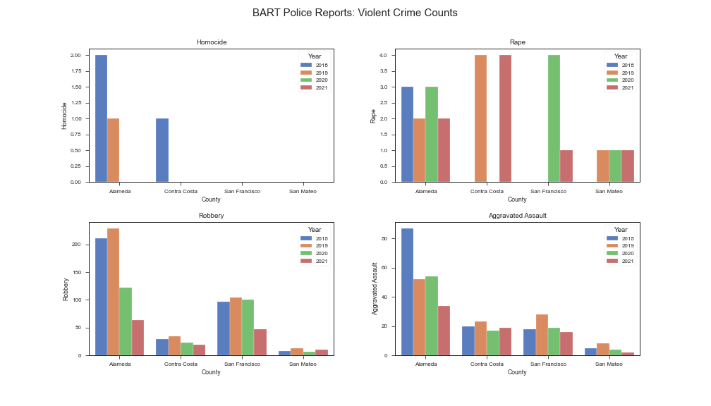

First we looked at BART Police Reports which report on crimes that happen inside BART facilities including trains and stations. We manually extracted the data from [PDFs](https://www.bart.gov/sites/default/files/docs/02-2022%20Monthly%20Chief%27s%20Report%20CRB%2003162022.pdf) as it's not available in other formats. The graph below shows the number of Violent Crime reports per county. Aggravated assults and robbery are the most common forms of crime.




**Here is some bold text**

## Here is a secondary heading

Here's a useless table:

| Number | Next number | Previous number |
| :------ |:--- | :--- |
| Five | Six | Four |
| Ten | Eleven | Nine |
| Seven | Eight | Six |
| Two | Three | One |


How about a yummy crepe?


It can also be centered!

{: .mx-auto.d-block :}

Here's a code chunk:

~~~
var foo = function(x) {
  return(x + 5);
}
foo(3)
~~~

And here is the same code with syntax highlighting:

```javascript
var foo = function(x) {
  return(x + 5);
}
foo(3)
```

And here is the same code yet again but with line numbers:


var foo = function(x) {
  return(x + 5);
}
foo(3)


## Boxes
You can add notification, warning and error boxes like this:

### Notification

{: .box-note}
**Note:** This is a notification box.

### Warning

{: .box-warning}
**Warning:** This is a warning box.

### Error

{: .box-error}
**Error:** This is an error box.
