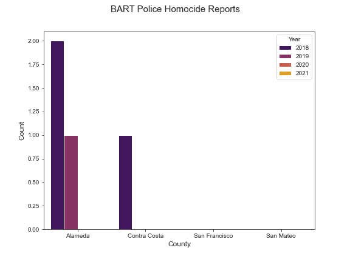
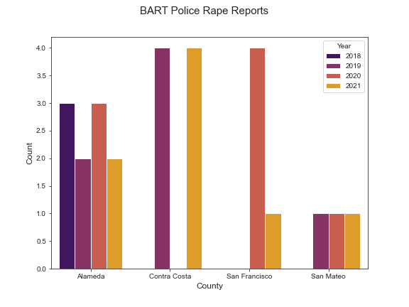
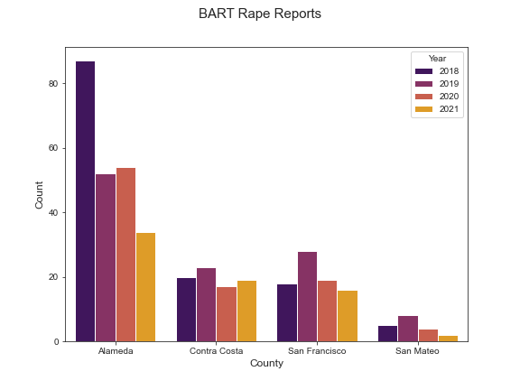
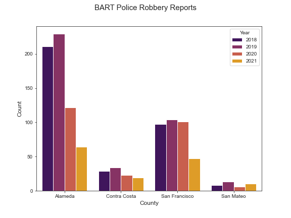

We looked at BART Police Reports which report on crimes that happen inside BART facilities such as trains and stations. We manually extracted the data from [PDFs](https://www.bart.gov/sites/default/files/docs/02-2022%20Monthly%20Chief%27s%20Report%20CRB%2003162022.pdf) as it's not available in other formats. 

The graphs below show the number of Violent Crime reports by crime per county per year. 

Some notes: (1) Aggravated assault is an attack that causes serious bodily harm to another person; (2) For the Homocide graph, most data for counties was unavailable so a zero count should be interpreted as no data available.

   
 
  
 
   

  

### Observations
* Alameda County had the most reports for all crime categories except for rape 
* San Mateo County had the least number of reports across all categories
* Systemwide, robbery is the most common crime followed by aggravated assault
* In San Francisco, robbery is the most common crime followed by aggravated assault
* Reduced crime counts in 2020 and 2021 are likely due to the effects of the COVID-19 pandemic

### Takeaways
Crimes inside BART facilities are prevelant and could be addressed by improving security measures. We recongize that BART has recently made addressing gender safety a priority through their [Not One More Girl](https://www.bart.gov/guide/safety/gbv/campaign) campaign, and as a result they have hired and trained more personnel to handle sexual harassement incidents. As the graphs in this post show, however, robbery and aggravated assaults are the most common types of crimes and we think BART would benefit from having increased security personnel on trains and stations that can respond to these more aggresive forms of crime.

_____
Photo: [KTVU](https://images.foxtv.com/static.ktvu.com/www.ktvu.com/content/uploads/2022/03/764/432/bart.jpg?ve=1&tl=1)

