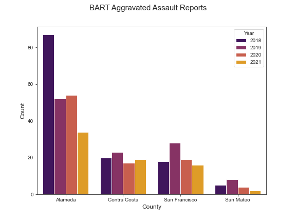

We looked at BART Police Reports which report on crimes that happen inside BART facilities such as trains and stations. We manually extracted the data from [PDFs](https://www.bart.gov/sites/default/files/docs/02-2022%20Monthly%20Chief%27s%20Report%20CRB%2003162022.pdf) as it's not available in other formats. 

The graphs below show the number of Violent Crime reports by crime per county per year. 

Some notes: (1) Aggravated assault is an attack that causes serious bodily harm to another person; (2) For the Homocide graph, most data for counties was unavailable so a zero count should be interpreted as no data available.

 

  | 
:------------------------------------------------------------------------- |:--------------------
   |   

### Observations
* Alameda County had the most reports for all crime categories except for rape 
* San Mateo County had the least number of reports across all categories
* Systemwide, robbery is the most common crime followed by aggravated assault
* In San Francisco, robbery is the most common crime followed by aggravated assault
* Reduced crime counts in 2020 and 2021 are likely due to the effects of the COVID-19 pandemic

